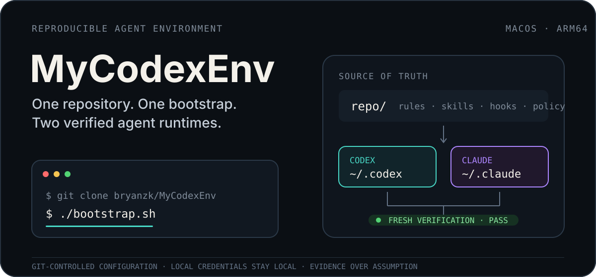
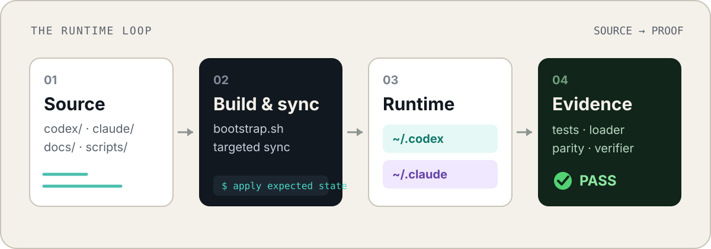

<p align="center">
  
</p>

# MyCodexEnv

通过 **Git clone + 一条 bootstrap 命令**，在新的 Apple Silicon Mac 上复现 Codex 与 Claude 双环境工作流。

它不是一份零散的 dotfiles 备份，而是一套可审查、可同步、可验证的 agentic engineering 控制面：规则、skills、hooks、runtime policy、工作流与验证脚本都以仓库文件为 source of truth；认证与本地运行态数据始终留在机器上。

[快速开始](#快速开始) · [工作原理](#工作原理) · [托管内容](#托管内容) · [常用工作流](#常用工作流) · [文档导航](#文档导航) · [验证](#验证)

## 快速开始

```bash
git clone https://github.com/bryanzk/MyCodexEnv.git
cd MyCodexEnv
./bootstrap.sh
```

bootstrap 会安装或配置仓库声明的本机依赖，将托管内容同步到 Codex 与 Claude home，并保留认证、会话、memory 等本地数据。新机器仍需单独完成登录：

```bash
codex login
```

### 运行前提

- macOS on Apple Silicon
- Git
- 可访问 Homebrew 与所需软件源
- Codex 与 Claude 的认证凭据不进入本仓库

可用参数：

```text
./bootstrap.sh \
  [--codex-home <path>] \
  [--claude-home <path>] \
  [--non-interactive]
```

## 为什么存在

通常，agent 环境会逐渐散落在 home 目录、插件状态、prompt 文件、skills、hooks 和个人脚本里。换机或排障时，很难回答三个问题：

1. 哪些文件才是 source of truth？
2. 当前 runtime 是否真的与仓库一致？
3. 一次修改是否破坏了 loader、hooks、策略或其他工作流？

MyCodexEnv 把这三个问题变成一条可重复的闭环：

- **仓库可审查**：Codex 与 Claude 的托管配置都在 Git 中。
- **同步有边界**：凭据和运行态数据不随仓库迁移。
- **结果可证明**：测试、skill loader、兼容性检查和环境验证提供 fresh evidence。

## 工作原理

<p align="center">
  
</p>

1. **Source** — `codex/`、`claude/`、`docs/`、`scripts/` 与 lock 文件定义期望状态。
2. **Build & sync** — `bootstrap.sh` 和定向同步脚本安装依赖、复制托管文件并保留本地状态。
3. **Runtime** — `~/.codex` 与 `~/.claude` 获得可运行的 rules、skills、hooks 和 workflow。
4. **Evidence** — `test_runner.py`、loader gate、兼容性检查和环境验证确认结果，而不是依赖“脚本运行过”的假设。

## 托管内容

| Surface | 仓库 source of truth | 本机目标 / 用途 |
| --- | --- | --- |
| Codex rules | `codex/AGENTS.md` | `~/.codex/AGENTS.md` |
| Codex config | `codex/config.template.toml` | Codex runtime 配置模板 |
| Hooks | `codex/hooks.json`、`codex/hooks/` | session、prompt、policy 与 evidence hooks |
| Runtime policy | `codex/runtime/` | tool policy、schemas、CLI resolver |
| Skills | `codex/skills/` | `~/.codex/skills/` |
| Codex workflow | `codex/workflow/` | `~/.codex/workflow/` |
| Shell integration | `codex/zsh/` | session title 与 shell 辅助 |
| Claude workflow | `claude/workflow/` | `~/.claude/workflow/` |
| Claude integration | `claude/CLAUDE_INTEGRATION_BLOCK.md` | 注入 `~/.claude/CLAUDE.md` |
| Version pins | `locks/` | 可复现的第三方组件版本 |

### Skills

`codex/skills/*` 是持久托管 skill 的唯一仓库来源。同步后，loader gate 会确认每个预期路径都已加载、启用且没有 loader error。

仓库同时维护：

- 本项目的通用 workflow skills，例如 planning、verification、delivery harness、skill evaluation 与 session continuity；
- vendored `garrytan/gstack` skill 集合及其共享支持文件；
- 第三方 skill 的受控副本、许可证和运行时同步。

首次同步 gstack 后，构建它的本地支持组件：

```bash
~/.codex/skills/gstack/setup
```

### Harness Runtime

Harness Runtime 把 agent 工作从“prompt + 工具”扩展为一套可恢复、可观察、可验证的交付系统：

- 生命周期与 skill 路由；
- 分阶段工具权限与 destructive/secret/remote guardrails；
- prompt/subtask 模型建议；
- decision 与 routine evidence schemas；
- checkpoint、recovery、requirements 与 agent-team validation；
- 全局 generic dispatcher 与按仓库延迟加载的 adapter。
- Runtime Plan Governor v1 的本地 CLI、三份 schema 与 managed skills 合同；Phase 0 当前为 `payload_capable=false`，因此仅支持 source-stage Shadow evidence，Production no-go，未激活 hook enforcement 或真实 runtime。

关键入口：

- [`docs/HARNESS_RUNTIME.md`](docs/HARNESS_RUNTIME.md) — workflow 与 infra 合同
- [`docs/LIFECYCLE_SKILL_ROUTING.md`](docs/LIFECYCLE_SKILL_ROUTING.md) — 生命周期到 skill 的路由
- [`docs/MODEL_ROUTER_EVAL_MATRIX.md`](docs/MODEL_ROUTER_EVAL_MATRIX.md) — 模型路由评估
- [`docs/harness-state.md`](docs/harness-state.md) — append-only 状态与 next safe task
- [`docs/AGENT_HARNESS_STATUS.md`](docs/AGENT_HARNESS_STATUS.md) — 当前能力状态图

### 当前控制能力

- **Thread discipline**：每个任务冻结 repo、mode 与 compaction anchors；确认发生 anchor mismatch 或第二次 compaction 时，在项目、工具、计数与幂等状态均可安全确认的前提下，只创建一个边界明确的继任任务。跨任务链合计最多自动迁移三次，且绝不自动归档或删除任务。
- **Codex Fluent**：以 report-only scanner 对活跃任务做大小排序与 handoff 审计；任何维护操作仍需要独立授权、备份和可恢复 handoff。
- **gbrain-aware planning**：配置后，gstack planning skills 可以使用缓存的产品、目标、developer persona、品牌、竞品与用户画像；generic Harness 仍只负责 repo state、lane 与验证边界。
- **iOS QA bridge**：vendored gstack 包含面向真实设备与 SwiftUI 的 QA、同步、修复和清理工作流；它们保留在 specialist skill 范围内，不扩大普通 prompt 的默认权限。

## 项目地图

```text
MyCodexEnv/
├── bootstrap.sh          # 新机器入口
├── codex/                # Codex rules、config、hooks、runtime、skills、workflow
├── claude/               # Claude workflow 与 integration block
├── scripts/              # 同步、验证、恢复、报告与维护工具
├── docs/                 # 架构、指南、状态、公开文档与可视化
├── locks/                # 第三方组件版本锁
├── tasks/                # 运行与维护证据
└── test_runner.py        # 仓库 canonical test suite
```

低 token、机器友好的完整入口索引见 [`docs/repo-index.md`](docs/repo-index.md)。

## 常用工作流

### 同步 Codex runtime

```bash
./scripts/sync_codex_home.sh \
  --repo-root "$(pwd)" \
  --codex-home "$HOME/.codex"
```

该入口会同步仓库托管的 Codex surfaces。对高风险目录或单一 skill 的修改，优先采用明确的定向同步并验证 source/runtime parity，避免无关 runtime 漂移。

### 验证完整环境

```bash
python3 test_runner.py

./scripts/verify_codex_env.sh \
  --repo-root "$(pwd)" \
  --codex-home "$HOME/.codex" \
  --claude-home "$HOME/.claude"
```

### 检查 skills

```bash
python3 scripts/check_skill_compatibility.py \
  --repo-root "$(pwd)"

python3 scripts/check_codex_skill_loader.py \
  --repo-root "$(pwd)" \
  --codex-home "$HOME/.codex"
```

兼容性检查验证 manifest、helper 语法、相对链接与持久托管 skill 的完整 parity；loader gate 在禁网环境中调用 Codex app-server，检查 loaded/enabled 状态和 loader errors。

### 刷新 vendored gstack

```bash
python3 scripts/prepare_gstack_dhf_daily_refresh.py --json
python3 scripts/sync_gstack_vendor.py \
  --repo-root "$(pwd)" \
  --source https://github.com/garrytan/gstack.git \
  --dry-run \
  --json
```

只有 dry-run 返回 `needs_update=true` 时才执行实际同步。同步后重新运行仓库测试、runtime sync、gstack setup 与环境验证。

### 管理多仓库 AGENTS

```bash
python3 scripts/manage_agents.py scan
python3 scripts/manage_agents.py backup --backup-id "$(date +%Y%m%d%H%M%S)"
python3 scripts/manage_agents.py generate --backup-id "<backup_id>"
python3 scripts/manage_agents.py verify
```

### 可选辅助工具

| 目标 | 入口 |
| --- | --- |
| 记录命令、prompt 或对话文本 | `python3 scripts/capture_text.py "要记录的文本"` |
| 构建本地 Codex subconscious 索引 | `python3 scripts/codex_subconscious.py build --emit-briefs` |
| 恢复当前仓库的 next safe task | `python3 scripts/harness_recover.py` |
| 汇总本机 evidence | `python3 scripts/harness_report.py` |
| 压缩大型命令输出 | `some-command \| python3 scripts/headroom_filter.py --mode auto --stats` |

这些工具的运行态输出默认保留在本机，不进入 Git。

## 文档导航

| 文档 | 用途 |
| --- | --- |
| [`docs/CODEX_ENV_REPRODUCTION.md`](docs/CODEX_ENV_REPRODUCTION.md) | Codex + Claude 环境复现细节 |
| [`docs/repo-index.md`](docs/repo-index.md) | source of truth 与 runtime surface 索引 |
| [`docs/HARNESS_RUNTIME.md`](docs/HARNESS_RUNTIME.md) | Harness Runtime 设计合同 |
| [`docs/LIFECYCLE_SKILL_ROUTING.md`](docs/LIFECYCLE_SKILL_ROUTING.md) | 生命周期、workflow 与 skill 路由 |
| [`docs/project-lifecycle-harness-flow-cn.html`](docs/project-lifecycle-harness-flow-cn.html) | 中文纵向 lifecycle flow |
| [`docs/project-lifecycle-harness-flow-skills.html`](docs/project-lifecycle-harness-flow-skills.html) | 中文 skill/helper 路由可视化 |
| [`docs/HEADROOM_WORKFLOW.md`](docs/HEADROOM_WORKFLOW.md) | Headroom 输出压缩工作流 |
| [`docs/CODEX_SUBCONSCIOUS.md`](docs/CODEX_SUBCONSCIOUS.md) | 本地 subconscious companion |
| [`docs/index.html`](docs/index.html) / [`docs/index-en.html`](docs/index-en.html) | GitHub Pages 中英文入口 |
| [`docs/delivery-harness-beginner-guide-cn.html`](docs/delivery-harness-beginner-guide-cn.html) / [`docs/delivery-harness-beginner-guide-en.html`](docs/delivery-harness-beginner-guide-en.html) | 中英文 beginner guide |

## 验证

仓库的 portable CI green gate 与本地验证入口保持一致：

```bash
python3 test_runner.py
git diff --check
python3 scripts/check_surfaces.py \
  --repo-root "$(pwd)" \
  --check-public-nav
```

任何“完成”结论都应附带本次运行的：

```text
command
exit_code
key_output
timestamp
```

## 安全边界

- 不同步或提交密钥、token、认证文件、会话与本地 memory。
- 外部 URL、第三方 skill、MCP 与动态执行入口必须先经过安全审查。
- `scripts/`、`codex/hooks/`、`codex/runtime/` 与 `codex/skills/` 属于高影响面；修改后需要 fresh verification。
- SSH、远程服务或 tunnel 操作前，先遵循 `codex/remote-access.md`。
- 认证不随仓库迁移；新机器必须自行完成登录。

## 常见问题

<details>
<summary>Codex Desktop 无法在 Documents 或 Desktop 创建目录</summary>

将任务根目录切换到 `~/Codes/...` 这类非受保护目录，或在 macOS 的“隐私与安全性 → 文件与文件夹 / 完全磁盘访问权限”中授权 Codex。

</details>

<details>
<summary>旧版 superpowers checkout 还能使用吗？</summary>

当前入口使用 Codex plugin 安装路径。旧环境中若仍存在 `~/.codex/superpowers/.codex/superpowers-codex`，只能把它当作条件 fallback，不应作为新的 source of truth。

</details>

<details>
<summary>EigenPhi MCP 默认会启用吗？</summary>

不会。EigenPhi MCP 默认禁用；`--eigenphi-backend-root` 只作为旧命令的兼容参数保留。

</details>
