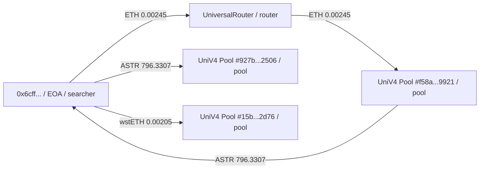

# MEVScan Arbitrage FP by Code

## Overview

用 `MEVScan` 的 Go 源码解释某笔交易为什么被识别成 arbitrage，或者为什么漏判。主线不是先看 protocol action，也不是先猜业务角色，而是先用 `[$eigenphi-address-tag](/Users/kezheng/.codex/skills/eigenphi-address-tag/SKILL.md)` 给关键地址补 tag，再按 `trace/logs -> transfers -> simplify -> SCC/cycle -> nearest node -> balance rule` 逐层定位。

## Required Inputs

- 最少输入：
  - `MEVScan` 仓库路径
  - 目标 tx hash
  - 对应链和区块号
  - receipt、trace，或能恢复 transfer 的原始数据
  - 至少一组需要解释业务角色的关键地址（通常来自 `tx.from`、`tx.to`、cycle 节点、PoolManager / Vault / Router / LP）
- 推荐输入：
  - `debug_traceBlockByNumber` 或同级别 trace
  - `eth_getTransactionByHash` / `eth_getTransactionReceipt`
  - tx metadata：`from`、`to`、`gasUsed`、`gasPrice`
  - 如有，parser 运行时产出的 transfer 表
  - 对关键地址做 `static + tx-context` tag 查询所需的链名和 tx hash

## Workflow

1. 读取 arbitrage 主链路。
   - `pkg/domain/transforms/analyze_mevs.go`
   - 先确认 `FindGraphCycles`、`FindNearestNodes`、`CheckNodeBalanceDelta` 的串联关系。
2. 先给关键地址补 tag，再写业务描述。
   - 调用 `[$eigenphi-address-tag](/Users/kezheng/.codex/skills/eigenphi-address-tag/SKILL.md)`
   - 优先查询：`tx.from`、`tx.to`、miner / coinbase、raw transfer 里的关键节点、疑似 router / pool / vault / wrapper / NFT / LP 合约
   - 需要上下文角色时必须带 `--tx`，不要只查静态 tag
   - 在没有 tag 之前，不要把地址直接说成 searcher、router、PoolManager、Vault 或 LP
3. 先看 raw 证据，不先下结论。
   - receipt 里的 swap / transfer log 数量
   - trace 里的 value transfer
   - `tx.to`、searcher/router、PoolManager、Vault 等关键地址
4. 还原 transfer 来源。
   - ERC20 `Transfer` 来自日志
   - native ETH 不在 ERC20 日志里，要检查 `pkg/parser/converter.go` 是否把非零 `value` 调用帧转成 ETH transfer
5. 比较 simplify 前后的最小 transfer 表。
   - `replaceTransferToken`
   - `simplifySameGroupTransfer`
   - `mergeSameFromToTokenTransfer`
   - `simplifyZeroAmountDeltaMiddleNode`
   - 明确哪一步让边消失、净额化，或把图压扁
6. 构造最小 SCC / cycle。
   - `pkg/recognizer/arbitrage/cycle.go`
   - 记录 cycle 是 raw 图就存在，还是只在 simplify 后才出现或消失
7. 检查 nearest node。
   - `tx.to` 往往会进入 `protectedAddrs`
   - balance rule 只对 `nearestNodes` 生效，不是对整张图统一计算
8. 对 nearest node 逐 token 算余额。
   - `净额 = inflow - outflow`
   - 分开记录：正余额 token、负余额 token、既有 inflow 又有 outflow 的 token
9. 继续检查负余额放行条件。
   - 负余额 token 在 cycle 内是否同时有 inflow 和 outflow
   - 是否存在 SCC 外部对该 token 的注入
   - 都不满足时，`CheckNodeBalanceDelta` 会拒绝该 cycle
10. 结合地址 tag 写问题和业务描述。
   - 明确哪些地址是 searcher / router / vault / pool / LP / token / NFT
   - 区分“链上直接证据 + tag 支持的业务角色”和“基于 transfer 图的推断”
   - 如果 tag 缺失或 tx-context 查询失败，要明确这是标签能力不足，不是业务结论
11. 归类根因。
   - parser 没产出关键 transfer
   - native ETH 被忽略
   - simplify 净额合并过强
   - address grouping 过强
   - nearest-node 选取改变了 balance 视角
   - balance rule 拒绝了本来像套利的路径

## Core Questions

先回答这几个问题，再给结论：

1. 原始 trace / log 里是否真的存在 swap 和 transfer
2. 关键地址各自的 tag 是什么，哪些角色是静态 tag 命中，哪些是 tx-context 命中
3. raw transfer 图和 simplified transfer 图分别是什么
4. cycle / SCC 是 raw 图就有，还是简化后才变形
5. `nearestNode` 是谁，为什么是它
6. 负余额 token 是哪个
7. 这个负余额 token 在 cycle 内是否既有 inflow 和 outflow
8. 该 token 是否有 SCC 外部补偿流入

## Quick Reference

- 主入口：
  - `pkg/domain/transforms/analyze_mevs.go`
- 地址 tag：
  - `[$eigenphi-address-tag](/Users/kezheng/.codex/skills/eigenphi-address-tag/SKILL.md)`
- transfer 构造：
  - `pkg/parser/converter.go`
- simplify：
  - `pkg/recognizer/arbitrage/simplify.go`
- cycle / SCC：
  - `pkg/recognizer/arbitrage/cycle.go`
- nearest node / balance rule：
  - `pkg/recognizer/arbitrage/arbitrageur.go`
- 设计对照：
  - `docs/design/algorithms/arbitrage.md`

## High-Risk Patterns

- 不要把“有 swap log”直接等同于“会被识别成 arbitrage”。
- 不要在没查 tag 前就把某地址写成 searcher/router/pool/vault。先查 tag，再写业务描述。
- 不要只看 raw ERC20 transfer；native ETH 可能是维持 SCC 的关键边。
- 不要把 raw transfer 和 `cycles.Transfers` 混为一谈；余额规则吃到的是简化后的图。
- 遇到 UniV4 时，优先核对 `PoolManager` 是否被错误参与合并。singleton 架构很容易在净额化后只剩少量边，触发误判或漏判。
- 如果某 token 原始上“既有流入也有流出”，但简化后只剩净流出，要明确说明这是算法视角，不是链上原始事实。

## Output Format

输出默认包含：

- 一句结论
- 关键地址 tag 摘要（标明 `static` / `tx-context`）
- 基于 tag 的业务角色描述
- 直接证据与推断的分界
- raw transfer 表
- simplified transfer 表
- 最小 SCC / cycle 图
  - 优先输出 `mermaid` 图，而不是只给文字列表
  - 图方向默认 `flowchart LR`
  - 节点标签格式：`短地址 / tag / 业务角色`
  - 边标签格式：`Token Amount`
  - 只画与结论直接相关的节点和边，不把整笔 tx 所有噪声边都画进去
  - raw 图和 simplified 图都要画；如果 simplified 后没有有效 cycle，也要画出“退化后的 2 节点图”
- nearest node 的逐 token 余额
- 精确拒绝点或放行点
- 根因分类

图模板建议长这样：

如果同一次回答里同时展示 raw / simplified 两张图，建议用这两个小标题：

- `Raw SCC Graph`
- `Simplified SCC Graph`

## Common Mistakes

- 用 protocol action 直接解释 arbitrage 结果
- 没先调用 `eigenphi-address-tag` 就开始写业务角色或问题描述
- 只拿静态 tag 就断言交易上下文角色，没有补 `--tx`
- 只看 simplify 后的图，不看前后差分
- 忽略 native ETH transfer
- 忽略 `nearestNodes` 限缩了 balance rule 的视角
- 看到负余额就下结论，没有继续检查“环内进出”或“环外注入”
- 把文档里的设计约束当成当前代码事实，没有交叉验证实现

## Verification

结论必须附带 fresh evidence：

- `command`
- `exit_code`
- `key_output`
- `timestamp`

如果没有运行时 transfer 表，就明确说明当前结论是“基于 trace 和源码的高质量人工复盘”，不是“1:1 运行时重放”。

如果用了地址 tag，也要附带 fresh evidence：

- `command`
- `exit_code`
- `key_output`
- `timestamp`
- 若是 tag 查询，还要说明查询模式（`static` 或 `static + tx-context`）、API 状态、服务来源
