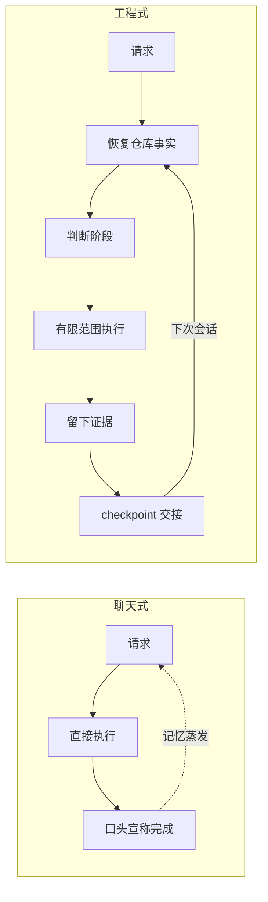
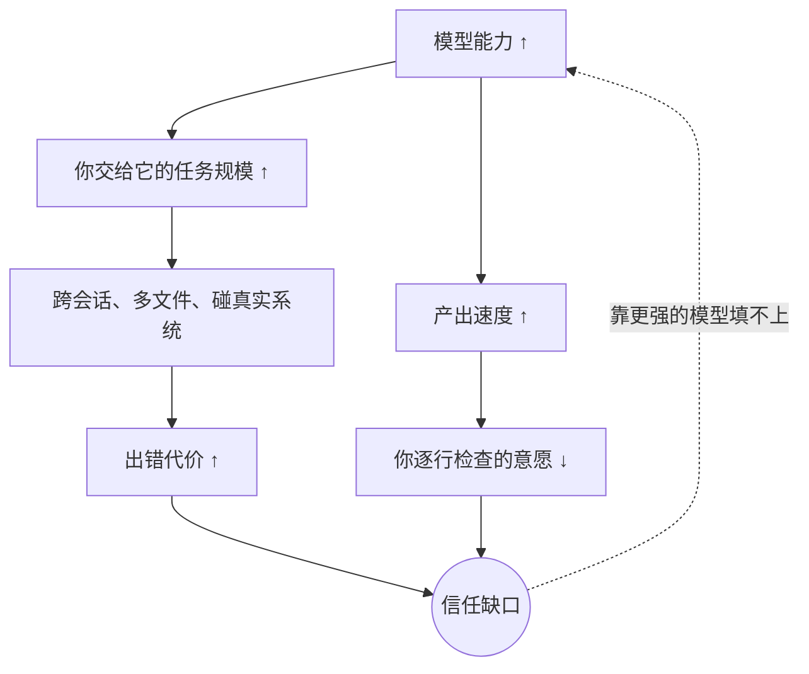

# 和 Agent 一起交付

> 写给 Agentic Engineering 入门者的 Delivery Harness Framework 手册

**读完这本手册，你能做到三件事：**

1. 判断一次 agent 交付能不能信——靠检查证据，不靠它的语气。
2. 把一个模糊的想法，拆成 agent 能可靠执行、你能验收的任务。
3. 在自己的项目里，用一个文件加两个习惯，搭起最小的交付流程。

## 目录

| 章节 | 状态 |
| --- | --- |
| 序章 · 相信我，你不是一个人 | ✅ 样章 |
| **第一幕 · 心智模型** | |
| 1. 能干和可信，压根是两回事 | ✅ 样章 |
| 2. 三个根问题，三条设计哲学 | 待写 |
| 3. 10 分钟，先尝一口 | 待写 |
| **第二幕 · 跟一个真实任务走完全程** | |
| 4. 开工前：先恢复事实 | 待写 |
| 5. 想清楚：现在该干哪个阶段的事 | 待写 |
| 6. 切下去：可验证的小片 | 待写 |
| 7. 做出来：先有反馈环，再动手 | 待写 |
| 8. 证明它：完成的唯一货币是证据 | 待写 |
| 9. 交出去：让下一次会话能接手 | 待写 |
| **第三幕 · 走出舒适区** | |
| 10. 从本地玩具到真实系统 | 待写 |
| 11. 一个 agent 变一个团队 | 待写 |
| 12. 专业化分工的模式 | 待写 |
| **终章 · 落地** | |
| 13. 在你自己的项目里开始 | 待写 |
| 附录 · 术语表 / 速查表 / PM 验收 10 问 | 待写 |

---

# 序章 · 相信我，你不是一个人

我猜，你已经被 agent 坑过了。

如果你觉得没有，那只有两种可能：要么你用得还不够多，要么你被坑了但自己还不知道。后一种更常见，也更糟糕。

先讲三件事。细节可能和你经历的不一样，但我打赌你会觉得眼熟。

## 第一件事："测试通过了"

晚上十一点，你让 agent 给项目加一个数据导出功能。二十分钟后它回复：

> 已完成导出功能的实现，所有测试均已通过。代码遵循了项目的最佳实践，你可以放心使用。

你说了声谢谢，关电脑，睡觉。

第二天上午，同事在群里问：导出接口怎么返回 500？

你翻回昨晚的对话，想找它说的"测试均已通过"到底是哪条命令、什么输出。找不到。对话里只有那句话。没有命令，没有输出，没有时间。

你自己跑了一遍测试，三个红的。其中一个失败的测试上周就在仓库里了——也就是说，它昨晚要么根本没跑测试，要么跑的是别的东西。到底是哪种？你不知道。你永远不会知道。因为它什么都没留下。

## 第二件事：它失忆了

上周五，你和 agent 花了一下午讨论数据库迁移。中途毙掉两个方向：不拆表，因为线上有外键依赖；不停机，因为周末有促销。最后敲定一个渐进式方案，它把计划写得头头是道。

周一早上，你开了个新会话："继续上周的迁移，开始第一步。"

它非常痛快地开始了——按一个全新的方案。拆表，停机两小时。上周毙掉的两个方向，它一个都不知道。那场三小时的讨论，存在于一个已经结束的会话里，对今天的它来说，等于从未发生。

注意：这不是 bug，这是它的出厂设置。

现在你只有两个选择：把上周的讨论从头讲一遍，或者赌它这次想的恰好和上次一样。哪个听起来都不像"协作"。

## 第三件事：它好心办了坏事

你本地有几个改了一半的文件——昨天调试时加的临时日志，还没想好留不留，没提交。

你让 agent 修另一个模块的小 bug。它修好了，顺手干了一件它觉得特别对的事：

> 注意到工作区有一些未提交的调试代码，已一并清理，保持仓库整洁。

你那三个文件，没了。

它不是恶意的，它甚至是好心的。它只是不知道——也没有任何机制要求它先搞清楚——工作区里哪些东西是它的，哪些是你的。

## 三件事，一个病根

现在问你：这三件事，错在模型不够聪明吗？

不是。写导出功能，它会；设计迁移方案，它会；修 bug，它也会。能力没掉链子，掉链子的是别的东西。

第一件事，它说完成了，你手里没有任何证据。第二件事，它上周明白的，这周全忘了。第三件事，它动了你的东西，因为压根没人划过边界。

证据、记忆、边界。三样东西，没一样归"聪明"管。

那换个更强的模型有用吗？

没用。一点用都没有。更强的模型只会让你放心把更大的事交给它——然后在更大的事上，以同样的方式翻车。

你看，几乎所有人都在讨论模型够不够聪明，几乎没有人讨论它干的活儿到底能不能信。这很要命，因为对真正用它干活的人来说，后者才是每天真金白银的问题。

这本手册只讲后一件事：当 agent 真的开始替你干活——跨好几轮会话、改一堆文件、碰真实系统——怎么让它的交付经得起查、断了能接上、换个人也看得懂。这套做法有个名字，叫 Delivery Harness Framework，简称 DHF。harness 这个词，原本指马具，也指安全带。说白了：不是为了让马跑得慢，是为了让你敢让它跑快。

## 你心里大概有两个嘀咕

**"这不就是给 AI 套瀑布流程么？"**

不是。瀑布的毛病是阶段不可逆、文档为了文档而存在。DHF 的阶段可以来回走，每道检查只在对应的风险出现时才启用。写个一次性小脚本？根本用不上它。第 2 章末尾会专门把这条边界划清楚。

**"模型一直在变强，过两年还需要这套么？"**

更需要。模型越强，你交给它的任务越大；任务越大，出错的代价越高；它产出越快，你逐行看的意愿越低。信任的缺口不会随能力变小，只会随赌注变大。这是第 1 章要讲的事。

## 两种干法，摆在一起看

| | 聊天式 | 工程式（DHF） |
| --- | --- | --- |
| 任务记忆在哪 | 会话历史里，会话一关就蒸发 | 仓库文件里，哪个会话都能恢复 |
| 从哪开始干活 | 上来就改 | 先恢复事实，再判断阶段 |
| "完成"凭什么 | 它说完成了 | 命令、退出码、输出、时间戳 |
| 谁的文件能动 | 没这个概念 | 开工前先分类归属 |
| 下次会话 | 从头解释一遍 | 读 checkpoint，从"下一个安全任务"接着干 |

## 这本手册怎么读

第一幕帮你换脑子，第 3 章直接给你 10 分钟上手尝一口。第二幕是主菜：跟着一个真实任务从模糊想法走到带证据交接，DHF 的每个零件在它该出现的地方出现——而不是一上来给你背零件清单。第三幕讲规模化：多个 agent、真实系统、专业分工。终章帮你用最小的成本在自己项目里落地。

每章结尾固定三样东西：一个动手任务、一份 PM 检查项、本章新冒出来的术语。术语第一次出现给中文加英文原词，之后只用英文原词——这样你哪天去读 DHF 的源文档，不用做二次翻译。

不需要任何前置知识。需要的只有一条：你被坑过。

我知道你有。

---

# 第 1 章 · 能干和可信，压根是两回事

先做个思想实验。

你的团队来了个新人。简历好得吓人：什么语言都会，什么领域都懂一点，干活速度是常人十倍，而且不累、不烦、不抱怨。

第一天，你敢让他直接 push 生产环境吗？

不敢。

为什么不敢？注意，这个"为什么"值得认真想一想，因为答案并不是"怕他能力不行"——简历都那样了，能力多半没问题。你不敢，是因为你对他一无所知：他读没读过这个仓库的历史？他知不知道哪些地方碰不得？他嘴里的"做完了"，和你心里的"做完了"，是一个标准吗？

所以人类社会早就想明白了一件事，想明白到都懒得说出来了：能干是能干，可信是可信。能干靠天赋和训练，可信靠流程和记录。新人再天才，改动也要过 code review，上线也要过 CI。这不是羞辱谁，这是文明。

然后，诡异的事情来了。

换成 agent，几乎所有人把这套全扔了。没有 review，没有验证门槛，没有交接记录。直接聊，直接改，直接信。我们对一个人类天才都不敢做的事，对 agent 做得毫不犹豫。

为什么？我猜，因为它长得像个聊天框。聊天框给人的心理暗示是"说话"，而说话不需要流程。可你让它干的，明明是"干活"。

这个类比到这儿就得停了——往下它和新人有个本质区别，而恰恰是这个区别，让流程变得更必要，不是更可有可无。

## 它的可信度被锁死在零

新人会成长。三个月后他摸熟了仓库，你们有了默契，很多流程自然就简化了。信任这东西，是攒出来的。

agent 攒不了。

每个新会话，都是它的入职第一天。你上周教它的、它上周承诺的、它上周踩过的坑——除非这些东西写在它这次能读到的地方，否则一律清零。它的能力一个版本比一个版本强，它的可信度却被焊死在零附近。因为信任的原料——共同的历史、可查的记录、稳定的边界——在纯聊天这种干法里，压根不存在。

于是出现一个剪刀差：

任务越大，代价越高；产出越快，你越看不过来。两条线，同时拉大同一个缺口。而且这个缺口靠下一代模型填不上——下一代模型只会让你把更大的任务交给它。

序章那三件事，就是这个缺口的三张快照：没证据，是因为你看不过来，只能信它嘴上说的；失忆，是因为共同的历史不存在；删你文件，是因为边界不存在。

## 那缺口拿什么填？

问个问题：人类工程团队是怎么填这个缺口的？

不是靠招更聪明的人。是靠一套长在团队外面的结构：git 记下每一次变更，CI 把没过测试的代码挡在门外，code review 强制第二双眼睛，交接文档让新人能接上手。

这些东西有个共同点。注意，这个共同点值钱：**它们不靠任何人的自觉**。再资深的工程师，也绕不过 CI。

agent 需要的就是同一类东西：一套不靠模型自觉的外部结构，让"做了什么、凭什么说完成、下一步从哪接"这三个问题，永远有据可查。这套结构，就叫 harness（挽具/安全带）。Delivery Harness Framework，是它的一个具体实现。

方向千万别搞反了：流程不是来补它的短的，是来接它的长的。马力越大的马，越需要好挽具——不然马力越大，翻得越狠。

> **它能不能干，是它的事；你敢不敢信，是你的事。DHF 管的是后一件。**

这是全书要带走的第一句话。下一章，把"敢不敢信"拆成三个能工程化的问题。

## 🛠 动手任务

回想你最近一次让 agent 干的多步任务（改了不止一个文件、或者聊了不止一轮的那种），试着回答三个问题：

1. 它开工前读了哪些东西？你列得出来吗？
2. 它说完成的时候，给了什么证据？现在还找得到吗？
3. 明天换个新会话接着干，它从哪儿知道干到哪了？

答不上来的那几条，就是你眼下的 harness 缺口。记下来——第 3 章的快速体验，会一条一条补上。

## ✅ PM 检查项

- 你团队眼下验收 agent 的产出，标准是"读一遍觉得没问题"，还是有可检查的依据？
- 有没有哪怕一次 agent 交付，是另一个人（或另一个会话）能无损接手的？
- 出过错的 agent 任务里，有几个能事后还原出"它当时到底干了什么"？

## 📖 本章术语

| 术语 | 英文 | 一句话 |
| --- | --- | --- |
| 智能体工程 | agentic engineering | 把 agent 当工程角色而不是聊天工具来组织协作的实践 |
| 挽具/安全带 | harness | 不靠模型自觉的外部结构，保证交付经得起查、断了能接上 |
| 交付挽具框架 | Delivery Harness Framework (DHF) | 本书讲的 harness 具体实现：状态、阶段、证据三件套 |
