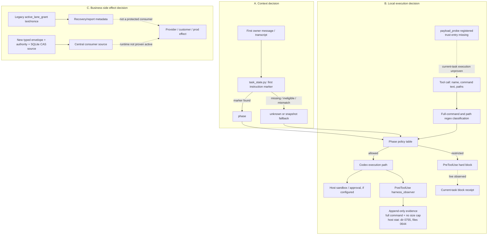
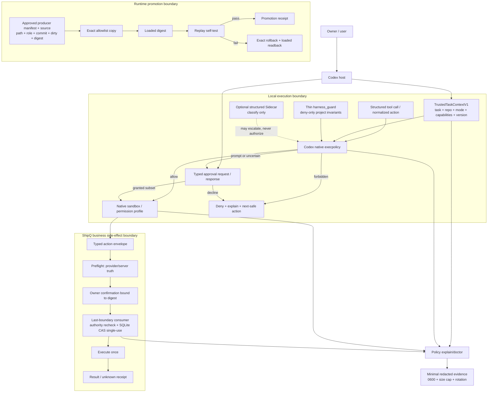

# Runtime Guard 两个月复盘与 Top 10 收敛方案

> Claude Fable 5 独立评审包

| 字段 | 值 |
| --- | --- |
| 文档状态 | `REVIEWED_PASS_V6`，五轮 Claude review 已闭环；最终 closure review 判定 RES-4/5 均 `CLOSED`、无新 finding；这是评审通过的设计文档，不是实施、unpause 或 runtime 激活授权 |
| 日期 | 2026-08-05，America/Toronto |
| 审查目标 | 判断 MyCodexEnv 与 ShipQ runtime guard 的职责拆分、Top 10 修复顺序和机器验收是否正确、最小、安全且改善开发流畅度 |
| 分析窗口 | 2026-06-05 至 2026-08-05 |
| 仓库 | `/Users/kezheng/Codes/CursorDeveloper/MyCodexEnv` |
| 任务模式 | `implementation`，但唯一产物是本文档 |
| 明确边界 | 未修改 ShipQ、`~/.codex` runtime、policy、hooks、tests 或配置；未 sync、commit、push、PR、部署、归档或清理 |

## Executive verdict

**Verdict: 保留外部副作用的强保护，收缩普通本地开发的 guard。** 当前体系保护了 dirty files、错误 checkout、认证材料、远程动作和 ShipQ Level 2 业务副作用，也迫使团队区分 source、tests、runtime sync、rollout observation 与 runtime activity。这些价值必须保留。

但当前 guard 把三个不同问题塞进了一条 hook 决策链：

1. 什么是可信任务上下文；
2. 一个本地命令是否能在 OS 与 workspace 边界内运行；
3. 一个业务副作用是否获得了最后一跳授权。

两个月证据显示，这种混合已经让普通本地开发的净体验转负。直接症状包括首条消息 marker 失效、引用文本触发危险命令规则、只读列名触发敏感信息规则、Ask 不可恢复而退化成硬阻断、source/runtime 双副本漂移，以及 committee/session fanout 放大。根因不是“规则还不够多”，而是职责放错了层。

推荐的最小方向是：

- 由 host 提供 `TrustedTaskContextV1`，停止从 transcript 或首行猜 phase；
- 让 Codex 原生 execpolicy、approval 和 sandbox 处理通用本地执行；
- 将 `harness_guard` 缩成少量 deny-only 项目不变量；
- 在 ShipQ 业务动作的最后一跳保留 typed preflight、owner confirmation、SQLite CAS single-use consume 和 server-truth recheck；
- 在任何 enforce 前先有 replay corpus、explain/doctor、可回滚 runtime promotion 和 SLO。

不建议引入 LangGraph、OPA、常驻 daemon、新 policy service 或新框架。当前证据还没有证明原生 host 能力、现有 Python helper 与 ShipQ SQLite CAS 不够用。

**Post-authoring runtime audit。** 2026-08-05 的只读核验确认核心 `harness_guard.py`、`task_state.py`、`harness_observer.py` 与 `tool-policy.json` 在 working-tree source/runtime 间 4/4 digest 一致，当前任务也 fresh 复现了只读搜索被 PreToolUse 误阻断。该核验加强了上述结论，但同时发现必须拆开处理的现役风险：observer 默认持久化完整 command、缺少单条长度上限及明确轮转/保留期；当前 unrestricted local shell 的 fresh `stat` 另显示 evidence 目录为 `0755`、87 个文件均为 `0644`。Claude 评审沙箱曾读到 `0700/0600`，但评审自己将该读数标为 UNVERIFIED；因此本文采用可复核的宿主侧采集方法和结果，并继续把权限作为 active remediation 与回归门禁。后续 explain/corpus 工作必须先收缩日志面。

**V4 automation-path audit。** 后续 Claude delta review 将陈旧的 controller workspace `/Users/kezheng/.codex/automation-workspaces/gstack-dhf-daily-refresh` 误当成实际 runtime sync source。fresh 只读核验显示：controller 确实停在 `c860eb8`、缺 `task_state.py` 且 dirty，但 2026-08-04 日志记录的 `clone_root` 是另一个目录 `/Users/kezheng/.codex/automations/gstack-dhf-daily-refresh/repo`；该 execution clone 当前含 `task_state.py`、guard 与 runtime byte-equal，并包含 `dbbf596`。配置流程先由 prepare 在 execution clone 执行 fetch、clean check、branch switch/rebase，返回 `ready` 后才允许 sync；automation 当前状态为 `PAUSED`。因此“陈旧 controller 已具备下一次直接回滚 runtime 的现役路径”未被证实。不过 execution clone 中的 sync helper **当前确实使用目录级 `rsync -a --delete`**，且缺少 approved source digest/file-set precondition；在任何未来 unpause 或 promotion 前仍应先用最小 source attestation 封堵这类旁路。

**V5 residual audit。** 第三轮 Claude review 独立确认上述路径拆分，并发现 prepare 信任链的上游仍不完整。fresh 核验确认 launcher 在 controller workspace 启动 Codex，`automation.toml` 要求先运行 controller 的 `prepare_gstack_dhf_daily_refresh.py`；该 prepare 文件当前有 `+65/-5` 未提交改动且与 execution clone 版本不同。V5 因而把实际 attestation producer set——launcher、automation manifest、controller prepare——纳入 approved digest/clean gate，并要求 unpause receipt 绑定当时各 source digest。controller 中同样 dirty 但历史 flow 未执行的 `sync_codex_home.sh` 只作为非权威副本记录，不因同名被虚构为 runtime consumer。

**V6 closure audit。** 第四轮 Claude review 将 RES-1、RES-2 判为 `CLOSED`，只留下 controlled-unpause receipt 的字段完整性与条款衔接问题。V6 不新增组件：receipt 将 `runtime_disk_digest` 与 `loaded_digest` 分列，固定 `prepare_to_sync_order`、`policy_result`、`self_test_result`；缺任一字段或 disk/loaded 不一致均保持 `blocked` 且不返回 authorized clone root。同一个 sync 入口的 fail-before-write 断言同时覆盖 sync source 与 attestation producer manifest，不为未执行的同名 controller helper 建立 authority。

**Final Claude closure。** 第五轮只读 delta check 对上述两处逐字核验并给出 `PASS`：RES-4/5 均 `CLOSED`，`New findings=None`，证据边界五项均 `PASS`。本轮 review 因此结束，不再创建替代 finding 或追加评审轮次。该 PASS 只关闭本文档设计评审；automation 仍保持 `PAUSED`，runtime pilot 与 ShipQ Level 2 仍为 `NO-GO`，直到各自的实现、真实 observation 与 owner-GO 门禁完成。

所有 live false-positive SLO 都必须由抽样人工 adjudication 或 owner appeal 确认；“没有投诉”不等于 0。任何 14 天 observation 均不得回填或由同日 synthetic batch 冒充。进度只使用附录 [Lifecycle truth table](#c-lifecycle-truth-table) 的七个状态名，不允许将某层 green 写成下一层完成。

## Scope and methodology

### 范围

本文整合五类材料：

1. MyCodexEnv 与 ShipQ 两个月的会话元数据和直接线程证据；
2. 2026-07-31 之后的 Chronicle 被动快照，用于后段交叉验证；
3. 当前 MyCodexEnv checkout 中 `task_state.py`、`harness_guard.py` 与 `tool-policy.json` 的只读源码；
4. 《AI Agent Book》第 1、4、5 章，以及 OpenAI Codex、Google Gemini CLI 的一手仓库资料。
5. 文档主体完成后的 current-runtime 只读 hook audit：digest parity、hook manifest、当前任务 observer receipts、文件权限、安全 classifier probe，以及 controller/execution-clone/runtime source provenance。

本文不重新声称已经完成 runtime rollout，也不把外部项目的实现直接等同于本项目可用能力。

### 证据标签

| 标签 | 含义 | 可支持的结论 |
| --- | --- | --- |
| **D：直接会话证据** | 父任务从 `state_5.sqlite`、会话 transcript、`codex-chat-search` 与关键线程提取的结果 | 两个月样本计数、线程行为、probe 结果、具体失败模式 |
| **R：当前仓库直接读取** | 本任务 fresh 读取当前 checkout | source 当前如何分类、解析 phase、返回 block；不证明 runtime 已加载 |
| **C：Chronicle 被动证据** | UI/会话快照的被动观察 | 仅用于时间线与后段交叉验证，不能证明 Git、runtime 或外部动作完成 |
| **L：本次 runtime 直接证据** | 2026-08-05 post-authoring audit 对实际 `~/.codex`、当前任务 hook 结果与脱敏统计的只读核验 | 可证明特定文件 parity、特定 hook 在本任务被观察到、特定阻断结果和日志元数据；不能外推为完整 rollout 或 owner GO |
| **I：推论** | 从 D/R/C/L 与外部资料推导的架构判断 | 必须由后续实验或 rollout 验证，不能写成已实现事实 |
| **E：外部来源建议** | 书籍与上游一手仓库的设计或能力 | 说明可借鉴方向；不证明当前本机版本具备同样能力 |

### 方法

- 计数单位统一为 **distinct thread**，除非明确写成样本、轮次或执行次数。
- SQLite cwd 元数据总数作为项目样本基准；关键词搜索只用于内容覆盖。
- 关键安全结论优先使用执行计数、CAS 结果和 server truth，不使用 UI 文案替代。
- source、tests、runtime sync、rollout observed、runtime active、owner GO/NO-GO 分开报告。
- 外部资料只引用作者站点、官方仓库或上游项目自身文档，并标注访问日期。

## Evidence quality and limitations

1. **两个月范围完整性。** cwd 元数据覆盖 2026-06-05 至 2026-08-05；`codex-chat-search` 项目关键词少 1 个目标 cwd 会话，因此总量使用 564，不用 563。
2. **Chronicle 有时间截断。** 475 个快照只覆盖 2026-07-31 之后。它不能冒充完整两个月样本，也不能独立证明 runtime 状态。
3. **关键词计数不是事件计数。** 例如 `runtime sync` 出现在 67 个不同 MCE 会话中，不表示执行了 67 次同步。
4. **Source/runtime 边界已局部刷新。** `source` 必须拆成 Git `HEAD`、当前 working tree、automation controller、automation execution clone 与 runtime；attestation producer 又必须与被证明的 sync consumer 分开。fresh 核验时 `HEAD=ddd63a626ce3bc317ba4354c60e27c1aa7076580`，核心 allowlist 路径无 tracked diff；唯一当前-checkout 变化是未跟踪的本文档。daily flow 的 launcher/manifest/controller prepare 选择并刷新独立 execution clone，后者才是历史 sync source。当前 execution clone `HEAD=2eb1c449...`、clean、含 `task_state.py`，guard 与 runtime 相同；controller prepare dirty 且版本分叉；automation 状态为 `PAUSED`。任何 unpause/promotion receipt 都必须记录 producer manifest 与 source exact path、role、commit、clean/dirty、file-set/digest。
5. **Codex 版本边界。** 2026-07 的 Ask/deny probe 针对 `codex-cli 0.144.1`，fresh `command -v codex && codex --version` 仍解析到 npm-global CLI `0.144.1`。`models_cache.json` 的 `client_version=0.147.0` 来自同日 cache metadata，但其组件归属与 CLI binary 的关系未由现有一手本地证据解释，故标为 **UNVERIFIED**；它不是“有更新可用”或已升级的 receipt。doctor 必须同时报告 `codex --version` 与 cache `client_version`，任一读数变化即把历史 14 轮 wire-shape probe 标为 `stale`，直到 fresh 重跑；归属澄清同样触发重测。本文引用的 OpenAI GitHub `main` 只展示上游方向。
6. **ShipQ 后续实现边界。** action registry、immutable envelope、authority、central consumer、journal 与 SQLite CAS 是 source-stage 正确方向；R7 仍处于 collecting/deny，不能称为 runtime active。
7. **外部资料是建议，不是授权。** 书中的 Sidecar 是概率分类层；本文明确不把它提升为确定性授权源。

## Current architecture



### 当前 source/runtime hook 职责

**R：当前仓库直接读取** 显示：

- `task_state.py` 只扫描 transcript 前 50 行，寻找第一条 owner-confirmed user message，并要求第一条指令行是 `任务模式:` 或 `task-mode:`；`report-only` 映射到 review，`implementation` 映射到 development。
- `harness_guard.py` 从 payload、环境、task-state 或 harness snapshot 解析 phase；无法解析时走 unknown read-only policy。
- `classify()` 先把完整 command text 与候选 path 拼接后做 regex，依次分类敏感、破坏性、动态执行、远程、网络、agent dispatch、repo write；否则视为 read。
- 由于历史 probe 中 Ask fail-open，当前 guard 把原本需要审批的类别升级为 legacy `decision=block`。
- `tool-policy.json` 同时定义 phase、风险类别、regex、dispatch receipt 与 source-stage Runtime Plan Governor 状态。

这些是文档主体生成时的 source 读取结果。Post-authoring **L** 类 audit 将 `registered`、`persisted trust entry` 与 `execution-observed` 分开如下：

| Hook surface | Runtime registration | Persisted trust entry | Execution-observed | 报告含义 |
| --- | --- | --- | --- | --- |
| `SessionStart` | naming + session bearing | 两项中仅 naming 有对应记录 | 本任务未取得逐项 receipt | registered 不等于 trusted 或 observed |
| `UserPromptSubmit` | compaction probe、model router、DHF dispatcher、额外 `payload_probe` | 前三项有记录；额外 probe 无记录 | 当前任务无逐项 receipt；compaction state 文件不存在；probe 样本为 0 | 整个事件类别的当前执行状态是 **unproven**，不能武断写成“均未执行”；ordinal 无可归因 receipt 时按 unknown |
| `PreToolUse` | `harness_guard` + 额外 `payload_probe` | guard 有记录；额外 probe 无记录 | guard fresh 阻断只读搜索；共享 probe 文件历史有 138 条，但 2026-08-05 的 3,128 条 evidence 增长期间 probe 文件未更新 | guard 已 live；额外 registration 当日未激活，更早期间 unproven；共享 sink 非空不能证明该 registration 执行 |
| `PostToolUse` | `harness_observer` | observer 有记录 | 当前任务 129 条 receipt，113 条含 command | observer 已 live；日志最小化是 Phase 0a blocker |
| enabled plugin hooks | Ponytail SessionStart/UserPrompt/Subagent；Understand Anything SessionStart/PostToolUse | 未逐项核对插件自有状态 | 本任务未对每项建立 receipt | 可影响指令或知识图更新，但不构成 guard/ShipQ authority |

Runtime `hooks.json` 比 repo source 多两项 `payload_probe.py` registration，当前 `[hooks.state]` 无对应 persisted trust entry。共享 probe 文件最后更新于 2026-08-04，包含 138 条 `pre_tool_use`、0 条 `user_prompt_submit`；到 2026-08-05 evidence 已增至 3,128 条时该文件仍未更新，因此可判定 **当日 registration path 未激活**。历史 138 条无法仅凭 sink 内容归因到 `hooks.json` registration，更早期间是否由该路径执行仍是 unproven。`~/.codex/harness/probe_state.json` 不存在且 evidence 中未找到可归因的 compaction-probe receipt；因此 ordinal 必须按 unknown 处理，但“整个 UserPromptSubmit 类永不执行”仍是过度推论。

Active evidence 在首次 audit 时已有 2,720 条、1,463 条非空 command，单条最大长度 1,385,972 字符。unrestricted local shell 的 fresh `stat` 显示目录 `0755`、87 个文件均 `0644`；本次只统计元数据，没有读取或复制 command 内容，因此不声称已发现真实认证材料。raw payload、长度/轮转/保留期与 filesystem permissions 是四个独立控制面，任一达标都不能掩盖其余风险。

## Two-month timeline

| 时间 | 直接证据与观察 | 结论 |
| --- | --- | --- |
| 6 月 | **D：** DHF 主要提供 phase、lane、checkpoint 指导；`local_dev` 与 `operator_live_demo` 曾需人工纠正 | 状态主要来自文本与流程约定，可信状态源不足 |
| 7 月中下旬 | **D：** Runtime Plan Governor source-stage 完成并保持 `payload_capable=false`、shadow、production no-go | source/test 价值存在，但不能代表 approval runtime |
| 7 月 28 日 | **D：** `codex-cli 0.144.1` 隔离 v3 probe 共 14 轮；nested deny、legacy block、hook 非零退出拦截，top-level deny 与两种 Ask fail-open | 必须以 `hook_delta/executed_delta` 判断；hard deny 不能冒充 Ask |
| 7 月末 | **D：** ShipQ 旧 `active_lane_grant` 被证明只是文本相关 nonce，缺少可信 provenance、protected consumer 和 check-and-consume | Level 2 不可由旧 grant 独立授权 |
| 8 月 1–2 日 | **D：** ShipQ 增加 action registry、immutable envelope、authority、central consumer、journal、SQLite CAS/single-use；R7 仍 collecting，runtime coverage 为 0 | 方向正确，状态仍是 source/local evidence，不是 runtime rollout |
| 8 月初 | **D：** task-scoped first-owner-message marker 使合法 ShipQ implementation 会话反复 `phase=unknown` / `MARKER_NOT_FOUND`；后续“继续实施”无法在同任务修复 | immutable transcript-derived mode 把恢复成本转化为新任务碎片 |
| 8 月 5 日 | **D：** 父任务捕获三类 regex false positive：只读搜索中的 <code>se<!-- -->cret_path_patterns</code>、策略示例文本中的破坏性命令、只读 SQLite 列名 <code>to<!-- -->kens_used</code>；report-only 任务仍显示 development / marker failure。**R：** 当前 source 仍以 transcript 首条指令与 full-command regex 为核心 | 普通本地开发净体验已转负，需职责收缩而不是继续堆 regex |
| 8 月 5 日 post-authoring | **L：** 核心 working-tree source/runtime 4/4 digest parity；当前任务 live 复现只读搜索被 block；observer 当前任务 129 条 receipt；active evidence 保存完整 command，host-side stat 为目录 `0755`/文件 `0644`；额外两个 payload probe registered 但无 persisted trust entry，历史 138 条 PreToolUse 样本不等于当前 execution | 核心 guard 结论被 live 加强；同时暴露日志最小化、source provenance 与 registered/trusted/observed 解释缺口 |
| 8 月 5 日 V4 delta audit | **L：** 陈旧/dirty controller 与 clean execution clone 是两个 repo；历史日志的 sync source 是后者，后者含 task_state 且 guard=runtime；automation 当前 paused。现役 execution-clone helper 仍使用 directory-level `rsync --delete`；shared probe sink 的 138 条不可归因 registration | Claude BL-2 的 stale-controller 因果链不成立；source attestation、broad-sync replacement 与 attributable receipt 仍是 Phase 0 前置 |

## Quantitative findings

### 样本构成

| 项目 | 顶层任务 | 子 Agent | 合计 | 顶层唯一 title |
| --- | ---: | ---: | ---: | ---: |
| MyCodexEnv | 113 | 132 | 245 | 110 |
| ShipQ | 118 | 201 | 319 | 107 |
| 合计 | 231 | 333 | 564 | 217 |

- 子 Agent 占 `333 / 564 = 59.0%`。
- 单个父任务最高派生 19 个子 Agent。
- 顶层 title 精确重复少：MCE 为 110/113 唯一，ShipQ 为 107/118 唯一。主要膨胀来自子 Agent 与流程 fanout，不是用户反复创建同名顶层任务。
- `codex-chat-search` 项目关键词命中 563 个线程；与 cwd 元数据总数差 1，是一个正文不含项目关键词的目标 cwd 会话。
- Chronicle 有 475 个快照，但只覆盖 2026-07-31 之后。

### 关键词覆盖

下表全部是包含关键词的 **不同线程数**，不是实际事件次数：

| 项目 | 关键词 | distinct threads |
| --- | --- | ---: |
| MCE | `runtime sync` | 67 |
| MCE | `runtime parity` | 41 |
| MCE | `PreToolUse` | 18 |
| ShipQ | `local_dev` | 185 |
| ShipQ | `harness_recover.py` | 62 |
| ShipQ | `active_lane_grant` | 26 |

另外：

- 至少 5 个不同线程明确出现 `PreToolUse blocked`：MCE 4，ShipQ 1。
- `::created-thread` 出现在 17 个不同线程：MCE 13，ShipQ 4。
- 这些是保守下界或内容覆盖，不能推导每个线程只发生一次事件。

## Current guard responsibilities

| 当前职责 | 现状 | 应保留、移动或删除 |
| --- | --- | --- |
| repo/cwd 与 dirty-file 保护 | 能阻止错误 checkout 或覆盖 user-owned work | **保留原则**；可信 repo anchor 进入 host context，文件写边界交给 sandbox/permission profile |
| phase/mode 解析 | transcript 首条指令 + snapshot fallback | **删除 transcript 推断**；改为 host-owned context 与显式 transition |
| 通用 shell 风险分类 | raw full-command regex | **移动**到 Codex native execpolicy/sandbox；harness 只保留项目不变量 |
| Ask / approval | host Ask 在历史版本 fail-open，guard 退化为 block | **移动**到可验证的 host approval request/response；不可用时高风险 fail closed |
| agent dispatch receipt | 本地 receipt + 10 分钟 freshness | **收缩**；只在高风险 fanout 使用，普通任务不强制 committee |
| source/runtime parity | Git HEAD、caller working tree、automation controller、execution clone 与 runtime 多端 provenance；现役 helper 对 hooks/runtime/zsh/workflow 使用 `rsync -a --delete` | **替换 broad mirror**；exact allowlist promotion、明确 path/role/commit/dirty/digest、loaded digest、自测、回滚 |
| ShipQ grant 与业务动作 | 旧 nonce 无 consumer；新 CAS consumer 为 source-stage | **强化最后一跳**；Level 2 始终 fail closed，Level 0/1 不受旧 grant 拖累 |
| evidence 与恢复 | receipts、append-only、idempotency；现役 observer 仍记录完整 command，目录/文件为 `0755/0644` | **保留审计价值、删除原始负载默认留存**；改为结构化最小字段、`0700/0600`、长度上限/轮转/最短保留期、policy digest、explanation 与 next-safe action |

## Pros

1. 保护 user-owned dirty files、错误 checkout、认证材料与未经授权的远程或外部操作。
2. 强制区分 `source_implemented`、`tests_verified`、`runtime_synced`、`rollout_observed`、`runtime_active` 与 owner GO/NO-GO。
3. ShipQ Level 2 fail-closed 是正确且不可降低的边界。provider、客户数据、生产 mutation、敏感材料或部署架构变化不能为了“顺滑”而自动放行。
4. 经过结构化、脱敏和最小权限处理的 append-only evidence，加上 idempotency、single-use/CAS 与 fresh receipts，可以提高审计、恢复和 crash ambiguity 处理能力。
5. wrong repo、dirty file、runtime drift 与 protected consumer 缺失被明确暴露，而不是被 source green 掩盖。

## Cons

1. transcript/首条消息被当成可信状态源；合法后续用户授权无法修复任务初始 marker。
2. raw full-command regex 不理解执行语义与被引用文本的区别，也会把只读列名或规则示例当作风险动作。
3. 历史 host Ask 不可用时，hard block 代替可恢复审批；安全边界还在，但开发者没有 next-safe resume path。
4. source/runtime 双副本与 broad sync 形成漂移和误同步风险。
5. immutable mode、handoff、committee 与 blind-final fanout 叠加，放大会话数量与证据重复。
6. 日志缺少稳定的 loaded policy digest、具体 matched rule、输入归一化解释和可执行恢复动作。
7. guard 正确保护高风险边界，却没有为普通 read/local edit/test 提供清晰 fast path。
8. 现役 `harness_observer` 默认持久化完整 command，且已经出现超长单条记录；raw payload、无长度上限和未声明的轮转/保留期会把控制面观测变成新的本地数据暴露面。
9. unrestricted local shell 的 fresh `stat` 显示 active evidence 目录/文件为 `0755/0644`；这与 raw payload 是独立风险，也与 Claude 沙箱内标为 UNVERIFIED 的 `0700/0600` 读数冲突，必须以明确观测面持续复核。
10. Runtime hook manifest、persisted trust state 与实际 execution receipts 没有统一 doctor 输出；额外 probe registered 但无 persisted trust entry，UserPromptSubmit 事件类也没有本任务 execution proof，失败可能静默。
11. raw regex 不只误报：开头锚定的网络规则会把 `date && curl ...` 和通过语言运行时发起的 HTTP 误判为 `read`，存在结构性 false negative。
12. 现役 sync helper 仍以 directory-level `rsync -a --delete` 覆盖 hooks、runtime、zsh、workflow；backup 降低恢复成本，但不能证明源端新鲜、被批准或不会删除 runtime-only 状态。

## Root-cause analysis

### 根因 1：可信状态与可见文本混淆

`task_state.py` 试图从 transcript 中恢复一个 host 应该直接持有的事实：当前 repo、mode、owner 授权与 task identity。即使 parser 更严格，它仍然是在不可信或不完整的消息历史上重建控制面。marker 丢失、subagent thread source、compaction 与后续合法授权都会让它失真。

### 根因 2：策略扫描的是 transport 字符串，不是执行计划

`harness_guard.py` 对完整 command text 和 path 做 regex。这个字符串可能同时包含将要执行的 argv、只读搜索 pattern、SQL 列名、文档示例与 shell 引号。对它做全局匹配，既会误报引用文本，也无法可靠识别 shell 展开、管道、subshell 或嵌套工具的真实效果。

### 根因 3：approval 与 deny 没有独立状态机

历史 `0.144.1` probe 证明 Ask 形状 fail-open。为避免外部副作用，guard 将需审批类别提升为 hard block，这是当时诚实的安全降级，但不是长期 developer flow。真正的 approval 必须有 pending request、结构化 proposal、owner decision、resume/decline 与 authoritative terminal result。

### 根因 4：同一 guard 同时承担本地 OS 风险和业务规则

通用本地执行应该由 host sandbox/exec policy 约束；ShipQ Level 2 则必须由接近副作用的业务 consumer 读取 server truth 并 CAS consume。把二者塞在 PreToolUse regex 中，前者过严、后者仍离真实副作用太远。

### 根因 5：验证门禁没有先验证“是否真的加载”

repo source、runtime copy、loader state、执行 probe 与 rollout 观察是不同层。验证还必须先证明 source identity、freshness、clean/dirty、approved digest 与 drift direction；否则“source green”可能只是错误源端的自证。缺少 transactional promotion 时，任何一层 green 都可能被误读成下一层已完成，或由 broad sync 把 runtime 降级伪装成“修复漂移”。

### 根因 6：可观察性没有自己的最小权限边界

当前 observer 为了保留审计线索直接持久化 transport command。它没有先做结构化提取、字段级脱敏、长度上限、权限收紧或保留期控制。结果是 guard 在保护认证材料的同时，旁路 evidence sink 可能复制同一类文本。观测层必须与执行层一样采用 fail-safe defaults 和 least-data 原则。

### 根因 7：配置契约、信任状态与活能力没有闭环校验

runtime 可以同时出现“已注册、无 persisted trust entry、无当前 execution receipt”三种状态，现有报告无法主动区分；`tool-policy.json` 的 `require_approval` 字段在当前 `harness_guard.py` 决策路径中也没有 consumer。此类死字段或静默跳过会让配置表面看似具备能力，实际却没有权威执行者。最小修复是 doctor 做 registration/trust/observed 差集、删除无 consumer 的字段或实现其唯一消费者，而不是再加一层配置服务。

## External first-party comparison

以下链接于 2026-08-05 fresh 访问。GitHub `main` 是当前上游资料，不是本机安装版本证明。

| 来源 | 项目明确展示的能力或建议 | 本文可用推论 | 不能推论 |
| --- | --- | --- | --- |
| [AI Agent Book 第 1 章](https://bojieli.github.io/ai-agent-book/book/chapter1/) | fail-safe defaults、结构化安全输入、保持简单透明、高风险 HITL | guard 应从最小职责开始，状态与工具输入要结构化 | 不能据此声称某个 host approval 已实现 |
| [AI Agent Book 第 4 章](https://bojieli.github.io/ai-agent-book/book/chapter4/) | layered defense、risk-graded review、Sidecar 只看结构化工具调用、OS sandbox、circuit breaker、idempotency、preflight-confirm | Sidecar 可做额外分类；不可逆动作需两段式与熔断 | Sidecar 不是 deterministic authorization，也不能替代 sandbox/CAS |
| [AI Agent Book 第 5 章](https://bojieli.github.io/ai-agent-book/book/chapter5/) | shell semantic parsing、default-deny network、server-truth final guard、约束代码化、review loop 有终止预算 | 最后一跳必须读模型不可伪造的事实；regex 只适合作为有限层 | 不能把模型自报参数或文档规则当业务真值 |
| [OpenAI Codex execpolicy README](https://github.com/openai/codex/blob/main/codex-rs/execpolicy/README.md) | to<!-- -->ken/prefix rule，`allow/prompt/forbidden`，justification，load-time `match/not_match`，JSON matched rules | 优先复用 native structured policy；本项目只补项目不变量与 corpus | 当前 execpolicy 是 prefix subset，不能夸大为完整 shell semantic parser |
| [OpenAI Codex app-server Approvals](https://github.com/openai/codex/blob/main/codex-rs/app-server/README.md#approvals) | server-initiated typed approval request，client response 后 turn 继续；command/file/permission request 分型，terminal result authoritative | host-owned approval/resume 可以替代 hook 自行 Ask；context/permissions 应走 typed wire data | `main` 的能力不证明历史 `0.144.1` probe 或本机 Desktop 已具备同样 surface |
| [OpenAI Codex exec-server README](https://github.com/openai/codex/blob/main/codex-rs/exec-server/README.md) | ReadOnly/WorkspaceWrite 通过 shared sandbox transform，返回 sandbox denial | 通用 filesystem/process isolation 应交给 native executor | sandbox 不能判断 ShipQ 业务授权 |
| [Gemini CLI policy engine](https://github.com/google-gemini/gemini-cli/blob/main/docs/reference/policy-engine.md) | `allow/deny/ask_user`、priority tiers、interactive/headless 差异、tool/args/mode conditions | 三态 policy 与 headless fail-closed 是可借鉴方向；策略需要解释和层级 | 文档警告 workspace tier 当前不可用，因此不能照抄其 workspace 配置假设 |
| [Gemini CLI tools reference](https://github.com/google-gemini/gemini-cli/blob/main/docs/reference/tools.md) | 修改和 shell 工具确认、命令/diff 展示、sandbox 与 trusted folders | approval UI 应展示具体动作，不只给“高风险”标签 | 不能据此替代 MyCodexEnv 自己的运行时 capability probe |

### Sidecar 的严格边界

LLM Sidecar 只能接收结构化 tool name、normalized argv/parameters、resolved cwd、target class 与拟议副作用，输出 `low/high/uncertain` 等分类。它可以升级到人工审批或增加拒绝理由，但：

- 不能覆盖 deterministic execpolicy 的 deny；
- 不能扩大 sandbox permission；
- 不能生成或消费 ShipQ Level 2 authority；
- 不能仅凭“看起来安全”触发业务副作用；
- 分类器异常、超时、连续拒绝或不确定时必须熔断并交回 host/user。

这使 Sidecar 成为可删除的附加层，而不是新的信任根。若 Top 8 corpus 在 native execpolicy + deny-only invariants 下已经达到 `false_allow=0`、`false_deny=0`，则 **不引入 Sidecar**；只有 corpus 证明一个 native 层无法覆盖的具体漏报类别时才评估。

## Top 10 summary

| # | 方案 | 建议优先级 | 主要依赖 | 首个机器门禁 |
| ---: | --- | --- | --- | --- |
| 1 | Host-owned `TrustedTaskContextV1` | P0 | host/app-server typed context | transcript 改写不改变 context；合法同任务 mode transition 生效 |
| 2 | Native execpolicy/sandbox；harness deny-only | P0 | #1、#8；先收紧 runtime allow rules | 引用文本零误报，真实危险动作仍阻断/审批 |
| 3 | Transactional runtime promotion | P0 | digest、exact allowlist、hook trust/load readback、self-test | loaded digest/registration 不符自动回滚，非目标 hash 不变 |
| 4 | ShipQ typed last-boundary consumer | P0 | 现有 registry/envelope/SQLite CAS | 并发 consume 恰好一个成功；Level 2 无授权始终 deny |
| 5 | 风险分级 approval | P1 | host approval surface、#2 | low 直通，high 必审，uncertain 升级；headless deny |
| 6 | 同任务显式 mode transition API | P1 | #1、host/user approval | task id 不变，assistant/transcript 不能自升权 |
| 7 | Policy explain/doctor + evidence minimization | P0，先止血 | stable schema、#1–#3 | 关闭 raw command 默认留存；每次决定输出最小 provenance、rule、tier、digest、recovery |
| 8 | Conversation replay regression corpus | P0，先做 | 人工脱敏的最小 fixture；禁止直接复制现役 evidence | golden corpus false allow=0、known false deny=0、fixture 无原始负载 |
| 9 | Bounded review/session fanout | P2 | risk tier、reuse key、预算 | 普通任务不自动开 review thread；高风险有上限与停止条件 |
| 10 | Staged rollout and SLO | P0 gate | #7、#8、rollback | Shadow→pilot→enforce 每级有阈值和一键回滚 |

## Top 1 — Host-owned `TrustedTaskContextV1`

**问题。** 当前 phase 来自 transcript 首条 owner message、thread source 与 snapshot fallback。合法任务可能因为 marker 不在首行、subagent 身份、compaction 或后续授权而落到 unknown；文本也不应是控制面的信任根。

**两个月证据。** **D：** 8 月 ShipQ implementation 会话反复 `MARKER_NOT_FOUND`，后续“继续实施”不能修复。父 report-only 任务仍出现 development/marker failure。**R：** 当前 `task_state.py` 明确只扫描 transcript 前 50 行并解析第一指令行。**L：** 当前任务 live block 带 `marker_reason=THREAD_SOURCE_NOT_ELIGIBLE`；该 reason code 是 thread-source 白名单的设计内 fail-closed 输出，不能当成缺陷本身。它证明的只是 mode 仍取决于 transcript metadata/parser 是否可解析，而不是由 host per-request 保证。

**最小方案。** host 在每个 tool request 上附带不可由 assistant 修改的 `TrustedTaskContextV1`：`task_id`、canonical `repo_anchor`、`mode`、`owner_authorized_capabilities`、`context_version`、`issued_at`、`source=host`。guard 只验证 schema、repo equality 与版本，不再读取 transcript 决定权限。暂时缺少 host surface 时保持旧路径 read-only shadow，仅记录差异，不新增第三套状态服务。

**为何不是更复杂方案。** 不建 context daemon、不做 transcript NLP、不引入签名 PKI。若数据与 tool request 同处受信 host channel，host ownership 和现有 transport identity 已够；只有跨主机转发出现真实伪造风险时再评估签名。

**依赖。** Codex app-server/desktop 能提供 typed per-request metadata；repo root canonicalization；#7 explain；#8 replay corpus。

**风险。** host bug 会系统性错误标 mode；旧 host 无字段时可能大量 unknown；context replay 跨 repo。

**可机器验收。**

1. 同一 tool call 分别搭配合法 context、被改写 transcript、伪造 assistant 文本，三者决策只由合法 context 决定。
2. `repo_anchor` 与 fresh `git rev-parse --show-toplevel` 不同则 fail closed，并输出 `ROOT_REPO_MISMATCH`。
3. 缺字段、未知版本、过期 context 均 read-only/deny，不回退到 transcript 推断。
4. 100% 决策 receipt 含 `task_id/context_version/source=host`，不含用户消息正文。
5. subagent context 必须从可信的 root task context 继承，不能把 subagent transcript 当成新的 owner authority。

**建议优先级。** P0。它是 #2、#6、#7 的可信输入基础。

## Top 2 — Native execpolicy/sandbox 负责通用命令，`harness_guard` 缩为 deny-only 项目不变量

**问题。** full-command regex 同时扫描执行语义与被引用文本，产生误报；同时又无法可靠理解 shell expansion。它与 Codex native approval/sandbox 重复承担通用本地安全。

**两个月证据。** **D：** 三类 false positive：只读搜索 pattern、策略文档中的破坏性示例、SQLite 只读列名。**D：** Ask 不可用时 hard block 代替审批。**R：** 当前 `classify()` 对 command/path 全文依序 regex。**L：** post-authoring audit 在当前任务 fresh 复现只读搜索被同一 guard 以敏感类别阻断；安全的 classifier-only probe 还显示开头锚定的网络规则把 `date && curl <invalid-url>` 和 `python3 -c` 语言运行时 HTTP 误判为 `read`。前者是 false positive，后两者是 false negative；probe 未执行网络动作。

**最小方案。**

1. 在任何放松前，先审计并收紧当前 runtime allow/prefix rules，确保没有 broad persistent approval。
2. 将 read/write/network/filesystem 的通用限制交给 Codex native execpolicy、typed approval 与 sandbox permission profile。
3. `harness_guard` 只保留少量项目不变量，例如 wrong repo、unapproved runtime source digest、明确禁止的 broad runtime mirror/delete、ShipQ Level 2 绕过 consumer、未授权 remote/deploy boundary。
4. policy 输入使用 tool name、normalized argv/actions、resolved cwd/paths，而不是连同搜索 pattern 和说明文本的 raw command blob。

**为何不是更复杂方案。** 不自建 shell parser。Codex execpolicy 已提供 structured to<!-- -->ken/prefix rule、prompt/forbidden 与 matched-rule JSON；先复用它。只有 #8 证明 native parser 有具体高风险漏报，才补一个局部 deterministic parser。

**依赖。** #1 context、#8 corpus、host native policy/sandbox capability probe；旧 regex 在 shadow 中保留一段时间用于差异比较。

**风险。** native prefix policy 仍不等于完整 shell semantics；过宽 persisted approval；旧 host surface 缺失；职责迁移时出现保护空档。

**可机器验收。**

1. 固定负例中的引用文本、只读 SQL 列名、search pattern 全部 allow，known false-deny=0。
2. 固定正例中的越界写、真实 destructive argv、未授权 network/remote 与 consumer bypass 全部 deny/ask，false-allow=0。
3. 每个 allow/deny/ask 都能返回 normalized action、matched native rule 与 sandbox profile。
4. 移除一条 harness 通用 regex 后，corpus 结果不退化；最终通用 regex 数量显著下降并有明确 deny-only allowlist。
5. `prefix && curl` 与语言运行时 HTTP fixture 必须由 native layer 判为 prompt/forbidden；不得因 harness regex 删除而变成 allow。

**建议优先级。** P0，但在 #8 corpus 和 current runtime allow-rule audit 之后切换 enforce。

## Top 3 — Transactional runtime promotion

**问题。** repo source、runtime copy 与 loaded state 是三层。手工或 broad sync 可能覆盖非目标文件，复制成功也不代表 host 加载成功。

**两个月证据。** **D：** `runtime sync` 覆盖 67 个 MCE 线程，`runtime parity` 覆盖 41 个；历史工作反复强调 source/test 不等于 runtime。broad sync 被多次识别为高风险。**R：** README 与 AGENTS 已要求 targeted sync 与 parity；现役 `sync_codex_home.sh` 仍对 hooks、runtime、zsh、workflow 调用带 backup 的 `rsync -a --delete`。**L：** 四个核心文件当前 4/4 parity，但 runtime `hooks.json` 仍比 source 多两个仅注册、未观察的 probe。V4 audit 另证明 automation controller 与真正 execution clone 是不同 source role，路径名错误会直接破坏 provenance。

**最小方案。** 用 exact allowlist transaction **替换现役 directory-level `rsync --delete` runtime promotion 路径**。automation flow 先验证 attestation producer manifest（launcher、automation config、实际执行的 controller prepare）；再由 receipt 声明 source exact path、`source_role=git_head|caller_worktree|automation_controller|automation_execution_clone`、commit、clean/dirty 与 approved file-set/digest，然后执行：

`source digest → backup exact targets → exact allowlist copy → on-disk target digest → loaded digest/config readback → isolated self-test → promote receipt`。

任一步失败，按 backup manifest 原子恢复 exact targets，并再次验证 loaded digest。人工同步从 caller working tree 取源；daily flow 的 controller 只负责启动/prepare，真正 runtime source 是 prepare 返回的 execution clone。promotion 入口必须先验证 expected files（至少 `task_state.py`）、approved digest、clean/dirty 与 drift direction；source stale/missing/unapproved 时 nonzero 且目标零写入。automation 不得绕过相同门禁。

**为何不是更复杂方案。** 不建发布服务或 package registry。当前是本机有限文件集合，manifest + SHA-256 + existing scripts 足够。只有多机、多租户、签名供应链成为真实需求时再升级。

**依赖。** exact allowlist、hook manifest/trust/load readback surface、backup location、#7 doctor、#8 self-test corpus。

**风险。** host cache 导致 loaded digest 与磁盘不同；rollback 本身失败；backup 泄漏本地敏感状态；并发 promotion。

**可机器验收。**

1. promotion receipt 同时包含 producer manifest digest、source exact path/role/commit/dirty/digest、target/loaded digest、hook manifest/trust state 与 allowlist digest；dirty producer/source 必须列出 exact dirty paths 并默认 fail closed。
2. 人为制造 target drift、loader self-test failure、copy interruption，三种情况均 nonzero 且恢复到 pre-promotion digest。
3. promotion 前后所有非 allowlist tracked/runtime targets hash 完全相同。
4. 并发 promotion 只有一个持锁成功；另一个不修改目标并给出 next-safe action。
5. controller 与 execution clone 调换、source 缺 `task_state.py`、guard digest 不在批准集合、或 runtime 比 source 新时，promotion 均 nonzero 且所有目标字节不变。
6. attestation producer missing/dirty/unapproved 时，preflight nonzero、不返回 authorized clone root，且 runtime 字节不变；同名但未执行的 controller helper 不进入 authority 集合。

**建议优先级。** P0。任何新 guard enforce 之前必须具备。

## Top 4 — ShipQ typed last-boundary consumer

**问题。** 旧 `active_lane_grant` 是文本相关 nonce；没有可信 provenance、action binding、protected consumer 与 check-and-consume。授权离副作用越远，TOCTOU、replay 与旁路越容易发生。

**两个月证据。** **D：** 线程 `019fbae3-46e4-7972-aa43-0159319ca6fa` 证明旧 grant 不是 mechanical authorization；`019fbb0e-4dbd-7c63-860f-09d198a2780f` 的 immutable envelope、authority、central consumer、journal、SQLite CAS 是正确 source 方向；`019fc493-882d-7002-a2ba-dc470c7576f9` 显示 R7 runtime coverage 0、authorization deny。

**最小方案。** 复用现有 ShipQ registry/envelope/SQLite CAS：

1. Level 2 adapter 构造 typed action envelope；
2. preflight 从 provider/server truth 读取目标、权限、当前状态与可预览结果；
3. host 显示完整 proposal，owner confirmation 绑定 envelope digest；
4. consumer 在紧邻副作用的位置 re-read server truth、验证 authority、CAS claim single-use grant；
5. 执行一次；写 consume/result receipt；未知 crash window 保持 unknown，不盲目重试。

Level 0/1 使用自身 typed policy，不要求旧 Level 2 grant；Level 2 无有效 consumer/authority 一律 deny。

**为何不是更复杂方案。** 不建 central authorization service。现有 SQLite CAS、journal 与 adapter 边界已覆盖本机单用户吞吐；只有多进程跨主机一致性成为实际需求时才考虑外部存储。

**依赖。** ShipQ action registry、envelope、authority、journal、CAS；host owner confirmation；每个 protected entrypoint 完整清单。

**风险。** entrypoint 漏接 consumer；server truth 在 preflight 与 execute 间变化；CAS 成功后进程崩溃；错误的 Level 分类。

**可机器验收。**

1. 每个 Level 2 protected entrypoint 的静态/运行时 coverage=100%，并按 provider SDK/connector 调用点反向扫描，与 registry 求差集；差集非空即 fail，不允许 registry 自证分母完整。
2. 两个并发 consume 对同一 grant 只有一个返回 `consumed`，另一个 deterministic deny。
3. envelope、provider target、server state 或 scope 任一变化都使 digest/recheck 失败，副作用计数保持 0。
4. crash-after-claim fixture 进入 `unknown`，重试必须重新 preflight/owner confirm，不重复副作用。
5. Level 0/1 regression 不要求 Level 2 grant；Level 2 缺 grant/consumer/runtime capability 永远 deny。

**建议优先级。** P0，且不能为了 developer flow 降低边界。

## Top 5 — 风险分级 approval

**问题。** 当前二元 allow/block 在 Ask 不可用时把可恢复的“不确定”变成 hard stop，也让低风险 read/local flow 承担高风险成本。

**两个月证据。** **D：** `0.144.1` 两种 Ask 均 fail-open；至少 5 个线程明确出现 block。**E：** AI Agent Book 与上游 CLI 都采用 risk-graded/HITL 或 allow/deny/ask 三态。

**最小方案。** deterministic policy 先分类：

- low：在 sandbox/profile 内直接执行；
- high：typed host approval，headless 时 deny；
- uncertain：升级到 user/host review，不自动 allow；
- deterministic deny：任何 Sidecar/user convenience rule 都不能覆盖。

可选 Sidecar 只对结构化参数给风险分类或 explanation；它只能把 low 升到 uncertain/high，不能独立授权。

| Risk classifier | Native execpolicy | Interactive | Headless |
| --- | --- | --- | --- |
| `low` | `allow` | allow in sandbox | allow in sandbox |
| `high` | `prompt` | typed approval | deny |
| `uncertain` | `prompt` | typed review/approval | deny |
| deterministic deny | `forbidden` | deny | deny |

本机 feature 状态的来源是 `codex features list`：`hooks=true`、`guardian_approval=true`，而 `exec_permission_approvals=false`、`request_permissions_tool=false`。feature flag 不等于 end-to-end approval 可用；升级或切换 host 后仍须以 request→decision→resume→terminal probe 为准。

**为何不是更复杂方案。** 不建 approval broker 或第二套 UI。优先使用 app-server typed request/response。只有 host 无法承载业务 proposal 时，才考虑单独的业务确认界面。

**依赖。** 可验证 host approval flow、#2 native policy、#7 explain、#8 risk corpus、#4 Level 2 consumer。

**风险。** risk misclassification；persistent approval 过宽；approval fatigue；Sidecar 延迟/漂移；headless 行为不一致。

**可机器验收。**

1. corpus 每个 case 有 expected tier 与 decision，known false allow=0、known false deny=0。
2. high/uncertain 在 interactive 产生 typed request；headless 等价 deny。
3. approval response 只授予 requested subset；未请求或未返回 capability 视为 deny。
4. Sidecar 输出 allow 时仍无法覆盖 deterministic deny 或产生 Level 2 consume。
5. request、decision、resume、terminal result 使用同一 item/action id，可检测重复执行。

**建议优先级。** P1。先证明 host approval surface 与 rollback，再 pilot。

## Top 6 — 同任务显式 mode transition API

**问题。** mode 被首条消息冻结后，后续合法 `plan → implementation` 请求无法在同任务生效，只能创建新任务；这把授权问题变成会话碎片问题。

**两个月证据。** **D：** ShipQ 合法 implementation 后续仍 `phase=unknown`；`::created-thread` 覆盖 17 个不同线程，子 Agent 占全部样本 59%。这些计数不全由 mode transition 造成，但说明任何强制 fanout 都应被严格预算。

**最小方案。** host/user-only `request_mode_transition(task_id, from, to, reason, capability_delta)`：展示权限变化，owner 批准后由 host 增加 `context_version` 并更新 `TrustedTaskContextV1`。transition 不修改历史消息；assistant 不能调用一个普通文本工具自我升权。`implementation → report-only` 可即时降权；升权必须显式批准。

**为何不是更复杂方案。** 不新建 workflow engine 或状态机服务。任务只有少量离散 mode 与单调 context version；host 当前 task storage 足够。

**依赖。** #1 context、host approval、audit receipt、repo anchor equality。

**风险。** 用户误批升权；旧 pending tool request 在 transition 后重放；跨 repo transition；mode 语义过多。

**可机器验收。**

1. approved `plan→implementation` 保持同一 task id，`context_version` 单调增加，随后 repo write 按新 mode 决策。
2. assistant 文本、transcript edit、environment variable 都不能改变 host mode。
3. pending request 绑定旧 context version，transition 后必须失效并重新提议。
4. repo anchor 改变不得 transition，必须进入 handoff/new task 边界。
5. transition 时已开始、仍在 sandbox 内执行的旧-context action 要么按绑定的旧 context 完成并标记，要么由 host 取消；不得被新 context 重新解释或补授 capability。

**建议优先级。** P1，紧随 #1。

## Top 7 — Policy explain/doctor 与 evidence minimization

**问题。** 当前 block 文本给出 category、phase、marker reason 与 risk tier，但缺少 stable schema、loaded digest、具体 pattern/action 归一化与 next-safe recovery；调试需要反复猜 source/runtime/host 哪层出错。与此同时，live observer 默认把完整 command 写入 host-side `0644` evidence，说明现有观测面既解释不足，又采集过量。

**两个月证据。** **D：** `runtime parity`、marker failure 与 false positive 反复出现；父任务 report-only 与显示 phase 不一致。**L：** 当前任务已有 129 条 observer receipt，113 条含 command；当日 evidence 在 audit 时 2,720 条、1,463 条含 command，单条最大 1,385,972 字符，文件权限 `0644`。**E：** Codex execpolicy JSON 返回 matched rules、matched prefix、resolved program 与 justification。

**最小方案。** 先收缩现有 observer，再扩展 `harness_env_probe.py` 或 `harness_report.py`；不新增 daemon：

1. 默认不持久化 raw command/output，只保留 normalized action type、长度/散列等最小元数据；确需调试时必须显式、短时、局部启用。
2. evidence 目录与文件使用 owner-only 权限，设置单条长度上限、按日/大小轮转和明确的最短/最长保留期；轮转不得早于仍在审计窗口内的下界，且 evidence/runtime-only state 不得放入现役 broad-mirror 覆盖的 hooks/runtime/zsh/workflow 目录。
3. 输出稳定 `PolicyDecisionExplainV1`：

`task_context_provenance`、`normalized_action`、`matched_layer/rule/id`、`risk_tier`、`decision`、`loaded_policy_digest`、`source_policy_digest`、`sandbox_profile`、`active_business_grant_summary`、`runtime_capabilities`、`next_safe_action`。

默认脱敏，不输出原始 grant、认证材料、客户数据、完整用户消息或完整 command。既有 evidence 只做单独授权的后续处置；本文不读取、不清理。

**为何不是更复杂方案。** 复用现有 probe/report；JSON + Markdown rendering 足够。先不建 tracing backend 或 dashboard。

**依赖。** 每层暴露 digest/capability；#1 context；#3 loaded readback；ShipQ redacted grant summary。

**风险。** explanation 本身泄漏路径/参数；schema 漂移；错误 explanation 给出虚假安全感；debug override 变成长期旁路；轮转删除破坏仍在保留期内的审计证据。

**可机器验收。**

1. 所有 deny/ask 与 sampled allow 都符合 JSON schema，含 rule id、digest、provenance、next-safe action。
2. source/target/loaded digest 不同必须明确 `runtime_parity=false`，不能只显示 source 状态。
3. redaction fixture 中 raw grant、认证材料、客户字段均不出现在 JSON/Markdown。
4. 每个 replay corpus case 的 explain 与 expected layer/rule 一致。
5. 默认运行 100 个含长 command/引用文本的 case 后，evidence 中 raw command 命中为 0，目录/文件权限均为 `0700/0600`，单条记录不超过约定上限。
6. doctor 按 hook 与事件类别同时列出 source/runtime manifest digest、`registered`、`persisted_trust_entry` 与 `execution_observed`；observed 必须来自可归因到该 exact registration/event 的 receipt，不得由共享输出文件非空推定。registered 与 trust-state 差集非空即告警，缺 receipt 必须显示 `unproven`。
7. `compaction_probe` 无可归因的正向 receipt 时，`compaction_ordinal=unknown` 并 fail closed；不得默认 0/1 或触发 successor lifecycle。
8. doctor 同时输出 CLI binary version 与 models-cache `client_version`；任一读数变化都将 Ask/deny wire-shape probe 标记为 `stale`，fresh probe 完成前不得用于 pilot capability 判断。

**建议优先级。** P0，且 raw evidence 止血应位于 corpus 建设与职责迁移之前。

## Top 8 — Conversation replay regression corpus

**问题。** 当前测试覆盖许多 parser 分支，但缺少一组固定、脱敏、跨层 conversation/action replay，无法量化 false deny、false allow 与 task fragmentation。现役 evidence 含完整 command，不能直接被当作安全 fixture 仓库。

**两个月证据。** **D：** 本次 false positives、Ask wire-shape、`MARKER_NOT_FOUND`、wrong repo、dirty file、remote action 与 ShipQ grant bypass 都有真实线程来源。**R：** 当前测试对 marker/parser 很细，但策略仍在真实引用文本上误报。

**最小方案。** 从现有线程人工提取最小脱敏 fixture，不批量导入 live evidence，不复制认证材料、真实 grant、客户内容、完整 command 或完整 transcript。每个 case 只保留：trusted context、tool type、normalized args、quoted/non-executed text、repo/dirty state、business envelope、expected layer/tier/decision/explanation。首批固定覆盖：

1. 三类 false positive；
2. top-level/nested Ask 与 deny probe；
3. missing marker 与合法 mode transition；
4. wrong repo；
5. dirty user-owned file；
6. real remote/network action；
7. Level 2 no grant、stale grant、replay、concurrent consume；
8. source/runtime digest drift；
9. `prefix && curl` 与语言运行时 HTTP 的 false-negative case；
10. `.venv/bin/python -m pytest` 正常 read control；
11. 带 `# Files mentioned by the user:` / `## My request for Codex:` 包装的 owner message。
12. runtime source provenance：controller/execution-clone 路径调换、缺 `task_state.py`、unapproved guard digest、dirty source、runtime-newer-than-source 均拒绝且目标字节不变。

**为何不是更复杂方案。** 不导入整库会话、不建 fuzz platform。先用几十个 table-driven JSON fixtures 和现有 test runner；只有覆盖稳定后再加 property-based mutation。

**依赖。** 脱敏规则、expected-decision schema、#7 explain schema、历史 probe 摘要。

**风险。** fixture 泄漏敏感文本；对历史 bug 过拟合；expected label 错误；样本无法代表 live traffic。

**可机器验收。**

1. golden corpus 对 known negatives `false_deny=0`，对 protected positives `false_allow=0`。
2. 每个 case 断言 layer、tier、decision、rule id、next-safe action，不只断言 exit code。
3. fixture repository scan 不含真实授权材料、客户数据、完整 command 或绝对 session path；每个 fixture 有人工脱敏 provenance。
4. Shadow live metrics 与 corpus 指标分开报告；不得用 corpus green 代替 rollout。
5. Shadow 发现任何 corpus 未覆盖的 decision class 时，pilot gate 保持 nonzero，先补最小脱敏 case 并人工确认 expected decision。

**建议优先级。** P0，实际迁移顺序第一。

## Top 9 — Bounded review/session fanout

**问题。** committee、blind-final、handoff、mode mismatch 与子 Agent 可叠加，同一父任务最高派生 19 个子 Agent。更多 reviewer 不自动等于更多独立信息，反而重复上下文与证据。

**两个月证据。** **D：** 子 Agent 333/564，占 59%；顶层 title 重复很少；`::created-thread` 覆盖 17 个线程。**C：** 后段快照显示 review/worktree/task 转换频繁，但只能作为路由观察。

**最小方案。**

- 普通任务在同一 task 内完成 plan、implementation、verification；
- 只有高风险安全、money、customer/prod、runtime promotion 才独立 review；
- 每个 review 定义问题、独立信息源、预算、停止条件、复用 key；
- committee 默认最多 2 个互补 reviewer + 1 次 blind final；已验证 receipt 按 digest 复用，不重复 fanout；
- mode transition 优先 #6，而不是新任务。

**为何不是更复杂方案。** 不建 agent scheduler。现有 task/agent API 加简单 budget/reuse metadata 足够。

**依赖。** #5 risk tier、artifact digest、review result schema、host task identity，以及 #7 对 control-plane hook/event execution 状态的可观察性；在 execution 状态仍 unproven 时不把 task fragmentation 归因于单一流程机制。

**风险。** 过度收缩导致漏审；复用 stale review；reviewer 不独立；预算被人为拆分规避。

**可机器验收。**

1. low/medium corpus 不自动创建 review task；high-risk case 创建数量不超过预算。
2. 相同 artifact digest + rubric 的已通过 review 被复用，source digest 变化时强制失效。
3. 每个 committee 有明确 stop reason：pass、budget_exhausted、blocked 或 changed_input。
4. 指标按每 100 个顶层任务报告子 Agent 数、review task 数、重复 review 比率与最终发现增量。
5. 每个 reviewer receipt 记录其 input digest 集合；若两名 reviewer 的集合完全相同，则 `independence=unproven`，不能计入互补 reviewer 预算。

**建议优先级。** P2。先修可信 context、approval 与 metrics，再收敛流程。

## Top 10 — Staged rollout and SLO

**问题。** 没有逐级 rollout 与量化阈值时，source/test green 容易被误写成 runtime active；错误 policy 一旦 enforce，会同时损害安全与开发效率。

**两个月证据。** **D：** Runtime Plan Governor 保持 shadow/no-go；ShipQ R7 本地 1000+ tests 仍不能替代 14 天真实 observation、coverage/reviewer receipt 与 owner R8。历史纪律反复要求不混淆生命周期状态。**L：** 当前 audit 同时看到核心 4/4 parity、live guard/observer 和额外仅注册 probe，说明单一 `runtime_synced=true` 仍不足以描述 hook graph。

**最小方案。** 三阶段：

1. **Shadow：** 新旧策略都评估，只有旧 enforce；记录差异、digest、latency，不改变行为。
2. **Approval-capable pilot：** 仅 MCE 本地开发小范围启用 host Ask；ShipQ Level 2 仍由 consumer deny-by-default，未进入 owner-approved pilot 前不放行。
3. **Narrow enforce：** 只对 corpus 和 live SLO 达标的 action classes enforce；其余保持 native/default 或 shadow。

每阶段绑定 #3 promotion/rollback，任何 false allow、digest mismatch、approval resume duplication 或 SLO breach 自动回滚前一版本。

**为何不是更复杂方案。** 不做 feature-flag platform。一个 versioned policy manifest、cohort allowlist、metrics JSON 与 rollback command 已足够。

**依赖。** #3、#7、#8，host metrics，ShipQ coverage/consumer receipts，owner GO/NO-GO。

**风险。** shadow 与 enforce code path 不同；样本偏差；指标被聚合掩盖；rollback 只恢复文件未恢复 loaded state。

**可机器验收。**

1. 每个 stage receipt 含 cohort、policy/loaded digest、start/end、metrics、owner decision 与 rollback target。
2. Shadow 不改变任何 tool decision；差异只写本地脱敏 evidence。
3. pilot 中 request→decision→resume→terminal 的 action id 唯一，重复执行计数为 0。
4. rollback 在目标时限内恢复磁盘与 loaded digest，并通过同一 self-test。
5. 未满足任一 gate 时 stage 状态为 `blocked/collecting`，不得自动升级。
6. 任一 stage 若出现 raw command 默认留存、evidence 权限漂移，或 registered/trust/observed 状态不明，自动退回 Phase 0a。
7. 每个 stage 的 runtime source exact path/role/commit/dirty/digest 必须在批准集合内；任一变化或 drift direction 不明均阻断并退回 Phase 0-pre。

**建议优先级。** P0 gate；它不是最后才补的发布文档。

## Recommended target architecture



### 三个决定必须分开

| 决定 | 权威输入 | 执行位置 | 失败默认值 |
| --- | --- | --- | --- |
| 可信任务上下文 | host-owned task/repo/mode/capability | tool request 进入 policy 前 | unknown/read-only，不能从 transcript 猜 |
| 本地命令能否运行 | normalized action + native policy + sandbox profile | Codex executor | deny/ask；headless uncertain=deny |
| 业务副作用是否授权 | typed envelope + provider/server truth + owner confirmation + CAS | protected adapter 最后一跳 | Level 2 deny/unknown，不旁路 |

## Migration order and rollback

### Phase 0-pre — Source attestation before any future runtime write

1. 保持当前 automation `PAUSED` 状态不被本文改变；unpause 是受控变更，receipt 必须记录 `unpause_timestamp`、attestation producer manifest、current checkout/controller/execution clone digests、分列的 `runtime_disk_digest` 与 `loaded_digest`、`prepare_to_sync_order`（包含 producer manifest 验证、`clone_root` 返回与 sync 的顺序）、`policy_result` 和 `self_test_result`。缺任一字段、disk/loaded 不一致或结果非通过即 `blocked`，且不返回 authorized clone root。
2. 先验证实际 attestation producer set：`run-network-enabled.sh`、`automation.toml`、controller 中实际执行的 `prepare_gstack_dhf_daily_refresh.py`。三者 digest 必须在批准集合；controller 对 prepare path 必须 clean。再枚举 current checkout、controller、prepare 返回的 execution clone 与 runtime，记录 exact path、role、commit、clean/dirty、expected file-set 与 digest。同名但未执行的 controller sync helper不进入 authority 集合。
3. 在现有 sync 入口增加统一的最小 fail-before-write 断言：attestation producer manifest 缺失/未批准、实际执行的 controller prepare path dirty，或 sync source 缺 `task_state.py`、guard/file-set digest 未批准、role/path 不符、drift direction 不明时，均 nonzero、不返回 authorized clone root 且不接触目标。
4. 用 source-missing、controller/execution-clone swapped、dirty、unapproved digest、runtime-newer 与 `attestation_producer_dirty_or_unapproved` 六个 fixture 证明 fail closed；producer fixture 必须 nonzero、不返回 authorized clone root，且 runtime 字节不变。
5. 退出条件：所有允许写 runtime 的路径均复用该 preflight；现役 directory-level `rsync --delete` 不再是 control-plane promotion 入口。

**Source/worktree disposition：** producer manifest、controller 与 execution clone 独立记录；`automation_execution_clone` 必须同时带 commit 与 clean/dirty，不能由 controller HEAD 代替。controller 其他 unrelated dirty paths 记录但不自动扩张 authority gate。

**Rollback：** 本阶段先做 source-stage guard 与 fixture；未取得另行 runtime-write 授权时不执行 sync。preflight 本身失败即保持 runtime 字节不变。

### Phase 0a — Evidence止血与 hook truth

1. 停止 observer 默认保存完整 command，改为最小结构化字段；设置单条长度上限、按日/大小轮转、最短/最长保留期。
2. 将 evidence 目录/文件收紧到 `0700/0600`；权限与 raw payload、length、retention 分开验收。
3. doctor 按 hook 与事件类别报告 `registered/persisted_trust_entry/execution_observed`，并检测 registration/trust 差集；observed 必须有 exact-registration attribution，无法证明时标 `unproven`。
4. `compaction_probe` 无可归因 receipt 时 ordinal 按 unknown/fail-closed。
5. 退出条件：raw command 默认留存为 0；长度上限可证伪；轮转不早于最短保留期；目录/文件 `0700/0600`；三态 attribution 可运行且差集为空或有明确归因。

**Source/worktree disposition：** 只允许经 exact allowlist 批准的 source edit；receipt 分别声明 Git HEAD、working-tree dirty paths、producer manifest、controller 与 execution-clone provenance。本阶段不做 runtime promotion，除非另有授权。

**Rollback：** 恢复上一个 observer policy digest；不得恢复 raw command 默认留存。若 loaded readback 不明，状态保持 `blocked`。

### Phase 0b — Freeze and measure

1. 冻结 Git HEAD、working-tree source、automation controller、automation execution clone、runtime/loaded digest 与 allow rules；不放松任何规则。
2. 完成 #8 最小 corpus 与 #7 explain schema；fixture 必须人工脱敏，不能直接批量导入 live evidence。
3. corpus 必须包含两类 network false negative、`.venv` read control 与包装 owner message。
4. 用 shadow replay 记录旧策略的 false deny/false allow、marker provenance 与 live 未覆盖 decision class。
5. 退出条件：golden labels 经人工复核；未覆盖 live decision class=0；manifest/trust/observed/loaded digest 可读；rollback 演练通过。

**Source/worktree disposition：** 每次收工记录 exact path/role/commit/clean-dirty/digest；当前 checkout 的 manual helper 取 caller working tree，daily flow 的 controller 与 execution clone 不能写成同一 source。

**Rollback：** 此阶段不改变 enforce；删除 shadow cohort即可停止。任何意外 promotion 按 #3 exact manifest 恢复磁盘与 loaded digest。

### Phase 1 — Trust context, not transcript

1. host 提供 `TrustedTaskContextV1`；旧 transcript parser 同时 shadow 计算差异。
2. 增加显式 same-task mode transition。
3. unknown host context 仍 fail closed；不回退到 transcript 自动升权。

**Rollback：** context feature flag 关闭，返回旧 guard enforce；保留差异 receipts，不修改 transcript。

**Source/worktree disposition：** context source 必须绑定实施时的 exact commit/working-tree digest；allowlist dirty 时不得默认 promotion。

### Phase 2 — Move generic local safety to native controls

1. 先审计 persistent allow rules 与 sandbox profiles。
2. 一类一类迁移 read/local write/test/network；每类先 shadow，再 approval pilot。
3. 每迁移一类，删除对应 harness regex；deny-only invariants 留下。

**Rollback：** transactional promotion 恢复上一 policy digest；loaded readback + corpus self-test 必须同时 green。

**Source/worktree disposition：** 每个 action class 的迁移 receipt 声明 exact path/role/commit/clean-dirty/digest；controller 与 execution clone 分开，dirty source 未获 exact 授权即 fail closed。

### Phase 3 — ShipQ last-boundary pilot

1. 枚举全部 Level 2 protected entrypoints，coverage 必须 100%。
2. synthetic concurrency/crash/replay 通过后才进入 shadow。
3. 真实 pilot 仍需 owner GO、trusted adapter、elapsed observation 与 independent review receipts。

**Rollback：** Level 2 global deny；撤销 cohort grants；consumer/journal 保留只读审计，不回退成旧 nonce authority。

**Source/worktree disposition：** ShipQ source、runtime coverage 与 owner GO 分开；本阶段不从 MCE working tree 隐式同步或修改 ShipQ。

### Phase 4 — Fanout cleanup

在 #7 能证明 control-plane hook/event execution 状态且安全与 approval SLO 稳定后，再收敛 committee/session fanout。不得把 unproven compaction/user-prompt execution 直接归因为 mode 问题，也不得用少开 review 任务换取降低 Level 2 边界。

## Non-goals

- 不在本文实施任何 guard、policy、ShipQ consumer 或 runtime 改动。
- 不以更宽 allow rule、关闭 sandbox 或跳过 approval 改善流畅度。
- 不把 hard deny 改名成 Ask。
- 不把 source/test/synthetic green 写成 runtime active 或 rollout observed。
- 不复制真实 grant、认证材料、客户数据或完整会话正文到 corpus。
- 不读取、导出、清理或迁移既有 runtime evidence；其处置需要单独授权和保留期决策。
- 不建立 LangGraph、OPA、daemon、policy microservice、中央授权服务或新数据库。
- 不替换 ShipQ 现有 SQLite CAS，除非未来有跨主机一致性的实测需求。
- 不自动提交、push、PR、部署、runtime sync、归档或清理。

## Risk register

| ID | 风险 | 概率 | 影响 | 控制与触发器 |
| --- | --- | --- | --- | --- |
| RG-01 | host context 错误或缺失 | 中 | 高 | schema/version/repo equality；unknown fail closed；shadow diff |
| RG-02 | native execpolicy 语义覆盖不足 | 中 | 高 | golden corpus；只补已证实 gap；sandbox 兜底 |
| RG-03 | persistent approval 过宽 | 中 | 高 | requested-subset grant；scope/expiry；doctor 列出 active grants |
| RG-04 | source/target/loaded digest 漂移 | 高 | 高 | transactional promotion、loaded readback、自动 rollback |
| RG-05 | ShipQ protected entrypoint 漏接 consumer | 中 | 极高 | registry coverage=100%；直连扫描；runtime instrumentation |
| RG-06 | CAS 后 crash 导致副作用未知 | 中 | 高 | unknown state；server truth readback；禁止盲目重试 |
| RG-07 | Sidecar 被误当授权 | 中 | 极高 | code-level non-authoritative type；只能 escalate；deny precedence test |
| RG-08 | observer/explain 默认保存 raw payload、无单条长度上限或明确轮转/保留期 | 高 | 高 | 默认不记录 raw payload；长度上限；最短/最长保留期；redaction regression；先于 corpus 止血 |
| RG-09 | mode transition 成为升权旁路 | 低/中 | 高 | host/user only；capability delta 展示；pending request invalidation |
| RG-10 | corpus 过拟合历史 bug | 中 | 中 | live shadow SLO 与 corpus 分开；定期增加新匿名 case |
| RG-11 | review fanout 收缩导致漏审 | 低/中 | 高 | high-risk mandatory review；risk-tier audit；发现增量指标 |
| RG-12 | rollout 指标被 source green 替代 | 高 | 高 | lifecycle states 独立字段；owner GO 与 elapsed observation 单独 gate |
| RG-13 | hook registered、persisted trust 与 observed 被混写；registration/trust 差集可能静默 | 中 | 高 | doctor 按 hook/事件类报告三态；observed 必须可归因 exact registration；无 receipt 标 `unproven` |
| RG-14 | caller working tree、attestation producer、automation controller 与 execution clone 身份被混写、分叉或隐式提升 | 中 | 高 | producer manifest digest + executed prepare path clean gate；source receipt 强制 exact path/role/commit/clean-dirty/digest；错配即 fail closed |
| RG-15 | raw regex 对 prefix chain 或语言运行时 HTTP 产生 false negative | 高 | 高 | corpus 固定 `prefix && curl` 与 runtime HTTP；通用 network 交 native policy/sandbox；false allow=0 |
| RG-16 | policy 字段或 capability 没有 live consumer，却被误读为可用 | 中 | 高 | consumer inventory；删除或实现 `require_approval`；registration/trust/observed/decision probe 闭环 |
| RG-17 | evidence filesystem permission 漂移，或不同观测面给出冲突读数 | 高 | 中/高 | unrestricted host-side `stat` receipt；目标 `0700/0600`；每阶段回归检查，与 raw logging 单独报告 |
| RG-18 | 现役 directory-level `rsync --delete` 删除 runtime-only 文件或绕过 exact promotion | 中 | 极高 | Phase 0-pre source attestation；替换为 exact allowlist transaction；missing/unapproved source 零写入 |
| RG-19 | “smoke failed → source 覆盖 → green”未判断 drift direction，把降级伪装成修复 | 中 | 极高 | 比较 source/runtime version+digest；runtime-newer 或方向不明即 block，不自动 mirror |
| RG-20 | 共享 probe/evidence sink 非空被误当 exact hook execution proof | 中 | 高 | registration-bound event/action id；attributable receipt；shared-file presence 不计 observed |

## Measurable SLOs and gates

| 指标 | Shadow gate | Pilot gate | Narrow enforce gate |
| --- | ---: | ---: | ---: |
| Golden corpus known false allow | 0 | 0 | 0 |
| Golden corpus known false deny | 0 | 0 | 0 |
| Live low-risk false-positive rate | 仅测量 | `< 0.5%` | `< 0.1%`，连续 14 天 |
| Level 2 false allow | 0 | 0 | 0 |
| Protected entrypoint instrumentation coverage | 报告 | 100% | 100% |
| Approval request time-to-render p95 | 报告 | `< 500 ms` | `< 500 ms` |
| Approval decision→resume overhead p95，不含人工思考 | 报告 | `< 1 s` | `< 1 s` |
| Approval duplicate execution | 0 | 0 | 0 |
| Unknown task context rate | 报告 | `< 1%` | `< 0.1%` |
| Source/loaded policy digest mismatch | 可检测 | 0 | 0 |
| Runtime source path/role/commit/dirty/digest approved | 全部报告且未知即 block | 100% | 100% |
| Attestation producer manifest approved/clean | `100%`，否则禁止 unpause | 100% | 100% |
| Controlled-unpause receipt complete | disk/loaded/order/policy/self-test 任一缺失即 block | 100% 且 disk=loaded | 100% 且 disk=loaded |
| Runtime source missing/unapproved fixture target mutations | 0 | 0 | 0 |
| Raw command persisted by default | `0`，进入 corpus 前必须满足 | `0` | `0` |
| Evidence path/file permissions | 当前 `0755/0644`；修复至 `0700/0600` | `0700/0600` 回归门禁 | `0700/0600` 回归门禁 |
| Evidence minimum retention | 明确窗口并验证轮转不早删 | `>=` approved audit window | `>=` approved audit window |
| Live decision classes absent from corpus | 仅测量并补 case | `0` | `0` |
| Registered without persisted trust entry | 报告并归因 | `0` | `0` |
| Hook/event execution state | attributable `observed` 或明确 `unproven` | 所有 enforce class 均 attributable-observed | 所有 enforce class 均 attributable-observed |
| Ask/deny probe basis versions current | doctor 报 CLI/cache-client；变化即 stale | `not_stale` | `not_stale` |
| Rollback 恢复磁盘+loaded digest | 演练 | `< 5 min` | `< 5 min` |
| Mode mismatch 新任务率 / 100 顶层任务 | 基线 | `< 5` | `< 2` |
| 高风险 review 超预算率 | 基线 | 0 | 0 |

说明：live false-positive 必须由抽样人工 adjudication 或 owner appeal 确认；不能把“没有投诉”当成 0。14 天门禁不能回填或用同日 synthetic batch 伪造。

## Evidence appendix

### A. Critical thread IDs

所有 ID 均符合 UUID 格式；它们是路由锚点，不自动证明当前状态。

| Thread ID | 类型 | 本文使用方式 |
| --- | --- | --- |
| `019fa674-9829-75c0-854b-be640bc8b3a8` | MCE 直接会话 | Runtime Plan Governor audit、Ask 边界与 Claude review artifact |
| `019faa61-22cc-7a92-a2d5-59fe2968d585` | MCE 直接会话 | 14 轮 PreToolUse wire-shape execution-count probe |
| `019fbae3-46e4-7972-aa43-0159319ca6fa` | ShipQ 直接会话 | 旧 lane grant 不是 mechanical authorization 的独立 review |
| `019fbb0e-4dbd-7c63-860f-09d198a2780f` | ShipQ 直接会话 | typed envelope、authority、consumer、journal、SQLite CAS source-stage |
| `019fc493-882d-7002-a2ba-dc470c7576f9` | ShipQ 直接会话 | R7 local hardening green 但 runtime rollout/owner acceptance 仍 blocked |

### B. Historical direct probe receipt

**D：直接会话证据，针对 `codex-cli 0.144.1`，不是当前版本复测。**

| Case | 两轮 `hook_delta/executed_delta` | 解释 |
| --- | --- | --- |
| S0 baseline | `1/1`, `1/1` | probe 链路有效 |
| S1 top-level deny | `1/1`, `1/1` | fail-open |
| S2 nested `hookSpecificOutput` deny | `1/0`, `1/0` | 拦截 |
| S3 legacy block | `1/0`, `1/0` | 拦截 |
| S4 hook nonzero exit | `1/0`, `1/0` | 拦截 |
| S5 top-level Ask | `1/1`, `1/1` | fail-open |
| S6 nested Ask | `1/1`, `1/1` | fail-open |

判据只认执行计数。`PreToolUse Failed` 等 transcript 文案不能替代它。

### C. Lifecycle truth table

| 状态 | 含义 | 不能替代 |
| --- | --- | --- |
| `source_implemented` | repo source 存在 | tests、runtime sync |
| `tests_verified` | 指定 source/test gate fresh green | runtime loaded、real side effect |
| `runtime_synced` | approved target bytes 与 source parity | host loaded、rollout observed |
| `runtime_loaded` | host readback/digest 证明加载 | policy 行为正确 |
| `rollout_observed` | 真实 cohort 有 elapsed telemetry | owner GO、runtime active 全量 |
| `runtime_active` | enforce path 真实生效且 SLO 达标 | owner 对 Level 2 的最终 GO |
| `owner_go` | owner 对明确 cohort/boundary 批准 | 未来、其他 repo、其他 action class |

### D. External links

- [AI Agent Book Chapter 1](https://bojieli.github.io/ai-agent-book/book/chapter1/)
- [AI Agent Book Chapter 4](https://bojieli.github.io/ai-agent-book/book/chapter4/)
- [AI Agent Book Chapter 5](https://bojieli.github.io/ai-agent-book/book/chapter5/)
- [OpenAI Codex execpolicy README](https://github.com/openai/codex/blob/main/codex-rs/execpolicy/README.md)
- [OpenAI Codex app-server README, Approvals](https://github.com/openai/codex/blob/main/codex-rs/app-server/README.md#approvals)
- [OpenAI Codex exec-server README](https://github.com/openai/codex/blob/main/codex-rs/exec-server/README.md)
- [Google Gemini CLI policy engine](https://github.com/google-gemini/gemini-cli/blob/main/docs/reference/policy-engine.md)
- [Google Gemini CLI tools reference](https://github.com/google-gemini/gemini-cli/blob/main/docs/reference/tools.md)

### E. Claude review dispositions

Claude Fable 5 的 `PASS_WITH_FINDINGS` 是 review input，不自动成为 D/R/L 事实。下表记录本次 fresh 复核后的处置，避免把 reviewer 推论升级为 runtime truth。

| Finding | 处置 | Fresh disposition |
| --- | --- | --- |
| BL-1 permissions | **部分接受** | 接受“必须说明采集面并拆分四类日志风险”；拒绝把沙箱 `0700/0600` 写成宿主事实。unrestricted local `stat` 为目录 `0755`、87 个文件 `0644`，故权限仍是 active remediation + regression gate。 |
| MA-1 thread source | **接受** | `THREAD_SOURCE_NOT_ELIGIBLE` 是正确的 fail-closed 白名单分支；只用于证明 mode 仍依赖 transcript metadata/parser。 |
| MA-2 payload probe | **部分接受，V4 收紧** | 两项 registration 缺 persisted trust entry；历史 138 条来自共享 sink，不能证明 registration path。2026-08-05 evidence 增至 3,128 条期间 probe 文件零新增，故当日路径未激活；更早期间 unproven。 |
| MA-3 UserPromptSubmit | **部分接受** | 当前任务无逐项 receipt、compaction state 文件不存在、probe 样本为 0；这证明 execution unproven，不足以证明整个事件类别永不执行。 |
| MA-4 / MR-1 source provenance | **部分接受，V4 细分** | manual helper 从 caller working tree 取源；daily flow 还必须分 controller 与 prepare 返回的 execution clone。2026-08-04 runtime sync 的 source 是后者，不是 current checkout 或 controller。 |
| MI-1 version cache | **拒绝原事实，接受重测要求** | fresh cache 没有 reviewer 所称 `latest_version/last_checked_at`；只有 `client_version=0.147.0`，不能证明 update available。任何 host/CLI 更新后重跑 14 轮 probe。 |
| MI-2 feature source | **接受** | 明确采集命令为 `codex features list`；flag 不等于 approval E2E proof。 |
| MI-3/4 corpus 与 review independence | **接受** | 增加 live uncovered decision-class gate 与 reviewer input-digest independence。 |
| MR-2/3/4/5/6 | **接受并收窄** | 增加 trust 差集、false negatives、reverse entrypoint scan、retention lower bound 与 risk→native mapping；无 receipt 时用 `unproven`。 |
| NO-1/2 | **接受** | Sidecar 默认不引入；七态 lifecycle truth table 升为全篇引用锚点。 |
| 未核实的 task-lifecycle/ShipQ dirty claims | **不纳入** | reviewer 的当前 ShipQ 工作树与工具存在性陈述不在本报告 fresh 证据范围；不用于修改 MCE runtime 结论。 |

第二轮 Claude delta review 的 `BLOCKED` 同样只是 review input。其有效缺口已纳入，但核心 BL-2 混淆了两个本地 repo path：

| Delta finding | 处置 | Fresh evidence | 复核命令/入口 |
| --- | --- | --- | --- |
| BL-2 stale controller rollback | **拒绝因果链，接受 preflight** | controller `c860eb8` 确实 stale/dirty；实际 execution clone 是 `automations/.../repo`，含 `task_state.py`、guard 与 runtime 一致；prepare 先 fetch/clean-check/rebase；automation 当前 `PAUSED` | 两个路径分别运行 `git rev-parse HEAD`、`git status --short --branch`、`cmp`；读 `automation.toml`、prepare lines 189–258 与 20260804 log 的 `clone_root`/sync receipt |
| MA-5 probe attribution | **接受** | shared probe 文件 138 条不能归因 registration；2026-08-05 3,128 条 evidence 增长期间 probe mtime/rows 不变，判当日 path 未激活 | 只统计 `hooks.json` registration、`[hooks.state]` match、probe event rows/mtime 与当日 evidence rows，不读取 command 值 |
| MA-6 active `--delete` | **接受** | 实际 execution clone 的 helper 对 hooks/runtime/zsh/workflow 调用 `rsync_runtime_dir`，内部为 `rsync -a --delete --backup` | `rg -n 'rsync_runtime_dir|rsync -a.*--delete' <execution-clone>/scripts/sync_codex_home.sh` |
| MA-7 source freshness gate | **接受为 Phase 0-pre** | 当前 helper 无 expected-file/approved-digest precondition；应在所有未来 runtime write 前 fail-before-write | source validation search + missing/unapproved fixture |
| MI-5 version ownership | **接受** | CLI path/version 为 npm-global `0.144.1`；cache `client_version=0.147.0` 的组件关系未证实 | `command -v codex && codex --version`；读取 cache 顶层 metadata keys |
| MI-6 clone dirty | **部分拒绝** | dirty 的是 controller（5 个修改）；actual execution clone 当前 clean。两者仍都须独立记录 clean/dirty | 两个 exact path 分别 `git status --short --branch` |
| MI-7 self-heal direction | **接受** | 历史日志确有 smoke failure 后 sync green；即使当次 source 正确，未来也必须先证明 drift direction | 20260804 log 的 prepare/test/sync receipts + source/runtime digest comparison |
| NO-3 compaction receipt | **接受** | 无可归因正向 receipt 时 ordinal 必须 unknown/fail-closed，不从缺证据推断整个 event class 永不执行 | compaction state/receipt metadata audit |
| MR-12 reverse entrypoint scan | **已在 V3 完成，拒绝重复** | Top 4 acceptance 已要求按 provider SDK/connector 调用点反向扫描，与 registry 求差集 | 本文 Top 4 acceptance item 1 |

第三轮 Claude delta review 给出 `PASS_WITH_RESIDUAL_FINDINGS`，确认 BL-2 的拒绝成立。V5 仅处置其三个 residual，不重开已关闭 finding：

| Residual | 处置 | Fresh evidence | V5 gate |
| --- | --- | --- | --- |
| RES-1 attestation producer | **接受并收窄** | launcher 在 controller cwd 启动 Codex；manifest 要求先运行 controller prepare；该 prepare `+65/-5`、dirty 且与 execution clone 不同 | producer manifest=`launcher + automation.toml + executed controller prepare`；digest approved、prepare path clean，否则禁止 unpause/preflight；未执行的 controller sync 同名副本不算 authority |
| RES-2 version-stale signal | **接受** | CLI `0.144.1` 与 cache client `0.147.0` 的关系仍 unverified | doctor 同时报两者；任一读数变化立即把历史 14-round probe 标 `stale` |
| RES-3 controlled unpause | **接受，V6 补全字段** | automation 当前 `PAUSED`；历史执行不等于下次 active | receipt 绑定 producer、unpause timestamp、各 source digest、disk/loaded、prepare→sync、policy/self-test；缺失或不一致即 blocked 且无 authorized clone root |

第四轮 Claude delta review 判定 RES-1/2 已闭合，V6 只处理两个相邻的字段/条款缺口，不重开 Top 10 或已关闭 findings：

| Residual | 处置 | Claude evidence boundary | V6 gate |
| --- | --- | --- | --- |
| RES-4 unpause disk/loaded/order/self-test | **接受并闭合** | automation 仍为 `PAUSED`；缺口是未来 unpause receipt 字段，不是当前 activation 失败 | `runtime_disk_digest`/`loaded_digest` 分列；记录 prepare→clone_root→sync 顺序、policy/self-test；缺字段、digest 不同或结果非通过即 blocked 且无 authorized clone root |
| RES-5 producer entrypoint assertion | **接受并闭合** | producer 已在 Phase 0-pre 2/4 出现，但需与 source 使用同一个入口断言 | Phase 0-pre 3 明列 producer manifest missing/unapproved 与 executed prepare dirty；同一 fail-before-write 入口 nonzero、零目标写入 |

第五轮 Claude closure review 的最终 disposition：

| Verdict | RES-4 | RES-5 | New findings | Operational boundary |
| --- | --- | --- | --- | --- |
| `PASS` | `CLOSED` | `CLOSED` | `None` | Phase 0-pre 可进入实现计划；automation 不得立即 unpause；runtime pilot 不得开始；ShipQ Level 2 继续 NO-GO |

### F. Post-authoring live runtime hook audit

**L：本次 runtime 直接证据。** 只读 audit 不修改 runtime，也不读取 evidence 中的 command 值；只统计 digest、schema 元数据、记录数、长度、时间与权限。

| command | exit_code | key_output | timestamp |
| --- | ---: | --- | --- |
| `python3 <inline runtime-hook audit>` | `0` | working-tree source/runtime core parity `4/4`; runtime hook extras `2` (`payload_probe`); current-session observer rows `129`; active evidence mode `0644`; 2,720 total rows / 1,463 nonempty commands / max length 1,385,972 | `2026-08-05T18:28:15Z` |
| `codex --version && codex features list` | `0` | `codex-cli 0.144.1`; `hooks=true`; `exec_permission_approvals=false`; `request_permissions_tool=false`; `guardian_approval=true` | `2026-08-05T18:28:45Z` |
| safe read control | `0` | target heading read successfully | `2026-08-05T18:26:42Z` |
| read-only false-positive probe | command not executed | PreToolUse classified a quoted SQLite column name as sensitive; `marker_reason=THREAD_SOURCE_NOT_ELIGIBLE`; `risk_tier=high` | immediately after `2026-08-05T18:26:42Z` |
| `git status --porcelain=v1` | `0` | only the review document remained untracked; audit added no path | `2026-08-05T18:28:18Z` |
| `stat -f '%Lp %N' ~/.codex/harness/evidence ~/.codex/harness/evidence/*.jsonl` + mode aggregation | `0` | unrestricted local shell: directory `755`; `file_mode=644 count=87`; current file `644` | `2026-08-05T19:14:18Z` |
| runtime hook/trust/probe metadata audit | `0` | payload probes registered without persisted trust entries; historical `pre_tool_use=138`, `user_prompt_submit=0`; compaction state absent; no compaction receipt found | `2026-08-05T19:14:18Z` |
| `git rev-parse HEAD` + allowlist tracked-diff check + automation launcher/script read | `0` | `HEAD=ddd63a626ce3bc317ba4354c60e27c1aa7076580`; core allowlist tracked diff empty; manual helper uses caller repo root; daily automation uses standalone clone | `2026-08-05T19:14:18Z` |
| safe classifier-only cases | `0` | `date && curl ... => read`; language-runtime HTTP `=> read`; `.venv/bin/python -m pytest => read`; no network command executed | `2026-08-05T19:14:52Z` |
| `codex --version && codex features list` + models-cache metadata | `0` | CLI `0.144.1`; exact four feature values unchanged; cache `client_version=0.147.0`, not an update receipt | `2026-08-05T19:14:18Z` |

该 audit 把“核心文件当前 parity 且 guard/observer live”提升为直接事实，但不把额外 probe 的 registration、persisted trust 或旧记录误写成 loaded/observed。它也不改变 ShipQ runtime/rollout/owner NO-GO。

### G. Original authoring verification receipts

外部链接由只读 web open 在 2026-08-05 fresh 加载；本地 contract check 同时验证本文恰有 8 个唯一外链和 5 个合法 UUID thread ID。`git diff --check` 按要求执行；由于目标是新文件，额外的 contract check 单独覆盖其 trailing whitespace。

| command | exit_code | key_output | timestamp |
| --- | ---: | --- | --- |
| `python3 scripts/check_surfaces.py --repo-root "$(pwd)" --check-public-nav --json` | `0` | `ok=true; errors=[]; manifest_count=87; repo_index_count=87; public_nav_count=19` | `2026-08-05T18:20:50Z` |
| `python3 test_runner.py` | `0` | `ran=111 passed=111 skipped=0 failed=0; [PASS] all tests` | `2026-08-05T18:22:29Z` |
| `python3 <inline document contract validator>` | `0` | `top10=10; labels=8x10; mermaid=2; links=8; thread_ids=5; trailing_ws=0` | `2026-08-05T18:23:00Z` |
| `git diff --check` | `0` | no output | `2026-08-05T18:23:06Z` |
| `git status --porcelain=v1` exact-scope assertion | `0` | only `?? docs/decisions/2026-08-05-runtime-guard-two-month-top10-claude-review.md` | `2026-08-05T18:23:06Z` |

### H. V2 hook-findings update verification receipts

| command | exit_code | key_output | timestamp |
| --- | ---: | --- | --- |
| `python3 test_runner.py` | `0` | `ran=111 passed=111 skipped=0 failed=0; [PASS] all tests` | `2026-08-05T18:35:38Z` |
| `python3 scripts/check_surfaces.py --repo-root "$(pwd)" --check-public-nav --json` | `0` | `ok=true; errors=[]; manifest_count=87; repo_index_count=87; public_nav_count=19` | `2026-08-05T18:35:51Z` |
| `python3 <inline V2 document contract validator>` | `0` | `lines=898; top10=10; labels=8x10; mermaid=2; links=8; ids=5; trailing_ws=0; hook_findings=present` | `2026-08-05T18:35:51Z` |
| `git diff --check` | `0` | no output | `2026-08-05T18:35:51Z` |
| `git status --porcelain=v1` exact-scope assertion | `0` | only `?? docs/decisions/2026-08-05-runtime-guard-two-month-top10-claude-review.md` | `2026-08-05T18:35:51Z` |

### I. V3 Claude-findings disposition receipts

| command | exit_code | key_output | timestamp |
| --- | ---: | --- | --- |
| direct read-only open of all 8 cited first-party URLs | `n/a (tool success)` | AI Agent Book chapters 1/4/5 plus OpenAI Codex and Gemini CLI primary pages all loaded; no search-result URL cited | completed before `2026-08-05T19:23:09Z` |
| `python3 test_runner.py` | `0` | `ran=111 passed=111 skipped=0 failed=0; [PASS] all tests` | `2026-08-05T19:21:11Z–19:22:46Z` |
| `python3 <inline V3 document contract validator>` | `0` | `lines=988; top10=10; labels=8x10; mermaid=2; links=8; ids=5; trailing_ws=0; disposition=present` | `2026-08-05T19:23:05Z` |

### J. V4 delta-review fact-check receipts

| command | exit_code | key_output | timestamp |
| --- | ---: | --- | --- |
| `python3 <inline controller/execution-clone/probe/version metadata audit>` | `0` | controller `c860eb8`, dirty=5, no task_state; execution clone `2eb1c449`, clean, contains `dbbf596` + task_state, guard=runtime; automation `PAUSED`; probe `pre_tool_use=138`, mtime `2026-08-04T18:42:41Z`; today evidence rows=3,128; cache client `0.147.0` | `2026-08-05T19:42:38Z` |
| prepare/log/sync-path read-only audit | `0` | prepare code fetches, checks clean state and rebases before ready; 20260804 log records execution `clone_root=~/.codex/automations/.../repo`, prepare before sync; actual clone helper uses `rsync -a --delete --backup` for hooks/runtime/zsh/workflow | `2026-08-05T19:43:24Z` |
| `command -v codex && codex --version` + cache top-level metadata | `0` | npm-global CLI `0.144.1`; cache keys include `client_version=0.147.0`; component relationship unverified | `2026-08-05T19:39:25Z` |

### K. V4 verification receipts

| command | exit_code | key_output | timestamp |
| --- | ---: | --- | --- |
| `python3 scripts/check_surfaces.py --repo-root "$(pwd)" --check-public-nav --json` | `0` | `ok=true; errors=[]; manifest_count=87; repo_index_count=87; public_nav_count=19` | `2026-08-05T19:44:22Z–19:44:23Z` |
| `python3 test_runner.py` | `0` | `ran=111 passed=111 skipped=0 failed=0; [PASS] all tests` | `2026-08-05T19:44:27Z–19:45:56Z` |

### L. V5 residual-findings fact-check receipts

| command | exit_code | key_output | timestamp |
| --- | ---: | --- | --- |
| controller producer/consumer path and digest audit | `0` | controller dirty paths=5; executed prepare diff `+65/-5`; controller sync diff `+93/-0`; both differ from execution clone; launcher cwd=controller; manifest calls prepare first; automation `PAUSED`; producer digests captured | `2026-08-05T19:56:41Z–19:56:42Z` |

### M. V5 verification receipts

| command | exit_code | key_output | timestamp |
| --- | ---: | --- | --- |
| `python3 scripts/check_surfaces.py --repo-root "$(pwd)" --check-public-nav --json` | `0` | `ok=true; errors=[]; manifest_count=87; repo_index_count=87; public_nav_count=19` | `2026-08-05T20:01:19Z` |
| `python3 test_runner.py` | `0` | `ran=111 passed=111 skipped=0 failed=0; [PASS] all tests` | `2026-08-05T19:59:20Z–20:00:45Z` |
| `python3 <inline V5 document contract validator>` | `0` | `top10=10; labels=8x10; mermaid=2; links=8; ids=5; trailing_ws=0; sections=L,M` | `2026-08-05T20:01:38Z` |
| `git diff --check` | `0` | no output | `2026-08-05T20:01:43Z` |
| `git status --porcelain=v1` exact-scope assertion | `0` | only `?? docs/decisions/2026-08-05-runtime-guard-two-month-top10-claude-review.md` | `2026-08-05T20:01:46Z` |

### N. V6 residual-closure verification receipts

| command | exit_code | key_output | timestamp |
| --- | ---: | --- | --- |
| `python3 <inline V6 document contract precheck>` | `0` | `top10=10; labels=8x10; mermaid=2; links=8; ids=5; trailing_ws=0; residuals=2; prompt=delta-only` | `2026-08-05T20:10:32Z` |
| `python3 scripts/check_surfaces.py --repo-root "$(pwd)" --check-public-nav --json` | `0` | `ok=true; errors=[]; manifest_count=87; repo_index_count=87; public_nav_count=19` | `2026-08-05T20:10:37Z` |
| `python3 test_runner.py` | `0` | `ran=111 passed=111 skipped=0 failed=0; [PASS] all tests` | `2026-08-05T20:10:41Z–20:12:10Z` |

### O. Final Claude closure disposition

| input | result | key_output | recorded_at |
| --- | --- | --- | --- |
| user-provided Claude V6 closure review | `PASS` | `RES-4=CLOSED; RES-5=CLOSED; New findings=None; evidence-boundary audit=PASS; no required change` | `2026-08-05T20:19:15Z` |

### P. Final review-close verification receipts

| command | exit_code | key_output | timestamp |
| --- | ---: | --- | --- |
| `python3 scripts/check_surfaces.py --repo-root "$(pwd)" --check-public-nav --json` | `0` | `ok=true; errors=[]; manifest_count=87; repo_index_count=87; public_nav_count=19` | `2026-08-05T20:19:55Z` |
| `python3 <inline final-review document contract>` | `0` | `status=REVIEWED_PASS_V6; top10=10; labels=8x10; mermaid=2; links=8; ids=5; trailing_ws=0; res4/res5=closed; packet=closed` | `2026-08-05T20:19:55Z` |
| `python3 test_runner.py` | `0` | `ran=111 passed=111 skipped=0 failed=0; [PASS] all tests` | `2026-08-05T20:20:05Z–20:21:31Z` |

## Claude Fable 5 Review Packet (closed)

以下 delta-only prompt 已完成评审并获得 `PASS`，仅为审计可复现性保留。除非本文证据或设计发生变化，不应重复运行或创建新评审轮次。

```text
你是 Claude Fable 5。请对文件
/Users/kezheng/Codes/CursorDeveloper/MyCodexEnv/docs/decisions/2026-08-05-runtime-guard-two-month-top10-claude-review.md
做一次严格、独立、只读的架构与安全评审。

绝对边界：
1. 只读，不实施，不修改任何 repo、runtime、policy、hook、test、配置或外部系统。
2. 不 commit、push、PR、部署、sync、归档或清理。
3. 不读取、输出或要求真实 grant、认证材料、客户数据；不要打开或抽样既有 runtime evidence 的 command 值。
4. 只使用文件中给出的直接证据和你能只读核验的一手来源；若无法核验，标为 UNVERIFIED。
5. 本文已包含四轮 Claude review 的逐项 disposition；只做 V6 closure check，核验 RES-4/5 的最小修订。不要重复 Top 10 综述、BL-2 路径审计、RES-1/2 或其他已关闭 findings；除非 V6 引入可直接证明的新矛盾。

证据纪律：
- 严格区分 D 直接会话证据、R 当前仓库直接读取、C Chronicle 被动证据、L 本次 runtime 直接证据、I 推论、E 外部来源建议。
- 不把 source/test/synthetic evidence 当成 runtime sync、runtime loaded、rollout observed、runtime active 或 owner GO。
- 不把 hard deny、hook failure 或 fail-open 称为 Ask。
- 不把 distinct-thread keyword count 写成实际事件次数。
- 不把 hook registration、persisted trust state 或旧 probe 文件当成本任务 execution-observed；也不把 4/4 core parity 外推为完整 hook graph loaded。
- execution receipt 缺失只能写 `unproven`；不能据此声称整个 UserPromptSubmit 类永不执行。历史 138 条 probe 记录也不能反推当前 activation。
- `source` 必须分别指 Git HEAD、caller working tree、automation controller、prepare 返回的 execution clone 或 runtime；不得把陈旧 controller 当成 20260804 log 中的 actual sync source。
- attestation producer 与 sync consumer 必须分开：当前 producer set 是 launcher、automation manifest、实际执行的 controller prepare；实际 historical sync consumer 在 execution clone。不得仅因 controller 中存在同名 sync 脚本就赋予 authority。
- 当前 automation 为 `PAUSED`；历史 sync receipt 证明过去执行过，不证明下一次运行 active。若主张 stale-source rollback，必须给出 exact source path、role、commit 与 prepare/sync 顺序。
- OpenAI/Gemini GitHub main 描述的是当前上游方向，不反向改变 codex-cli 0.144.1 的历史 probe。

安全与最小性红线：
- 不允许通过降低 ShipQ Level 2 fail-closed、protected consumer、server-truth recheck、single-use/CAS 或 owner confirmation 来换开发流畅度。
- 明确质疑每个新组件是否真的需要。若 native Codex、现有 MyCodexEnv helper 或 ShipQ SQLite CAS 已覆盖，要求删除新抽象。
- LLM Sidecar 只能是读取结构化工具参数的额外概率分类层，不能替代 deterministic execpolicy、OS sandbox 或 ShipQ last-boundary consumer，也不能单独授权。
- 当前 `harness_observer` 完整 command 留存、无长度上限、轮转/保留期不明，以及 unrestricted local shell 读到的目录/文件 `0755/0644` 是四个必须分别处理的 active risk；不得用“append-only audit value”回避 least-data。上一轮沙箱 `0700/0600` 读数已标 UNVERIFIED，不得覆盖宿主侧 fresh receipt。
- 不建议 LangGraph、OPA、daemon、新 policy service 或新框架，除非给出当前证据证明 native 路径不足。

只核验以下两项：
1. RES-4：controlled-unpause receipt 是否分列 `runtime_disk_digest` 与 `loaded_digest`，记录 `prepare_to_sync_order`、`policy_result`、`self_test_result`；缺字段、digest 不一致或结果非通过时，是否 deterministic `blocked`、不返回 authorized clone root。
2. RES-5：Phase 0-pre 是否让同一个 fail-before-write 入口同时拦截 attestation producer manifest missing/unapproved、实际执行的 controller prepare dirty，以及既有 sync-source failures；是否继续排除未执行的同名 controller helper，不给它 authority。

不得要求新增 daemon、service、authority state 或评审轮次来修复这两个文档字段问题。若 V6 已满足，直接判 PASS；不要用新的命名重述已关闭 finding。

输出格式必须严格如下：

# Verdict
仅选一个：PASS / PASS_WITH_FINDINGS / BLOCKED / REJECT
用 3-6 句解释判定。PASS 仅在没有 required change 时使用。

# Residual disposition
用表格逐项输出 RES-4、RES-5：`CLOSED / PARTIALLY_CLOSED / OPEN / REJECTED`，并给出精确章节证据、remaining gap 与最小 required change。两项都 CLOSED 时不要创造替代 finding。

# New findings
只报告由 V6 两处改动直接引入的新问题；每项必须包含 severity、evidence、impact、minimal required change、machine acceptance。没有则写 `None`。

# Evidence-boundary audit
分别给出 PASS/FAIL：producer vs sync consumer、controller vs execution clone、runtime disk vs loaded、paused vs controlled unpause、未执行同名 helper 是否仍无 authority。

# Final recommendation
逐项给出 YES / NO / CONDITIONAL：本轮 review 是否可结束、Phase 0-pre 是否可进入实现计划、automation 是否可立即 unpause、runtime pilot 是否可开始、ShipQ Level 2 是否继续 NO-GO。每项只写一句条件或理由。
```

## Final reviewer decision (received)

Claude 最终 verdict 为 `PASS`：RES-4/5 均 `CLOSED`，无新 finding，本轮文档 review 结束。Phase 0-pre 可以进入后续实现计划，但这不批准立即 unpause、runtime pilot 或 ShipQ Level 2；三者仍分别受 producer/preflight 实现、runtime/approval observation 与 protected coverage + independent review + owner GO 门禁约束。
