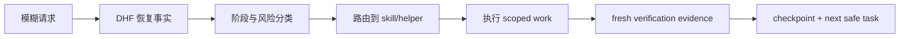
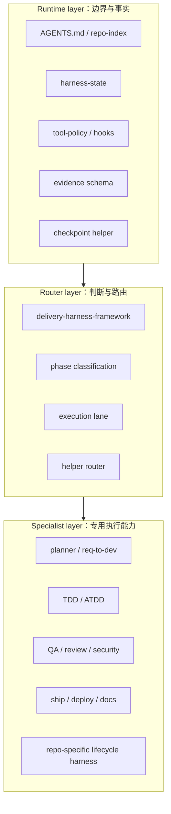
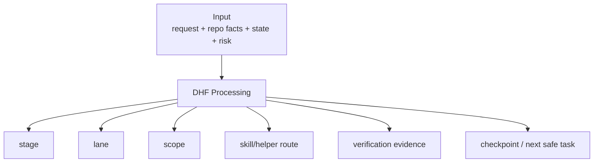
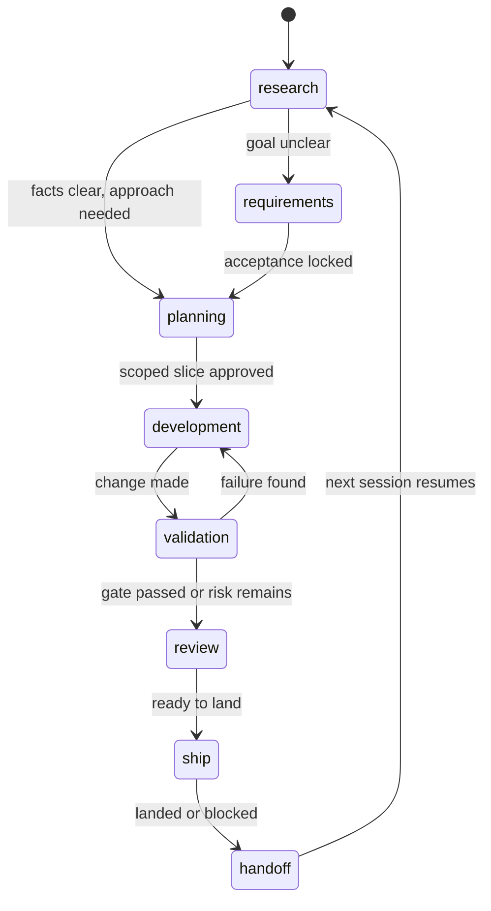
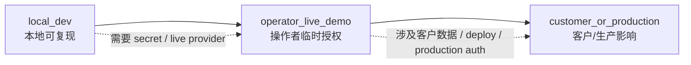
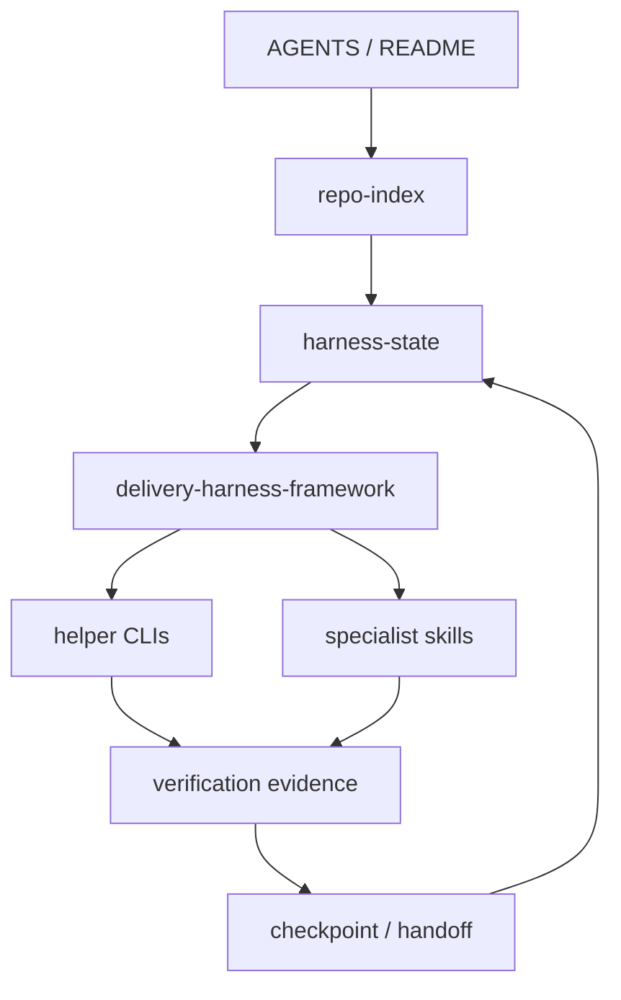

# Delivery Harness Framework 手册

> 从模糊请求到可验证交付。

## 阅读定位

这本手册用产品经理能理解的语言解释 Delivery Harness Framework
（DHF）：它为什么存在、它由哪些组件组成、一次任务如何被它从模糊输入推进到可验证交付。

这不是某个脚本的参数说明，也不是一份面向 agent 的内部提示词。它的目标读者是：

- 产品经理：判断一次 agent 交付是否真的可信。
- Tech Lead / Engineering Manager：理解阶段、权限、验证和交接如何降低协作风险。
- Agent 使用者：知道什么时候该进入需求、计划、开发、验证、review、发布或 handoff。

一句话定义：

**DHF 把“帮我做这个”变成“已读哪些事实、当前处于哪个阶段、谁负责执行、怎样验证、下一次如何接手”。**

## 手册结构

1. 为什么需要 DHF
2. DHF 是什么
3. DHF 的产品模型
4. DHF 如何判断现在在哪一步
5. DHF 如何判断风险有多高
6. DHF 的关键组件
7. DHF 如何把模糊请求变成可交付任务
8. Skill Routing：什么时候用哪个 skill
9. 验证与证据：DHF 如何定义完成
10. 多 Agent 协作：什么时候可以并行
11. Checkpoint 与 Handoff
12. 完整案例
13. DHF 采用指南
14. 附录

---

## 1. 为什么需要 DHF

Agentic engineering 的真正难点不是“模型会不会写代码”，而是“模型能不能稳定地交付一个可恢复、可验证、可审计的结果”。当一个任务跨越多轮对话、多个文件、多个 skill、多个外部系统时，单靠聊天上下文会很快失效。

### 1.1 没有 DHF 时，常见失败模式

| 失败模式 | 表面现象 | 对交付的影响 | DHF 的对应机制 |
| --- | --- | --- | --- |
| 记忆不可靠 | agent 依赖上一轮印象，没有重新读 repo 状态 | 做错分支、覆盖用户改动、沿用过期结论 | `harness_recover.py`、`docs/harness-state.md`、source-of-truth 顺序 |
| 请求太模糊 | “帮我修一下”直接进入实现 | 范围膨胀，验收标准不清 | requirements gate、`harness_requirements.py` |
| 工具太多 | 不知道该用 planner、TDD、QA、security 还是 ship | 工作流跳步，风险误判 | `delivery-harness-framework` lifecycle routing |
| 完成不可审计 | 只说“修好了”“测试通过了” | 无法判断是否 fresh、是否覆盖目标 | evidence gate：`command`、`exit_code`、`key_output`、`timestamp` |
| 下次无法接手 | 新会话不知道当前 phase 和 next step | 每次重启都重新考古 | checkpoint 和 handoff contract |

### 1.2 DHF 的产品价值

DHF 的核心价值不是让 agent 更“努力”，而是让 agent 的工作变得可管理。它把一次交付拆成可观察的产品状态：

- 当前事实是什么？
- 当前阶段是什么？
- 当前风险 lane 是什么？
- 哪个组件应该接手？
- 什么证据能证明完成？
- 下一次从哪里继续？

这让 PM 和工程负责人不必相信一句“done”，而是检查一组明确证据。

### 1.3 图：从失控任务到可管理交付

---

## 2. DHF 是什么

DHF 不是一个单点工具。它是一套围绕 agent 工作的交付系统，由三层组成：

1. Runtime layer：提供边界和运行时事实。
2. Router layer：判断当前任务应该走哪条路。
3. Specialist layer：由专用 skill、repo harness 或 helper 完成具体工作。

### 2.1 三层架构

### 2.2 Runtime layer：让 agent 有边界

Runtime layer 回答的问题是：**什么是当前 repo 的事实，什么动作被允许，什么证据能被记录。**

典型组件：

- `docs/repo-index.md`：低 token 的项目地图。
- `docs/harness-state.md`：append-only 状态、checkpoint 和 next safe task。
- `docs/HARNESS_RUNTIME.md`：生命周期、权限、证据、checkpoint、subagent 合同。
- `codex/runtime/tool-policy.json`：按阶段定义工具和权限。
- `codex/hooks/*`：在工具调用前后做 guard、observer 和 model routing。
- `codex/runtime/evidence.schema.json`：定义 evidence 事件结构。

产品视角下，这一层相当于“交付操作系统”：它不直接写功能，但它规定工作怎么被观察、限制和恢复。

### 2.3 Router layer：让 agent 先判断再行动

Router layer 的核心是 `delivery-harness-framework` skill。它回答：

- 这是 research、requirements、planning、development、validation、review、ship 还是 handoff？
- 当前是 local-only，还是 live demo，还是 customer/production？
- 是否需要先读 state、requirements、ADR 或 repo-specific harness？
- 是否应该调用 planner、TDD、QA、security、ship、doc-updater 或 committee-review-loop？

产品视角下，这一层相当于“任务分诊台”：它防止 agent 把所有问题都当成“马上改代码”。

### 2.4 Specialist layer：让正确专家接手

Specialist layer 做具体工作：

- `planner`：把目标、范围、风险和验证方式拆清楚。
- `tdd-guide` / `atdd-guide`：把行为变化先转成测试。
- `verification-loop`：交付前跑验证。
- `gstack-qa` / `gstack-qa-only`：做浏览器和用户体验验证。
- `security-reviewer` / `gstack-cso`：处理安全、权限、隐私。
- `gstack-ship` / `gstack-land-and-deploy`：处理发布、PR、部署。
- `doc-updater` / `visual-explainer`：更新文档与可视化说明。
- repo-specific lifecycle harness：处理项目自己的路径、命令、fixtures、部署拓扑和业务边界。

产品视角下，这一层相当于“专家团队”：DHF 不要求一个 skill 解决所有事，而是让合适的专家在合适阶段接手。

---

## 3. DHF 的产品模型

从产品模型看，DHF 是一个把“不确定输入”转成“可验证输出”的系统。

### 3.1 输入

DHF 的输入不只是用户的一句话。一次任务进入 DHF 后，至少会考虑这些信息：

- 用户请求：用户真正想完成什么。
- repo 事实：README、AGENTS、docs、测试、脚本、当前 git 状态。
- durable state：`docs/harness-state.md`、handoff、checkpoint。
- runtime 状态：hooks、policy、evidence schema、sandbox 可观测配置。
- 历史证据：本地 evidence summary、latest verification、conversion health。
- 风险信号：是否涉及 secret、remote、deploy、customer data、production。

### 3.2 处理

DHF 的处理过程可以理解成六个产品判断：

1. **恢复事实**：不能只相信聊天上下文，要回查 repo 和 state。
2. **判断阶段**：当前最应该做 research、requirements、planning，还是开发和验证。
3. **判断 lane**：这是 local_dev、operator_live_demo，还是 customer_or_production。
4. **选择组件**：路由到 helper、planner、TDD、QA、security、ship 或 repo harness。
5. **定义完成**：明确哪个 command、exit code、key output 和 timestamp 能证明完成。
6. **保存可恢复状态**：用 checkpoint/handoff 记录下一次如何继续。

### 3.3 输出

DHF 输出的不是“模型回复”，而是一组可审计交付字段：

- lifecycle stage
- execution lane
- dirty worktree classification
- source-of-truth files read
- selected skill/helper
- scope and out-of-scope
- verification gate
- failure modes
- blocker or approval needs
- next safe task

### 3.4 图：DHF 输出合同

### 3.5 PM 如何验收 DHF 输出

PM 不需要读懂每一行代码，但需要检查交付是否回答了五个问题：

1. 这次工作的目标和边界是否明确？
2. agent 是否基于当前 repo 事实行动？
3. 是否选择了正确的阶段和风险 lane？
4. 是否有 fresh verification evidence？
5. 下一次是否能从 checkpoint 或 handoff 继续？

如果任何一个答案缺失，这次交付还不能算真正完成。

---

## 4. DHF 如何判断现在在哪一步

DHF 的第一件事不是执行，而是判断当前任务处于哪个生命周期阶段。这个判断决定了 agent 应该读什么、能不能写文件、是否需要用户确认，以及完成时需要什么证据。

### 4.1 八个标准阶段

| 阶段 | 何时进入 | PM 能期待的输出 | 默认边界 |
| --- | --- | --- | --- |
| `research` | repo、需求或现状不清楚 | 事实清单、source-of-truth、风险提示 | 只读 |
| `requirements` | 目标、范围、验收标准不清楚 | 需求 artifact、验收标准、out of scope | 只读 |
| `planning` | 需要决定架构、切片、测试或 rollout | 实施计划、风险、验证门禁 | 默认只读 |
| `development` | 范围和验收已经足够明确 | scoped code/docs change | 只改授权范围 |
| `validation` | 已有改动，需要证明结果 | fresh verification evidence | 不继续扩大范围 |
| `review` | 接近合并或交付，需要找风险 | findings、缺口、可接受风险 | 默认只读 |
| `ship` | 需要 commit、push、PR、merge、deploy | 发布动作和回滚/验证记录 | 只做明确请求的发布动作 |
| `handoff` | 任务告一段落或需要跨会话恢复 | checkpoint、next safe task | 只更新状态/文档 |

关键点：阶段越早，越强调读事实和定义问题；阶段越晚，越强调验证、审计和交接。DHF 不鼓励 agent 从一句模糊请求直接跳到 `development`。

### 4.2 阶段判断的常见信号

DHF 会看这些信号：

- 用户是否给了明确目标和验收标准。
- repo 当前是否 clean，是否有未知来源的改动。
- durable state 是否有 next safe task。
- 是否涉及外部系统、secret、远程服务、customer data 或 deploy。
- 是否已经有可运行的测试或验证命令。
- 这次工作是否只是文档/config，还是会改变用户可见行为。

如果信号冲突，DHF 会选择更早、更保守的阶段。例如用户说“直接修”，但 repo state 显示有未解释的 dirty files，DHF 应先停在 research/recovery，而不是直接覆盖文件。

### 4.3 生命周期状态机

### 4.4 PM 如何使用阶段判断

PM 不需要记住所有 hook 或 helper，只需要看 agent 是否说清楚：

1. 当前阶段是什么。
2. 为什么不是另一个阶段。
3. 当前阶段允许做什么。
4. 进入下一阶段的证据是什么。

如果 agent 没有说明阶段，却已经开始改代码、push 或 deploy，这是一个流程风险。

## 5. DHF 如何判断风险有多高

DHF 把生命周期阶段和风险 lane 分开处理。阶段回答“现在在做什么”，lane 回答“这件事可能影响谁”。同样是 `development`，本地 fixture 开发和生产数据库迁移不是同一个风险级别。

### 5.1 三条 execution lane

| Lane | 含义 | 允许的默认动作 | 典型禁止事项 |
| --- | --- | --- | --- |
| `local_dev` | 本地、fixture、fake provider、静态文档或本地测试 | 读写 repo、跑本地测试、生成本地 artifact | 不读 secret、不改远程、不碰客户数据 |
| `operator_live_demo` | 操作者临时授权的 live demo 或 capture | 明确授权下使用本机凭据或临时输出 | 不扩大到生产权限，不把 raw capture 直接提交 |
| `customer_or_production` | 客户、生产、部署、真实数据或远程基础设施 | 只有 readiness gate 和明确 approval 后才能执行 | 不隐式 deploy，不绕过 IAM/rollback/smoke |

### 5.2 风险阶梯

### 5.3 什么时候必须升级 lane

这些信号出现时，不能再把任务当作 `local_dev`：

- 需要读取 token、OAuth、cookie、SSH key、API key 或本机 secret。
- 要调用 live Gmail、GitHub、Cloud、database、payment、CRM 等真实外部系统。
- 要写远程仓库、创建 PR、merge、deploy 或修改生产配置。
- 输入或输出包含客户文件、PII、未脱敏 provider capture。
- 用户希望把本地 demo 变成公开页面、客户可用版本或生产流程。

lane 升级不是禁止工作，而是要求更强的前置条件：owner、环境、凭据、权限、数据边界、rollback、smoke/canary 和明确 approval。

### 5.4 PM 如何判断风险声明是否足够

一个合格的 DHF 风险声明至少包含：

- 当前 lane。
- 允许使用的外部系统。
- 明确禁止的动作。
- 什么条件会触发 lane 升级。
- 如果需要 approval，approval 的对象和范围是什么。

## 6. DHF 的关键组件

DHF 由多个组件协作。产品上可以把它理解成“状态、规则、执行、证据”四类能力。

### 6.1 组件责任矩阵

| 组件 | 位置 | 主要责任 | PM 关心的问题 |
| --- | --- | --- | --- |
| Repo instructions | `AGENTS.md`、README、repo docs | 定义本仓库导航、验证入口和高风险区 | agent 有没有先读本仓库规则 |
| Repo index | `docs/repo-index.md` | 低 token source-of-truth 地图 | 新会话能不能快速定位事实 |
| Harness state | `docs/harness-state.md` | append-only phase、latest verification、next safe task | 下次能不能接上 |
| Runtime contract | `docs/HARNESS_RUNTIME.md` | 生命周期、权限、证据、checkpoint、agent team 合同 | 规则是否稳定且可审计 |
| Tool policy | `codex/runtime/tool-policy.json` | 按阶段约束工具和权限 | 不同阶段是否有不同边界 |
| Hooks | `codex/hooks/*` | guard、observer、model routing | 工具调用是否被运行时观察和限制 |
| Evidence schemas | `codex/runtime/evidence*.json` | 定义 verification、decision、routine receipt 结构 | 证据能否被机器校验 |
| Helper CLIs | `scripts/harness_*.py` | recover、probe、checkpoint、report、requirements validation | 是否有 repo-native 验证入口 |
| Skills | `codex/skills/*`、`~/.codex/skills/*` | 生命周期路由和专项执行能力 | 是否用对了专家能力 |

### 6.2 最小可用 DHF

不是每个 repo 一开始都需要完整 hooks 和 evidence schema。一个最小可用 DHF 可以从四件事开始：

1. `AGENTS.md`：告诉 agent 本仓库怎么工作。
2. `docs/repo-index.md`：告诉 agent 先读哪些事实。
3. `docs/harness-state.md`：告诉下一次从哪里继续。
4. 一个明确验证入口：例如 `python3 test_runner.py`。

当任务开始涉及多会话、并行 agent、runtime guard、CI、生产发布或审计要求，再逐步加入 policy、hooks、helper CLIs 和 evidence schema。

### 6.3 组件之间如何配合

这条链路的产品意义是：每一次交付都能被恢复、解释、验证，并且不会只存在于聊天记录里。

## 7. DHF 如何把模糊请求变成可交付任务

DHF 处理模糊请求时，不会假设用户已经给出了完整任务规格。它会把“帮我做这个”拆成可执行的交付链。

### 7.1 标准转化流程

| 步骤 | DHF 做什么 | 产物 |
| --- | --- | --- |
| 1. 接收请求 | 识别用户想要的 outcome，而不是只复述文字 | 初始目标 |
| 2. 恢复事实 | 读取 AGENTS、repo-index、harness-state、git status、env probe | 当前事实快照 |
| 3. 判断阶段和 lane | 决定是否先 research/requirements/planning，还是能 development | stage + lane |
| 4. 锁定范围 | 明确 changed surfaces、out of scope、failure modes | scope contract |
| 5. 路由专家 | 选择 helper、planner、TDD、QA、review、ship、docs 等 | workflow route |
| 6. 执行 scoped work | 只做当前 slice 需要的改动 | repo diff |
| 7. 验证 | 运行 fresh gate，不复用旧结果 | command / exit_code / key_output / timestamp |
| 8. 交接 | checkpoint 记录发生了什么和下一步 | next safe task |

### 7.2 示例：一句模糊请求如何被收敛

用户说：“把这个计划落地，然后告诉我下一步。”

DHF 不应直接开始大范围修改，而应收敛成：

- 当前阶段：`development` 或 `validation`，取决于计划是否已经决策完整。
- lane：通常是 `local_dev`，除非涉及 remote、secret、deploy 或客户数据。
- 范围：本次只落地计划中第一个可验证 slice。
- 验证：focused test + repo full gate + `git diff --check`。
- checkpoint：写明已落地内容、验证输出和下一步。
- 下一步：不是“继续优化”，而是一个可执行 task，例如“观察第一条 CI run”或“清理已合入的 stale branches”。

### 7.3 为什么要保留 out of scope

模糊请求最容易失败的地方，是 agent 把“顺手能做的事”也纳入当前任务。DHF 要求显式写出 out of scope，例如：

- 不读取 secret。
- 不部署。
- 不删除未合入分支。
- 不修改无关文档。
- 不把本地验证说成线上验证。

out of scope 不是保守主义，而是保护交付可信度：一个小 slice 只要能被验证，就比一个大而不可审计的“完成”更可靠。

## 8. Skill Routing：什么时候用哪个 skill

Skill routing 的目标是让 agent 用正确的工作流，而不是把所有任务都变成“读文件、改文件、跑测试”。不同问题需要不同专家。

### 8.1 PM 可读 routing 表

| 任务类型 | 首选 route | 典型输出物 | 验证方式 |
| --- | --- | --- | --- |
| 事实不清、状态不明 | `delivery-harness-framework` recovery | 当前 phase、dirty state、next safe task | `harness_recover.py`、`git status` |
| 需求不清 | `planner`、`req-to-dev`、requirements gate | 目标、验收、out of scope、任务切片 | requirements validator 或计划 review |
| 行为改动 | `tdd-guide`、`atdd-guide` | failing test、implementation、green test | focused test + full gate |
| UI/浏览器体验 | `gstack-qa` / browser QA | smoke result、截图/console/network 证据 | browser smoke + key interactions |
| 安全/隐私/secret | `security-reviewer` / `gstack-cso` | 风险发现、边界、缓解方案 | security checklist / targeted tests |
| PR 或 diff review | `review` / code review workflow | findings 或 no-issue statement | file/line grounded review |
| 发布、merge、deploy | `ship` / land-deploy workflow | commit、PR、merge、deploy evidence | release gate + rollback/smoke |
| 文档和可视化 | `doc-updater` / `visual-explainer` | docs、diagram、public explanation | link/path consistency + diff check |
| 多 agent 并行 | `harness_agent_team.py` + subagent workflow | worker scopes、write sets、reports | agent team validator + integrator gate |
| 显式委员会评分 | `committee-review-loop` | review score、revision loop、final artifact | target score + verification gate |

### 8.2 Routing 的两个常见误区

误区一：把所有任务都交给 TDD。
TDD 适合行为变化，但不适合一开始就解决需求模糊、产品边界、发布 readiness 或安全授权问题。

误区二：把所有问题都升级给大型 planning。
如果只是小的 docs/config change，最小 gate 可能只是 link/path consistency、`check_surfaces.py` 和 `git diff --check`。DHF 要求 gate 和任务需求匹配，而不是流程越重越好。

### 8.3 Routing 的验收问题

PM 可以用三个问题判断 routing 是否正确：

1. 这个 skill 是否解决当前阶段的问题？
2. 这个 skill 的输出是否能被验证？
3. 如果任务失败，是否能从输出中知道下一步该做什么？

如果答案是否定的，说明 routing 需要回到 DHF 重新判断。

## 9. 验证与证据：DHF 如何定义完成

本章待扩写。核心字段：

- `command`
- `exit_code`
- `key_output`
- `timestamp`

建议图表：Verification Evidence Card。

## 10. 多 Agent 协作：什么时候可以并行

本章待扩写。重点解释 write set、role、scope、verification command、durable brief 和 integrator ownership。

## 11. Checkpoint 与 Handoff

本章待扩写。重点解释 checkpoint 不是总结，而是下一次会话的恢复入口。

## 12. 完整案例

本章待扩写。建议至少包含三个案例：

- 文档导航修复。
- 小功能实现。
- 高风险 release/deploy 请求。

每个案例按 why / what / how / evidence / handoff 展开。

## 13. DHF 采用指南

本章待扩写。建议拆成四个成熟度：

1. Manual：只有 AGENTS 和 README。
2. Assisted：加入 repo-index 和 harness-state。
3. Governed：加入 policy、hooks、helper CLIs。
4. Observable：加入 evidence、report、checkpoint 和 public docs。

## 14. 附录

本章待扩写：

- 术语表。
- 生命周期速查。
- helper CLI 速查。
- skill routing 速查。
- PM 验收清单。
