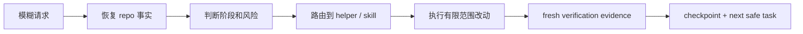
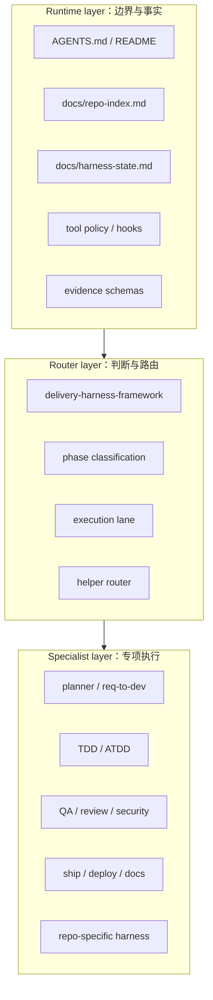
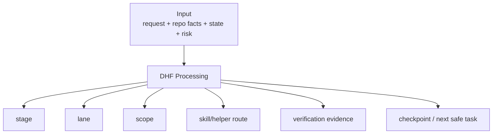
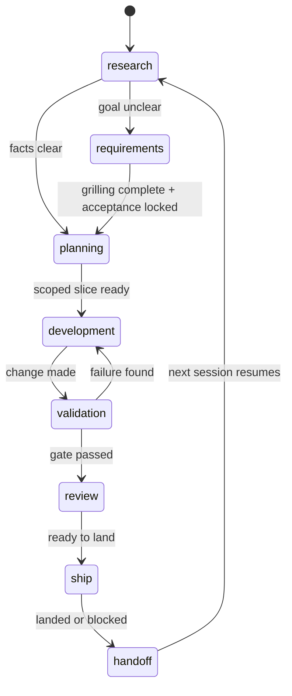
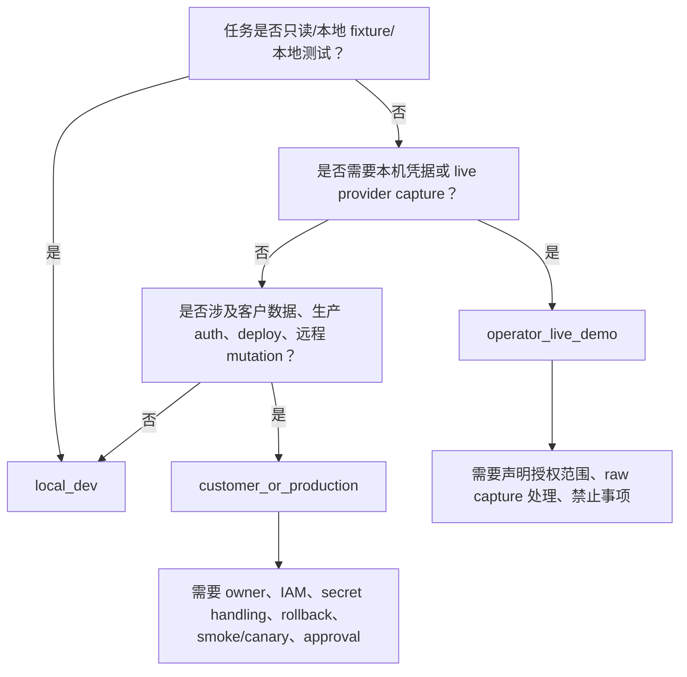
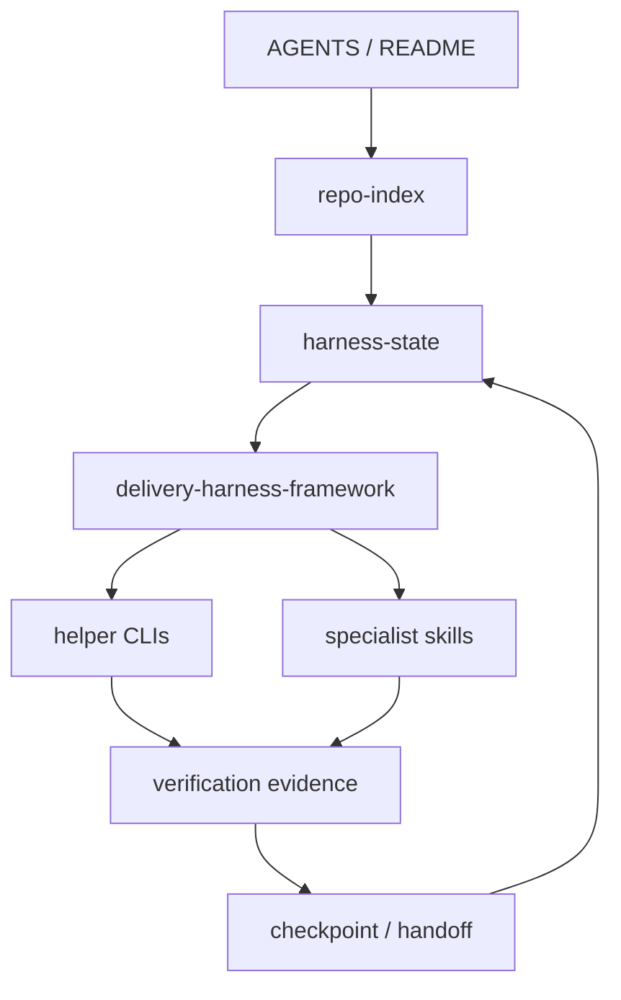
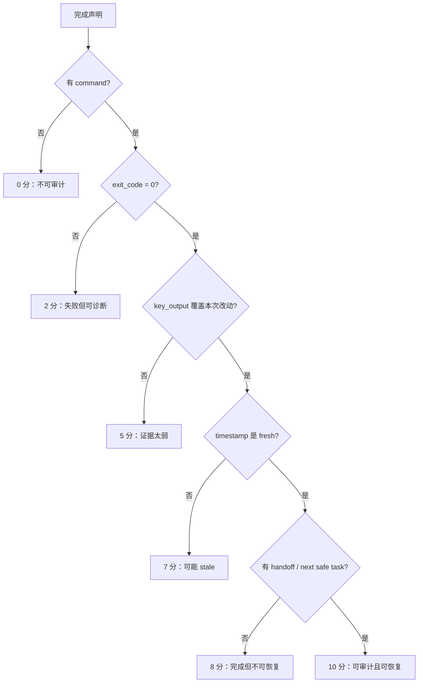
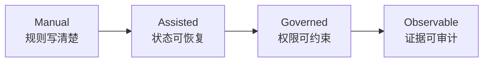

# Delivery Harness Framework 手册

> 一套把模糊请求变成可验证交付的工程工作法。

## 写在前面

当 agent 声称“完成”时，先检查四件事：目标是否清楚、事实是否最新、验证是否可审计、下一步是否可恢复。DHF 就是围绕这四件事设计的交付框架。

Delivery Harness Framework，简称 DHF。它要解决的不是“模型会不会写代码”这个单点问题，而是一个更实际的问题：

**当一个任务跨越多轮会话、多个文件、多个 skill、多个验证命令时，我们如何让交付仍然可恢复、可验证、可审计。**

一句话定义：

**DHF 把“帮我做这个”变成“目标是什么、事实读了哪些、现在处于哪个阶段、由谁执行、怎样验证、下一次如何接手”。**

## Choose Your Path

| 目标 | 先读 | 你会得到什么 |
| --- | --- | --- |
| 快速判断一次 agent 交付是否可信 | Concepts：第 1、3、5、9 章 | 风险、证据、完成可信度评分卡 |
| 在一个 repo 里开始接入 DHF | How-to / Playbooks：第 7、11、13 章 | Day 1 路径、checkpoint、采用决策表 |
| 组织多 agent 或 review loop | Playbooks：第 8、10、12 章 | skill routing、agent team gate、贯穿案例 |
| 查询命令、术语和检查清单 | Reference：第 14 章 | helper CLI、术语表、PM 最终验收清单 |

## Diátaxis 导航

| 类型 | 章节 | 用途 |
| --- | --- | --- |
| Concepts | 第 1-6 章 | 解释 DHF 为什么存在、由什么组成、如何判断阶段和风险 |
| How-to | 第 7、9、11 章 | 把模糊请求转成任务、验证完成、写 checkpoint |
| Playbooks | 第 8、10、12、13 章 | 选择 skill、多 agent 协作、完整案例、团队采用 |
| Reference | 第 14 章 | 术语、阶段、helper CLI 和最终检查清单 |

## 读者路径

- PM 快读：读第 1、3、9、12、13 章，重点看“怎么判断交付可信”。
- Tech Lead 深读：读第 2、4、5、6、10、11 章，重点看 runtime、权限、agent team 和 checkpoint。
- Agent operator 操作读法：按第 7、8、9、11 章执行，重点看 helper、skill routing、evidence 和 next safe task。

## 贯穿案例

全书会反复使用同一个中等复杂度任务：

> 为 DHF 新增一份 PM 可读的中文手册，把它接入 README、repo index 和 surface manifest；用 committee review loop 评审修订；最后用 fresh verification 和 checkpoint 证明这次文档切片可以交接。

这个任务不涉及生产系统，但它已经足够展示 DHF 的关键能力：需求收敛、范围控制、manifest 一致性、评审循环、验证证据和 handoff。

## 全书结构

1. 为什么需要 DHF
2. DHF 是什么
3. DHF 的产品模型
4. DHF 如何判断现在在哪一步
5. DHF 如何判断风险有多高
6. DHF 的关键组件
7. DHF 如何把模糊请求变成可交付任务
8. Skill Routing：什么时候用哪个 skill
9. 验证与证据：DHF 如何定义完成
10. 多 Agent 协作：什么时候可以并行
11. Checkpoint 与 Handoff
12. 完整案例：新增并评审 DHF PM 手册
13. DHF 采用指南
14. 附录

---

## 1. 为什么需要 DHF

先看一个常见场景。

用户说：“把这个计划落地，然后告诉我下一步。”
agent 很快开始改文件、跑测试、总结“已经完成”。表面上看，事情推进得很快。但过几个小时再打开仓库，问题来了：

- 它到底读的是当前 repo 状态，还是上一轮聊天里的旧印象？
- 它有没有覆盖别人留下的未提交改动？
- 它为什么直接进入开发，而不是先确认需求？
- 它说测试通过了，具体是哪条命令？什么时候跑的？输出是什么？
- 下一次会话从哪里继续？

换成贯穿案例也一样。用户说“使用资深中文工程博客风格重写 DHF 手册，并用 committee review loop 评审”。如果 agent 只改了几段文字，却没有说明不能模仿具体在世作者、没有补齐第 9-14 章、没有把 review 反馈落实到文档、没有 fresh evidence，那这次交付仍然不可信。

这就是 DHF 要解决的问题。它不是为了给流程增加仪式感，而是为了让 agent 的交付从“对话里的承诺”变成“仓库里可检查的事实”。

### 1.1 没有 DHF 时的失败模式

| 失败模式 | 表面现象 | 真实风险 | DHF 的对应机制 |
| --- | --- | --- | --- |
| 记忆不可靠 | agent 依赖上一轮印象 | 做错分支、沿用过期结论 | recovery、repo index、state file |
| 请求太模糊 | 直接进入实现 | 验收标准不清，范围膨胀 | requirements gate |
| 工具太多 | 不知道该用哪个 skill | 工作流跳步，风险误判 | lifecycle routing |
| 完成不可审计 | 只说“测试通过” | 无法判断证据是否新鲜 | evidence gate |
| 交接断裂 | 新会话重新考古 | 时间浪费，容易反复犯错 | checkpoint 和 next safe task |

### 1.2 DHF 带来的产品价值

DHF 的价值可以用四句话概括：

1. 让 agent 先恢复事实，再开始行动。
2. 让任务先进入正确阶段，而不是所有问题都直接改代码。
3. 让完成声明必须带证据，而不是靠语气判断。
4. 让下一次会话可以接手，而不是重新猜。

这对 PM 很重要。因为 PM 不需要理解每一行代码，但必须知道交付是否可信。DHF 把这个判断从“信任模型”变成“检查证据”。

### 1.3 图：从模糊请求到可管理交付



### 1.4 PM 检查项

- agent 是否说明当前阶段？
- agent 是否说明读了哪些 source of truth？
- agent 是否说明本次不做什么？
- agent 是否给出 `command`、`exit_code`、`key_output`、`timestamp`？
- agent 是否留下下一步安全任务？

---

## 2. DHF 是什么

DHF 不是一个脚本，也不是一个万能 skill。它更像一套 agent 交付系统，由三层组成：Runtime layer、Router layer、Specialist layer。

### 2.1 三层架构



### 2.2 Runtime layer：让工作有边界

Runtime layer 回答四个问题：

- 当前 repo 的事实在哪里？
- 当前阶段允许什么动作？
- 什么动作应该被阻断或要求确认？
- 交付证据按什么格式记录？

它包含 `AGENTS.md`、`docs/repo-index.md`、`docs/harness-state.md`、`docs/HARNESS_RUNTIME.md`、`codex/runtime/tool-policy.json`、hooks 和 evidence schemas。

工程取舍是：Runtime layer 不直接替 agent 做判断，但它提供足够硬的边界。这样 agent 可以灵活执行，但不能把高风险操作伪装成普通本地改动。

### 2.3 Router layer：让行动前先分诊

Router layer 的核心是 `delivery-harness-framework`。它不负责所有细节，而是先判断：

- 当前是 research、requirements、planning、development、validation、review、ship 还是 handoff？
- 当前 lane 是 local_dev、operator_live_demo，还是 customer_or_production？
- 应该用哪个 helper？
- 应该交给哪个 specialist skill？

这层的产品意义很直接：**别让 agent 把所有任务都当成“马上改代码”。**

### 2.4 Specialist layer：让专家做专家的事

Specialist layer 包括：

- `planner`：需求、架构、任务拆解、风险。
- `tdd-guide` / `atdd-guide`：行为变化和验收测试。
- `verification-loop`：交付前验证。
- `gstack-qa` / `gstack-qa-only`：浏览器和用户体验验证。
- `security-reviewer` / `gstack-cso`：安全、权限、隐私。
- `gstack-ship` / `gstack-land-and-deploy`：发布、PR、部署。
- `doc-updater` / `visual-explainer`：文档和可视化。
- repo-specific harness：项目自己的路径、命令、fixtures、部署拓扑和业务边界。

好的框架不应该让一个工具做所有事情。DHF 的做法是：先判断问题类型，再找正确的专家。

### 2.5 PM 检查项

- 当前任务是否已经被分到明确层级？
- runtime 事实和 specialist 能力是否混在了一起？
- 项目专属命令是否放在 repo-specific harness，而不是写进通用 DHF？
- 复杂工作是否先路由，再执行？

---

## 3. DHF 的产品模型

从产品模型看，DHF 是一个把“不确定输入”转成“可验证输出”的系统。

### 3.1 输入

DHF 的输入不只是一句话。它会同时看：

- 用户请求：用户希望达成的 outcome。
- repo 事实：README、AGENTS、docs、测试、脚本、git status。
- durable state：`docs/harness-state.md`、handoff、checkpoint。
- runtime 状态：hooks、policy、evidence schema、sandbox 可观测配置。
- 历史证据：latest verification、evidence summary、conversion health。
- 风险信号：secret、remote、deploy、customer data、production。

在贯穿案例里，输入不是“重写手册”四个字。真实输入包括当前手册草稿、README 和 repo index 的导航状态、`docs/surfaces.json` 的 manifest 规则、committee 的评分结果，以及本次只允许修改文档而不触碰 runtime hook 的边界。

### 3.2 处理

DHF 的处理可以拆成六个判断：

1. 恢复事实：当前 repo 到底是什么状态？
2. 判断阶段：现在该读、该问、该计划、该开发，还是该验证？
3. 判断 lane：这次工作会不会触碰 live 系统或客户数据？
4. 选择组件：用 helper、planner、TDD、QA、security、ship，还是 repo harness？
5. 定义完成：什么命令和输出能证明完成？
6. 保存状态：下一次如何继续？

### 3.3 输出

合格的 DHF 输出至少包含：

- lifecycle stage
- execution lane
- dirty worktree classification
- source-of-truth files read
- selected skill/helper
- scope and out-of-scope
- verification gate
- failure modes
- blocker or approval needs
- next safe task

落到贯穿案例，合格输出应该说清楚：当前 phase=`development`，随后进入 phase=`review`；lane 是 `local_dev`；改动面是手册 Markdown 和必要导航；验证 gate 是 `check_surfaces.py`、`git diff --check`、`test_runner.py`；committee rating 是否达标；下一步是否还需要继续修订。

### 3.4 图：DHF 输出合同



### 3.5 PM 检查项

- 目标是否被翻译成可验收 outcome？
- 是否明确了本次范围和不做范围？
- 输出是否能支持下一次会话恢复？
- “完成”是否对应一条 fresh evidence，而不是一句描述？

---

## 4. DHF 如何判断现在在哪一步

DHF 的第一件事不是执行，而是判断当前任务处于哪个生命周期阶段。阶段判断决定了 agent 应该读什么、能不能写文件、是否需要用户确认，以及完成时需要什么证据。

### 4.1 八个标准阶段

| 阶段 | 何时进入 | PM 能期待的输出 | 默认边界 |
| --- | --- | --- | --- |
| `research` | repo、需求或现状不清楚 | 事实清单、source-of-truth、风险提示 | 只读 |
| `requirements` | 目标、范围、验收标准不清楚 | grilling 问答、需求 artifact、验收标准、out of scope | 只读 |
| `planning` | 需要决定架构、切片、测试或 rollout | 实施计划、风险、验证门禁 | 默认只读 |
| `development` | 范围和验收已经足够明确 | scoped code/docs change | 只改授权范围 |
| `validation` | 已有改动，需要证明结果 | fresh verification evidence | 不继续扩大范围 |
| `review` | 接近合并或交付，需要找风险 | findings、缺口、可接受风险 | 默认只读 |
| `ship` | 需要 commit、push、PR、merge、deploy | 发布动作和回滚/验证记录 | 只做明确请求的发布动作 |
| `handoff` | 任务告一段落或需要跨会话恢复 | checkpoint、next safe task | 只更新状态/文档 |

关键点：阶段越早，越强调读事实和定义问题；阶段越晚，越强调验证、审计和交接。

### 4.2 阶段判断的常见信号

DHF 会看这些信号：

- 用户是否给了明确目标和验收标准；如果没有，先用 `grilling` 逐题问清楚，而不是让 agent 补完空白。
- repo 当前是否 clean，是否有未知来源改动。
- durable state 是否有 next safe task。
- 是否涉及外部系统、secret、远程服务、customer data 或 deploy。
- 是否已经有可运行的测试或验证命令。
- 这次工作是文档/config，还是会改变用户可见行为。

如果信号冲突，DHF 选择更早、更保守的阶段。例如用户说“直接修”，但 repo state 显示有未解释的 dirty files，DHF 应先停在 research/recovery，而不是直接覆盖文件。

### 4.3 生命周期状态机



### 4.4 PM 检查项

- agent 是否说清楚当前阶段？
- 为什么不是另一个阶段？
- 当前阶段允许做什么？
- 进入下一阶段需要什么证据？

如果 agent 没有说明阶段，却已经开始 push、deploy 或读取 secret，这是流程风险。

---

## 5. DHF 如何判断风险有多高

阶段回答“现在在做什么”，lane 回答“这件事可能影响谁”。同样是 `development`，本地 fixture 开发和生产数据库迁移不是同一个风险级别。

### 5.1 三条 execution lane

| Lane | 含义 | 允许的默认动作 | 典型禁止事项 |
| --- | --- | --- | --- |
| `local_dev` | 本地、fixture、fake provider、静态文档或本地测试 | 读写 repo、跑本地测试、生成本地 artifact | 不读 secret、不改远程、不碰客户数据 |
| `operator_live_demo` | 操作者临时授权的 live demo 或 capture | 明确授权下使用本机凭据或临时输出 | 不扩大到生产权限，不把 raw capture 直接提交 |
| `customer_or_production` | 客户、生产、部署、真实数据或远程基础设施 | readiness gate 和明确 approval 后才能执行 | 不隐式 deploy，不绕过 IAM/rollback/smoke |

这里的 lane 是手册里的风险模型，用来帮助读者理解 DHF 的决策边界。具体 runtime policy 仍以 `codex/runtime/tool-policy.json`、hooks 和 repo-specific harness 为准。

### 5.2 Lane 升级决策树



### 5.3 必须升级 lane 的信号

- 需要读取 token、OAuth、cookie、SSH key、API key 或本机 secret。
- 要调用 live Gmail、GitHub、Cloud、database、payment、CRM 等真实外部系统。
- 要写远程仓库、创建 PR、merge、deploy 或修改生产配置。
- 输入或输出包含客户文件、PII、未脱敏 provider capture。
- 用户希望把本地 demo 变成公开页面、客户可用版本或生产流程。

### 5.4 工程取舍

lane 升级不是禁止工作，而是要求更强的前置条件。很多事故并不是因为开发者不知道风险，而是因为流程把风险当成普通步骤处理了。DHF 的做法是把风险显式写出来。

### 5.5 PM 检查项

- 当前 lane 是什么？
- 允许使用哪些外部系统？
- 明确禁止哪些动作？
- 什么条件会触发 lane 升级？
- 如果需要 approval，approval 的对象和范围是什么？

### 5.6 PM 如何判定 agent 没有越权

PM 不需要检查每一次工具调用，但要检查边界声明和事实是否一致：

- 如果 agent 声称是 `local_dev`，输出里不应出现 secret、live provider、deploy、remote mutation。
- 如果 agent 使用了外部系统，必须说明授权来源、作用范围和禁止事项。
- 如果 agent 创建 PR、push、merge 或 deploy，必须能解释为什么任务已经进入 `ship` 或 customer/production lane。
- 如果 agent 只跑了本地测试，不能把结果描述成线上验证。

对贯穿案例来说，agent 只应读写 repo 文档和运行本地验证。它不需要访问浏览器账号、云服务、GitHub Pages 发布后台或任何 secret。

---

## 6. DHF 的关键组件

DHF 由多个组件协作。产品上可以把它理解成四类能力：状态、规则、执行、证据。

### 6.1 组件责任矩阵

| 组件 | 位置 | 主要责任 | PM 关心的问题 |
| --- | --- | --- | --- |
| Repo instructions | `AGENTS.md`、README、repo docs | 定义导航、验证入口和高风险区 | agent 有没有先读本仓库规则 |
| Repo index | `docs/repo-index.md` | 低 token source-of-truth 地图 | 新会话能不能快速定位事实 |
| Harness state | `docs/harness-state.md` | append-only phase、latest verification、next safe task | 下次能不能接上 |
| Runtime contract | `docs/HARNESS_RUNTIME.md` | 生命周期、权限、证据、checkpoint、agent team 合同 | 规则是否稳定且可审计 |
| Tool policy | `codex/runtime/tool-policy.json` | 按阶段约束工具和权限 | 不同阶段是否有不同边界 |
| Hooks | `codex/hooks/*` | guard、observer、model routing、项目 preprompt | 工具调用是否被观察和限制 |
| Evidence schemas | `codex/runtime/evidence.schema.json`、`codex/runtime/evidence/*` | compatibility schema、decision schema、routine receipt schema | 证据能否被机器校验 |
| Evidence helper | `scripts/harness_evidence.py` | 验证并追加结构化 evidence | 证据是否先校验再写入 |
| Feedback helper | `scripts/harness_feedback.py` | 计算 conversion health | 是否能发现低效反馈循环 |
| Report helper | `scripts/harness_report.py` | 汇总本地 evidence | 是否有近期验证记录 |
| Recovery helper | `scripts/harness_recover.py` | 恢复 phase、dirty state、next safe task | 新会话是否能恢复 |
| Env probe | `scripts/harness_env_probe.py` | 观测 hooks、policy、schema、sandbox 字段 | runtime 是否与预期一致 |
| Requirements validator | `scripts/harness_requirements.py` | 校验需求 artifact | 需求是否可作为 source of truth |
| Agent team validator | `scripts/harness_agent_team.py` | 校验 role、scope、write set、green gate | 并行 agent 是否安全 |
| Checkpoint helper | `scripts/harness_checkpoint.py` | 追加 state checkpoint | 交接是否可恢复 |
| Runtime verifier | `scripts/verify_codex_env.sh` | 验证 Codex/Claude runtime sync | 本机 runtime 是否匹配 repo |

本地 evidence 默认写到 `~/.codex/harness/evidence/`，不进入 Git。repo-visible 的 `docs/harness-state.md` 只推广 compact decision summaries：phase、changed surfaces、verification、blockers、next safe task。这个边界很重要，否则 handoff 会被大量 routine tool calls 淹没。

### 6.2 最小可用 DHF

不是每个 repo 一开始都需要完整 hooks 和 evidence schema。一个最小可用 DHF 可以从四件事开始：

1. `AGENTS.md`：告诉 agent 本仓库怎么工作。
2. `docs/repo-index.md`：告诉 agent 先读哪些事实。
3. `docs/harness-state.md`：告诉下一次从哪里继续。
4. 一个明确验证入口：例如 `python3 test_runner.py`。

当任务开始涉及多会话、并行 agent、runtime guard、CI、生产发布或审计要求，再逐步加入 policy、hooks、helper CLIs 和 evidence schema。

### 6.3 组件协作图



### 6.4 PM 检查项

- 组件清单是否和 repo index 对齐？
- runtime 证据是否保存在本地 evidence，而不是写进 Git？
- public state 是否只保存可公开的阶段、验证和 handoff 事实？
- helper 是否先校验再写入？

---

## 7. DHF 如何把模糊请求变成可交付任务

DHF 处理模糊请求时，不假设用户已经给出完整任务规格。它会把“帮我做这个”拆成可执行的交付链。

### 7.1 标准转化流程

| 步骤 | DHF 做什么 | 产物 |
| --- | --- | --- |
| 1. 接收请求 | 识别用户想要的 outcome | 初始目标 |
| 2. 恢复事实 | 读取 AGENTS、repo-index、CONTEXT、harness-state、git status、env probe | 当前事实快照 |
| 3. 判断阶段和 lane | 决定先 research/requirements/planning，还是能 development | stage + lane |
| 4. 先 grilling | 需求、验收或术语不清时一次只问一个问题；能查 repo 的问题不问人 | open_questions_resolved |
| 5. 锁定范围 | 明确 changed surfaces、out of scope、failure modes | scope contract |
| 6. 路由专家 | 选择 helper、planner、TDD、QA、review、ship、docs | workflow route |
| 7. 执行 scoped work | 只做当前 slice 需要的改动 | repo diff |
| 8. 验证 | 运行 fresh gate，不复用旧结果 | command / exit_code / key_output / timestamp |
| 9. 交接 | checkpoint 记录发生了什么和下一步 | next safe task |

### 7.2 贯穿案例如何收敛

用户说：“使用资深中文工程博客风格重写 DHF 手册，并用 committee review loop 评审。”

DHF 会把它收敛成：

- 当前阶段：`development` + `review`，因为要先改手册，再根据 committee 评分修订。
- lane：`local_dev`，因为不需要外部系统和 secret。
- 范围：`docs/delivery-harness-framework-manual-cn.md`，必要时同步 README、repo-index、surface manifest。
- out of scope：不部署、不改 runtime hook、不读取本地凭据、不直接模仿具体在世作者。
- 验证：`check_surfaces.py --check-public-nav`、`git diff --check`、`test_runner.py`。
- review gate：committee rating 达到目标，或明确留下 must-fix。
- handoff：记录评分、验证输出、剩余 blocker 和 next safe task。

这就是 DHF 的基本工作方式：把一句自然语言请求变成一组可检查的工程动作。

### 7.3 为什么要保留 out of scope

模糊请求最容易失败的地方，是 agent 把“顺手能做的事”也纳入当前任务。DHF 要求显式写出 out of scope，例如：

- 不读取 secret。
- 不部署。
- 不删除未合入分支。
- 不修改无关文档。
- 不把本地验证说成线上验证。

out of scope 不是保守主义，而是保护交付可信度。一个小 slice 只要能被验证，就比一个大而不可审计的“完成”更可靠。

### 7.4 PM 检查项

- 模糊请求是否被转成 outcome？
- 是否有 scope 和 out of scope？
- 是否说明为什么当前 gate 足够？
- 是否避免把 local proof 说成 public/production proof？

---

## 8. Skill Routing：什么时候用哪个 skill

Skill routing 的目标是让 agent 用正确的工作流，而不是把所有任务都变成“读文件、改文件、跑测试”。不同问题需要不同专家。

### 8.1 PM 可读 routing 表

| 任务类型 | 首选 route | 典型输出物 | 验证方式 |
| --- | --- | --- | --- |
| 事实不清、状态不明 | `delivery-harness-framework` recovery | 当前 phase、dirty state、next safe task | `harness_recover.py`、`git status` |
| 需求不清 | `grilling` → `planner` / `req-to-dev` → requirements gate | 目标、验收、out of scope、open_questions_resolved、任务切片 | requirements validator 或计划 review |
| 行为改动 | `tdd-guide`、`atdd-guide` | failing test、implementation、green test | focused test + full gate |
| UI/浏览器体验 | `gstack-qa` / browser QA | smoke result、截图/console/network 证据 | browser smoke + key interactions |
| 安全/隐私/secret | `security-reviewer` / `gstack-cso` | 风险发现、边界、缓解方案 | security checklist / targeted tests |
| PR 或 diff review | `gstack-review` / code review workflow | findings 或 no-issue statement | file/line grounded review |
| 发布、merge、deploy | `gstack-ship` / `gstack-land-and-deploy` | commit、PR、merge、deploy evidence | release gate + rollback/smoke |
| 文档和可视化 | `doc-updater` / `visual-explainer` | docs、diagram、public explanation | link/path consistency + diff check |
| 多 agent 并行 | `harness_agent_team.py` + subagent workflow | worker scopes、write sets、reports | agent team validator + integrator gate |
| 显式委员会评分 | `committee-review-loop` | review score、revision loop、final artifact | target score + verification gate |

### 8.2 两个常见误区

误区一：把所有任务都交给 TDD。
TDD 适合行为变化，但不适合一开始就解决需求模糊、产品边界、发布 readiness 或安全授权问题。

误区二：把所有问题都升级给大型 planning。
如果只是小的 docs/config change，最小 gate 可能只是 link/path consistency、`check_surfaces.py` 和 `git diff --check`。DHF 要求 gate 和任务需求匹配，而不是流程越重越好。

### 8.3 PM 检查项

- 这个 skill 是否解决当前阶段的问题？
- 这个 skill 的输出是否能被验证？
- 如果任务失败，是否能从输出中知道下一步？

如果答案是否定的，说明 routing 需要回到 DHF 重新判断。

---

## 9. 验证与证据：DHF 如何定义完成

“完成”是 agentic engineering 里最容易被滥用的词。DHF 对完成的要求很朴素：必须有 fresh evidence。

### 9.1 四个必填字段

任何完成、修复、通过的结论，都必须带上：

| 字段 | 含义 | 例子 |
| --- | --- | --- |
| `command` | 实际运行的命令 | `python3 test_runner.py` |
| `exit_code` | 命令退出码 | `0` |
| `key_output` | 能证明结果的关键输出 | `ran=57 passed=57 skipped=0 failed=0` |
| `timestamp` | 运行时间 | `2026-06-09T10:53:06-04:00` |

缺少任何一个字段，都只能说“未完成验证”，不能说“通过”。

### 9.2 Evidence kind

DHF 当前把 evidence 分成三类：

- `decision`：状态、handoff、approval、guardrail、agent-team validation 等决策证据。
- `routine`：测试结果、browser smoke、普通工具调用、常规 subagent report。
- `unknown`：旧本地 JSONL 事件的兼容读法，新写入不应依赖它。

这个拆分的意义是：handoff 不应被大量 routine tool call 淹没。下一次恢复时，agent 应优先看到最新决策，而不是一长串普通命令。

### 9.3 Verification Evidence Card

```text
verification:
  command: python3 test_runner.py
  exit_code: 0
  key_output: ran=57 passed=57 skipped=0 failed=0; [PASS] all tests
  timestamp: 2026-06-09T10:53:06-04:00
```

### 9.4 PM 完成可信度评分卡



在贯穿案例里，committee 评分不是 verification 的替代品。它证明文本质量；`test_runner.py` 和 `check_surfaces.py` 才证明仓库一致性。两类证据要一起看。下面的 verification block 是 example evidence，用来展示证据格式；当前交付仍必须重新跑 fresh verification。

### 9.5 工程取舍

不是所有任务都需要跑全量测试。文档链接改动可以先跑 `check_surfaces.py` 和 `git diff --check`；runtime policy 或 helper 改动就应跑 `test_runner.py` 和相关 sync/probe。DHF 强调的是“gate 与风险匹配”，不是“每次都用最重流程”。

### 9.6 PM 检查项

- 验证是否 fresh？
- key_output 是否能支撑结论？
- gate 是否覆盖本次改动面？
- 如果没有跑某个更重 gate，原因是否合理？
- 是否把本地验证和线上验证区分清楚？

---

## 10. 多 Agent 协作：什么时候可以并行

多 agent 并行不是默认加速器。它只有在任务能被拆成互不冲突的 write set，并且每个 worker 都有明确验证命令时，才是好主意。

### 10.1 Agent team contract

每个 delegated agent 至少需要：

| 字段 | 含义 |
| --- | --- |
| `role` | planner、worker、reviewer、security、qa |
| `scope` | 具体任务和拥有的模块/文件 |
| `write_set` | worker 可写范围；read-only 角色必须为空 |
| `verification_command` | worker 或 integrator 用来证明结果的命令 |
| `report` | 变更、证据、blockers、risks |

worker 还需要 task demand 和 green gate：

- `task_demand.level`：`low`、`medium`、`high`。
- `L`、`H_tool`、`S_state`、`N_obs`：解释任务需求。
- `green_gate.command`：与需求等级匹配的验证命令。

### 10.2 Demand-level gate

| Demand | 需要的 gate | 适用场景 |
| --- | --- | --- |
| `low` | `green_gate.command` | 小文档、配置、单文件修复 |
| `medium` | `green_gate.command` + `focused_gate_command` | 多文件文档、局部行为改动、需要一个 focused test |
| `high` | `green_gate.command` + `focused_gate_command` + `full_gate_command` + `new_probe` | 跨模块、runtime、发布、安全、并行 worker |

贯穿案例如果只由主 agent 修改手册，属于 medium：需要 `git diff --check`、`check_surfaces.py` 和 committee review。若拆给多个 worker，例如一个写第 9-11 章、一个写第 12-13 章、一个做只读工程准确性 review，就必须先跑 agent team validator，确保 write set 不重叠。

### 10.3 Protected integrator surface

`docs/harness-state.md` 这类全局状态文件应由 integrator 负责。worker 不应该直接拥有它，也不应该用 `docs/` 这种过宽 parent path 作为 write set。

原因很简单：多个 worker 如果都写全局 state，最后没人能判断哪条记录代表真实集成状态。

### 10.4 并行前的最低门禁

```bash
python3 scripts/harness_agent_team.py validate PLAN.json
```

这个 validator 要检查：

- role 是否合法。
- read-only 角色是否真的没有 write set。
- worker write set 是否非空且互不重叠。
- 路径是否 repo-relative，没有 `..` traversal。
- 是否碰到了 protected integrator state。
- demand 和 green gate 是否匹配。

### 10.5 PM 检查项

- 为什么需要并行，而不是单 agent 顺序执行？
- worker 的 write set 是否互不重叠？
- 每个 worker 的完成证据是什么？
- integrator 是否负责最终 state append？
- 如果 worker 失败，是否能保留局部状态而不污染全局 handoff？

---

## 11. Checkpoint 与 Handoff

Checkpoint 不是总结。总结是给人看的，checkpoint 是给下一次工作恢复用的。

### 11.1 什么时候写 checkpoint

这些时候应写 checkpoint：

- 任务跨阶段，例如从 development 到 validation。
- 完成一个有意义的 validated slice。
- 准备进入 destructive、remote、release、deploy 动作之前。
- 长任务结束或需要下一次会话接手。

### 11.2 Checkpoint contract

一个合格 checkpoint 至少记录：

- phase
- changed surfaces
- validation evidence
- blockers
- next safe task
- commit status

推荐用 helper：

```bash
python3 scripts/harness_checkpoint.py append \
  --phase handoff \
  --summary "Drafted PM-facing DHF manual." \
  --changed-surface "docs/delivery-harness-framework-manual-cn.md" \
  --verification-command "python3 test_runner.py" \
  --verification-exit-code "0" \
  --verification-key-output "ran=57 passed=57 skipped=0 failed=0" \
  --next-safe-task "Continue expanding the manual examples."
```

在贯穿案例里，checkpoint 不应只说“手册已重写”。它应记录：committee rating、哪些章节被补齐、跑过哪些验证、是否还有未达标评分、下一步是否继续修订或准备发布。

### 11.3 Handoff 的好坏判断

差的 handoff：

> 文档写了一部分，后面继续优化。

好的 handoff：

> 已完成第 1-8 章，第 9-14 章仍需扩写。验证命令为 `python3 test_runner.py`，exit_code=0。下一步：补第 9 章 evidence、补第 10 章 agent team contract，并重跑 `check_surfaces.py` 与 `git diff --check`。

区别在于，好的 handoff 让下一次会话能直接开工。

### 11.4 PM 检查项

- next safe task 是否具体到可执行动作？
- checkpoint 是否带 verification evidence？
- blockers 是否明确？
- commit 状态是否说明？
- 下一次是否不需要读聊天历史也能继续？

---

## 12. 完整案例：新增并评审 DHF PM 手册

下面把前文的贯穿案例完整走一遍。

### 12.1 用户请求

> 使用资深中文工程博客风格重写 DHF 手册，并使用 committee review loop 评审。

### 12.2 DHF 分诊

- 阶段：phase=`development`，随后进入 phase=`review`，因为需要先改正文，再经过 committee 评分。
- lane：`local_dev`，不需要 secret、remote、deploy 或 customer data。
- source of truth：当前手册、`docs/HARNESS_RUNTIME.md`、`docs/LIFECYCLE_SKILL_ROUTING.md`、committee findings。
- out of scope：不部署、不改 runtime hooks、不读取本机凭据、不直接模仿具体作者。
- gate：committee rating、`check_surfaces.py --check-public-nav`、`git diff --check`、`test_runner.py`。

### 12.3 执行

agent 应该做的是：

1. 明确不能直接模仿具体在世作者，只采用泛化的中文工程博客体例。
2. 将占位章节补成完整正文。
3. 把 runtime helper、evidence schema、agent team、checkpoint 合同对齐当前 repo 文档。
4. 派发只读 committee review。
5. 根据 committee must-fix 修订。
6. 跑 `check_surfaces.py`、`git diff --check`、`test_runner.py`。
7. 写 checkpoint，留下下一步。

### 12.4 验证

下面是 example evidence，用来展示交付输出形态，不代表读者当前运行环境里的 fresh verification。

```text
command: python3 scripts/check_surfaces.py --repo-root "$(pwd)" --check-public-nav
exit_code: 0
key_output: surfaces manifest consistent
timestamp: 2026-06-09T10:53:06-04:00
```

```text
command: python3 test_runner.py
exit_code: 0
key_output: ran=57 passed=57 skipped=0 failed=0; [PASS] all tests
timestamp: 2026-06-09T10:53:06-04:00
```

### 12.5 交接

下一步不应写“继续完善文档”，而应写：

> 根据 committee 第三轮评分决定是否进入发布/导出阶段；如果评分未达标，优先修 must-fix；如果评分达标，保留当前手册为 PM-facing reference，并更新 checkpoint。

### 12.6 PM 检查项

- 请求是否被切成了可验证文档 slice？
- 是否规避具体作者仿写风险？
- committee findings 是否实际落实到正文？
- verification 是否覆盖文档一致性和仓库测试？
- handoff 是否给出下一步具体文件、评分状态和命令？

---

## 13. DHF 采用指南

DHF 不需要一步到位。更好的方式是按成熟度逐步接入。

### 13.0 Day 1 adoption path

Use this when：一个 repo 还没有完整 DHF，但团队希望第一天就让 agent 工作可恢复。

Day 1 不追求完整 runtime。目标是留下三个 artifact 和一条验证命令。

1. 写 repo-local `AGENTS.md`。

   说明 read-first 文件、验证命令、高风险区域、何时必须问人。

2. 建 `docs/repo-index.md`。

   用低 token 形式列出 source of truth、runtime surfaces、verification、high-risk areas。

3. 建 `docs/harness-state.md`。

   记录当前 phase、latest verification、blockers、next safe task。第一天可以手写，后续再接 `harness_checkpoint.py`。

4. 固定一个验证入口。

   例如：

   ```bash
   python3 test_runner.py
   git diff --check
   ```

5. 写第一条 checkpoint。

   输出 artifact 应类似：

   ```text
   phase: handoff
   changed_surfaces: AGENTS.md, docs/repo-index.md, docs/harness-state.md
   verification: command=python3 test_runner.py; exit_code=0; key_output=...
   blockers: none
   next_safe_task: run the first real task through DHF recovery
   ```

第一条成功证据不是“DHF 已接入完成”，而是“新会话不读聊天历史也能知道下一步做什么”。

### 13.1 采用决策表

| 阶段 | 适合团队 | Owner | 典型投入 | 预计见效时间 | 主要收益 | 失败信号 | 退出条件 | PM 观察指标 | 第一条成功证据 |
| --- | --- | --- | --- | --- | --- | --- | --- | --- | --- |
| Manual | 单人或早期试点 | Tech Lead | 半天到一天 | 当天 | agent 不再完全靠猜 | README/AGENTS 过期 | 新会话能读到基本规则 | 任务是否少问重复问题 | 新 agent 能说出 read-first 文件 |
| Assisted | 多会话任务频繁 | Tech Lead + PM | 1-2 天 | 1 周内 | 状态可恢复 | next safe task 仍然含糊 | 不读聊天也能接手 | handoff 是否可执行 | `docs/harness-state.md` 有可执行 next safe task |
| Governed | 多 agent 或高风险 repo | Eng Lead | 2-5 天 | 1-2 周 | 权限和证据可约束 | guard 误拦/漏拦多 | runtime drift 可检测 | 高风险动作是否被门禁拦住 | `harness_env_probe.py` 能解释 runtime 状态 |
| Observable | 需要审计和持续改进 | Eng Lead + Ops | 持续维护 | 2-4 周 | 证据可查询，低效循环可发现 | routine 噪音淹没 decision | report/recover 能解释当前状态 | 完成声明是否都有 fresh evidence | `harness_report.py --json` 能找到最新验证 |

贯穿案例属于 Assisted 到 Observable 之间：它已经有 repo index、surface manifest、committee review 和 test evidence，但没有触碰 live 系统，所以不需要升到 production readiness。

### 13.2 Level 1：Manual

投入：

- 写清楚 `AGENTS.md`。
- README 给出验证命令。

收益：

- agent 不至于完全靠猜。

风险：

- 跨会话恢复仍然弱。
- 完成证据容易散在聊天里。

退出条件：

- 新会话能读到本仓库基本规则。

### 13.3 Level 2：Assisted

投入：

- 增加 `docs/repo-index.md`。
- 增加 `docs/harness-state.md`。
- 每次重要阶段写 next safe task。

收益：

- 新会话能快速恢复。
- PM 能看到最近验证和下一步。

风险：

- 状态更新仍靠人工调用 helper。

退出条件：

- 一次任务中断后，下一次不用读聊天历史也能继续。

### 13.4 Level 3：Governed

投入：

- 增加 `docs/HARNESS_RUNTIME.md`。
- 增加 helper CLIs。
- 增加 `tool-policy.json` 和 hooks。

收益：

- 阶段、权限、证据、agent team 有可执行约束。
- 高风险操作能被 guard 或 ask-gate 拦住。

风险：

- policy 和 hooks 需要持续维护，避免误拦或漏拦。

退出条件：

- runtime drift 能被验证脚本发现。

### 13.5 Level 4：Observable

投入：

- 增加 evidence schema。
- 增加 report/recover/probe/checkpoint 工作流。
- 将 public docs、routing map、手册和测试纳入统一验证。

收益：

- 交付可以被审计。
- 低效反馈循环可以被发现。
- 团队可以持续改进 agent workflow。

风险：

- 证据过多时需要区分 decision 与 routine，避免 handoff 被噪音淹没。

退出条件：

- PM、Tech Lead 和 agent operator 都能从同一组文档和证据判断当前状态。

### 13.6 采用路线图



---

## 14. 附录

### 14.1 术语表

术语表的 source of truth 是仓库根目录的 `CONTEXT.md`。手册不再复制术语定义，避免 `phase`、`lane`、`evidence`、`checkpoint`、`write set`、`integrator` 等词在两处漂移。

### 14.2 生命周期速查

```text
research -> requirements -> planning -> development -> validation -> review -> ship -> handoff
```

不是每个任务都必须走完整链路。关键是不要跳过当前任务真正需要的阶段。

### 14.3 Helper CLI 速查

| 需求 | 命令 |
| --- | --- |
| 恢复当前状态 | `python3 scripts/harness_recover.py --repo-root "$(pwd)" --codex-home "$HOME/.codex" --json` |
| 观测 runtime | `python3 scripts/harness_env_probe.py --codex-home "$HOME/.codex" --json` |
| 校验需求 artifact | `python3 scripts/harness_requirements.py validate PATH` |
| 追加结构化 evidence | `python3 scripts/harness_evidence.py append ...` |
| 计算 conversion health | `scripts/harness_feedback.py` |
| 汇总本地 evidence | `python3 scripts/harness_report.py --json` |
| 校验 agent team | `python3 scripts/harness_agent_team.py validate PLAN.json` |
| 追加 checkpoint | `python3 scripts/harness_checkpoint.py append ...` |
| 验证 runtime sync | `./scripts/verify_codex_env.sh --repo-root "$(pwd)" --codex-home "$HOME/.codex" --claude-home "$HOME/.claude"` |

`scripts/harness_feedback.py` 的 conversion health 是 advisory signal，不是 automatic failure gate。它提示反馈循环可能低效，但不会自动判定任务失败。

### 14.4 PM 最终验收清单

- 目标是否清楚？
- 当前 phase 是否清楚？
- 当前 lane 是否清楚？
- scope 和 out of scope 是否清楚？
- 用了哪个 skill/helper，为什么？
- 是否有 fresh verification evidence？
- key_output 是否支撑结论？
- dirty worktree ownership 是否说明？
- 是否没有越过 secret、remote、deploy、customer data 边界？
- checkpoint 是否留下 next safe task？
