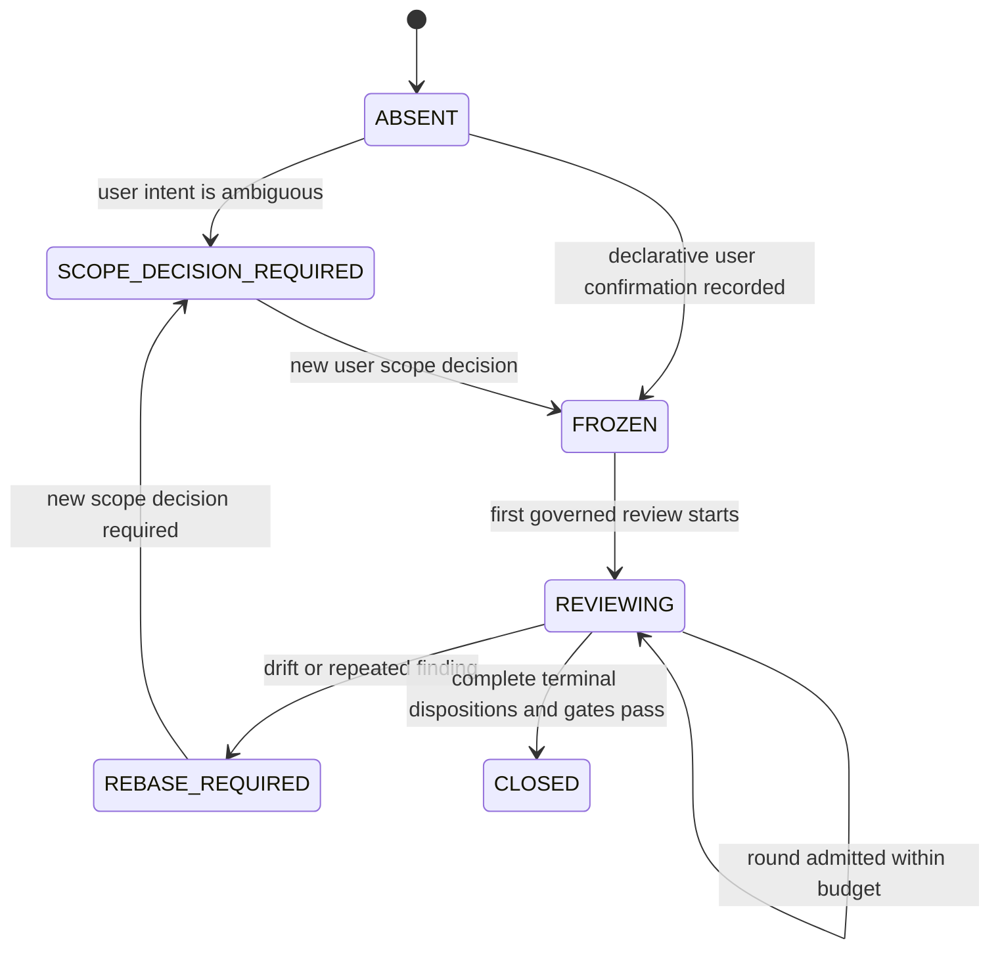

# Runtime Plan Governor v1

Status: candidate for committee review
Mode: plan only
Implementation: not started
Production: no-go
Last updated: 2026-07-26

## 1. Objective

Implement a small, local planning-governance layer that prevents a committee
review loop from turning out-of-scope or weakly evidenced risks into mandatory
v1 architecture.

The governor must:

1. freeze a bounded product scope before a complex planning committee starts;
2. validate the declared classification of every finding before it may change
   the v1 plan;
3. detect complexity-budget drift and repeated non-convergence;
4. allow `MANUAL_CONTROL`, `ACCEPTED_RISK`, `DEFERRED`, and `UNSUPPORTED`
   as legitimate outcomes;
5. bind decisions to the current session, repo, scope, plan, and review round;
6. reuse the existing Harness `PreToolUse` and evidence surfaces;
7. remain materially simpler than the planning failures it is intended to
   prevent.

This is a generic MyCodexEnv runtime capability. ShipAI is the first replay and
pilot case, not a hard-coded runtime dependency.

## 2. Review Contract

The committee should review this document, not implement it.

- Editable artifact: this plan only.
- Rating thresholds are owned by the invoking review protocol and are not
  embedded in the artifact supplied to a blind reviewer.
- Maximum rounds: 5, including the blind final review.
- Required expert domains:
  1. Codex hook/runtime feasibility;
  2. product scope and risk governance;
  3. developer experience, operability, and anti-overengineering.
- Non-goals during review:
  - no source edits outside this document;
  - no runtime sync;
  - no changes under `~/.codex`;
  - no external business-system writes;
  - no expansion into a general requirements or compliance platform.
- Pass condition:
  - no open in-scope blocker, major, or minor finding;
  - all material claims are either evidenced or explicitly qualified;
  - blind review finds no new material issue;
  - residual risks and runtime limitations remain explicit.

Committee scores are scoped scores. An excluded scenario may create a risk
register entry but cannot reduce the v1 score when the exclusion is enforceable
and honestly stated.

## 3. Frozen v1 Scope

### 3.1 Included

- A local Python CLI implemented with the standard library.
- Three JSON schemas.
- One extension to the existing `PreToolUse` harness guard.
- Small updates to the managed `planner` and `committee-review-loop` skills.
- Local state and receipts under the existing Codex harness evidence boundary.
- Shadow, ask, and narrow enforce rollout modes.
- A replay of the ShipAI overengineering sequence as an acceptance fixture.

### 3.2 Excluded

- A database, server, daemon, Cloudflare component, or network service.
- HSMs, signing services, PKI, mTLS, or a new identity system.
- Natural-language semantic proof of user intent.
- Automatic enforcement over plain text when no supported lifecycle hook sees
  the relevant event.
- Final-answer interception while the host exposes no supported completion
  hook.
- External business-write authorization.
- Replacement of ShipAI record-sync receipts or no-write controls.
- Generic project management, requirements management, or compliance tooling.

### 3.3 Complexity Ceiling

Implementation must stop and rebase rather than exceed:

- one new executable Python entry point;
- three new JSON schemas;
- one modified lifecycle hook;
- no new global hook registration;
- no third-party runtime dependency;
- approximately 600 lines of production Python, excluding tests and schemas;
- no new trust root, credential, background process, or external data store.

The line and counter targets are human-review alarms, not scores, optimization
targets, or automatic proof of quality. Any breach returns `ask` and requires
simplification or an explicit scope rebase; it must not create another
governance layer.

## 4. Current Evidence and Constraints

### 4.1 Existing Harness Capabilities

MyCodexEnv currently provides:

- a global generic `UserPromptSubmit` dispatcher;
- a `PreToolUse` guard in `codex/hooks/harness_guard.py`;
- a `PostToolUse` observer in `codex/hooks/harness_observer.py`;
- phase-aware policy in `codex/runtime/tool-policy.json`;
- local evidence schemas and helpers;
- source-to-runtime sync and parity verification;
- an agent-team validation receipt pattern.

The current runtime documentation says that completion-hook enforcement is not
available. This plan must not claim otherwise.

### 4.2 ShipAI Baseline

The project-local ShipAI hook suite currently passes:

```text
command:
  env PYTHONDONTWRITEBYTECODE=1 /usr/bin/python3
  tests/test_shipai_record_sync_hook.py
exit_code: 0
key_output: Ran 43 tests in 3.794s; OK
timestamp: 2026-07-26T22:27:45Z
```

This proves project hook contract behavior only. It does not prove current
runtime activation, external connector truth, or business authorization.

The observed ShipAI project dispatcher differs from the current managed/runtime
MyCodexEnv dispatcher, and the current runtime hook directory did not expose
the ShipAI adapter/policy/stop files during plan preparation. That drift is a
separate issue. The governor must not silently repair or absorb it.

## 5. Guarantee Boundary

### 5.1 Conditional Hard Guarantees Supported by v1

Hard enforcement is conditional on Phase 0 proving
`payload_capable=true`: the actual `PreToolUse` payload must expose a trusted
tool name, configured planning/review dispatch shape, message marker, session
binding, cwd/repo anchor, and supported ask/deny response shape.

Under that condition, v1 can deterministically validate binding and return
`ask` or `deny` only for the **next configured planning/review dispatch that is
actually intercepted by `PreToolUse`**. This can gate the next intercepted
round after a recorded budget breach, scope rebase requirement, or declared
out-of-scope adoption. It does not prove or prevent direct adoption through
plain text or any unconfigured/unintercepted path.

v1 makes no duplicate-consumption or replay-prevention hard guarantee. The
receipt is immutable and time-bound, but v1 has no atomic single-consumer
protocol; a matching receipt may therefore be presented more than once within
its bounded validity window.

If Phase 0 yields `payload_capable=false`, hook integration, enforce-mode work,
and runtime activation stop. The fixed v1 result is CLI + skills + shadow
evidence, production remains no-go, and all claims in this section, Rollout,
and Acceptance Criteria are interpreted as validation/observation claims, not
runtime prevention.

### 5.2 Explicit Non-Guarantees

v1 cannot independently:

- determine that arbitrary prose is a plan;
- prove that the user semantically approved a scope;
- stop a text-only response that never invokes an intercepted tool;
- prove that a committee actually inspected all supplied material;
- prevent a deliberately malicious process from rewriting local state;
- replace financial, security, legal, or product judgment.

Skill instructions remain a soft gate for text-only planning. The runtime hard
gate starts only at supported intercepted tool boundaries.

## 6. Data Contracts

### 6.1 `ScopeEnvelope`

Required fields:

```text
schema_version
scope_id
scope_version
session_binding
repo_anchor
mode
product_stage
supported_scenarios
non_goals
manual_controls
risk_policy
complexity_budget
allowed_claims
confirmation_source
confirmation_message_sha256
created_at
```

The session binding is domain-separated from record sync:

```text
sha256("plan-governor:" + trusted_top_level_session_id)
```

`confirmation_source=user_message` is declarative provenance. It does not prove
that the hook understood the user's intent. Ambiguity produces
`SCOPE_DECISION_REQUIRED`, not `FROZEN`.

### 6.2 `FindingDecision`

Required fields:

```text
finding_id
category
claim
in_scope
evidence_level
affected_asset
required_preconditions
likelihood
impact
irreversibility
manual_control_available
manual_control_adequate
complexity_delta
disposition
rationale
owner
future_trigger
status
```

Allowed evidence levels:

- `observed`
- `reproduced`
- `provider_or_standard_documented`
- `reasoned_current_scope_counterexample`
- `speculative`

A low-probability catastrophic claim enters v1 only when it identifies a
current in-scope asset, a credible causal path, and concrete preconditions.
`speculative` findings return `NEEDS_EVIDENCE`.

Allowed dispositions:

- terminal:
  - `MITIGATE_IN_V1`
  - `MANUAL_CONTROL`
  - `ACCEPTED_RISK`
  - `DEFERRED`
  - `UNSUPPORTED`
- non-terminal decisions:
  - `NEEDS_EVIDENCE`
  - `SCOPE_DECISION_REQUIRED`
  - `SCOPE_REBASE_REQUIRED`

The terminal/non-terminal distinction is normative. A terminal disposition
requires `owner`, bounded `rationale`, and `future_trigger`, plus any
disposition-specific metadata required by its schema. Missing metadata leaves
the finding non-terminal. Pending/non-terminal decisions never count as
closure.

For clarity, the enum values are:

- `MITIGATE_IN_V1`
- `MANUAL_CONTROL`
- `ACCEPTED_RISK`
- `DEFERRED`
- `UNSUPPORTED`
- `NEEDS_EVIDENCE`
- `SCOPE_DECISION_REQUIRED`
- `SCOPE_REBASE_REQUIRED`

### 6.3 `ArchitectureDelta`

Required counters:

```text
new_services
new_trust_roots
new_identity_systems
new_state_machines
new_states
new_operational_roles
new_external_dependencies
repeated_finding_category_count
```

These counters are drift alarms, not proof that a design is good or bad.
`ArchitectureDelta` is the object carried by
`FindingDecision.complexity_delta` and is validated by the finding-decision
schema; it is not a fourth schema.

### 6.4 `GovernorReceipt`

Required fields:

```text
schema_version
session_binding
repo_anchor_hash
scope_hash
plan_hash
finding_set_hash
architecture_delta_hash
review_round
decision
operation_key
timestamp
expires_at
```

The receipt uses canonical JSON and SHA-256. It is an internal consistency
control, not cryptographic proof of user authorization or review quality.

The engine validates only reviewer/user-declared schema, binding, enum
membership, required metadata, and rule consistency. It cannot establish as
objective fact that `in_scope`, `evidence_level`, likelihood, impact, or
`manual_control_adequate` is semantically correct. Adversarial tests cover
machine-detectable contradictions between a declaration and its structured
evidence; those contradictions remain non-terminal. A semantically wrong but
internally consistent label is not machine-detectable in v1 and must be
challenged by a reviewer or user rather than being presented as an engine
guarantee.

## 7. Decision Rules

Evaluate in this order:

1. If the finding is outside the frozen scope:
   `DEFERRED` or `UNSUPPORTED`.
2. If its evidence is speculative or required facts are missing:
   `NEEDS_EVIDENCE`.
3. If a manual control is adequate and the outcome is not catastrophic and
   irreversible:
   `MANUAL_CONTROL`.
4. If the current scenario has a credible high-likelihood, high-impact risk:
   `MITIGATE_IN_V1`.
5. If the current scenario has a credible catastrophic, irreversible risk:
   `MITIGATE_IN_V1`.
6. Otherwise:
   `ACCEPTED_RISK` or `DEFERRED`, with owner and trigger.
7. If the proposed control exceeds any frozen complexity ceiling:
   `SCOPE_REBASE_REQUIRED`, regardless of risk disposition.

No numeric probability multiplication is used. Enumerated judgments must
remain reviewable and tied to evidence.

## 8. State Machine



Rules:

- the model cannot silently mutate a frozen envelope;
- a new scope version invalidates earlier review receipts and ratings;
- lost or expired state returns to `SCOPE_DECISION_REQUIRED`, never `FROZEN`;
- malformed state also returns to `SCOPE_DECISION_REQUIRED`;
- two rounds with the same unresolved category require a simplification review;
- `ACCEPTED_RISK` and `DEFERRED` are valid closure states when their required
  metadata is complete.

## 9. Runtime Flow

1. The managed `planner` skill creates a proposed envelope for complex plans.
2. The user either supplied explicit scope or is shown the unresolved scope
   decision.
3. `scripts/plan_governor.py freeze` validates and records the envelope.
4. The committee receives the artifact and frozen envelope.
5. Findings return in the structured `FindingDecision` shape.
6. `scripts/plan_governor.py evaluate-round` applies the deterministic rules
   and complexity budget.
7. The CLI emits a bounded receipt marker whose exact shape was proven in
   Phase 0.
8. The next configured planning/review agent-dispatch message carries that
   marker.
9. `harness_guard.py` validates it before allowing the dispatch.
10. The existing evidence helper records freeze and round decisions as
    `guardrail_decision` events with bounded metadata; v1 adds no event type or
    evidence taxonomy.

Local state path:

```text
~/.codex/harness/plan-governor/<session-binding>/state.json
```

State is written atomically with owner-only permissions. It stores hashes,
enums, counters, and bounded reason codes only, not raw prompts, free-form
rationales, document bodies, or business records. The state directory is
created with mode `0700` and files with mode `0600`; writes use same-directory
temporary files, flush/fsync, and atomic replace. Fixtures are synthetic or
redacted.

Active state expires 30 days after its last governed decision. Expired state is
read as `SCOPE_DECISION_REQUIRED`; it is not silently reconstructed. Physical
deletion is not automated in v1 and follows the existing harness evidence
retention policy.

## 10. Planned Write Set

### Add

- `scripts/plan_governor.py`
- `codex/runtime/evidence/plan-scope-envelope.schema.json`
- `codex/runtime/evidence/plan-finding-decision.schema.json`
- `codex/runtime/evidence/plan-governor-receipt.schema.json`

### Modify

- `docs/surfaces.json` first, before adding runtime surfaces
- `codex/hooks/harness_guard.py`
- `codex/runtime/tool-policy.json`
- `codex/skills/planner/SKILL.md`
- `codex/skills/committee-review-loop/SKILL.md`
- `codex/skills/committee-review-loop/evals/evals.json`
- `test_runner.py`
- `README.md`
- `docs/HARNESS_RUNTIME.md`
- `docs/AGENT_HARNESS_STATUS.md`
- `docs/repo-index.md`
- `docs/harness-state.md`, append-only after fresh verification

### Do Not Modify in v1

- `codex/hooks.json`
- `codex/hooks/harness_observer.py`
- ShipAI project files or `sources/`
- runtime files under `~/.codex` before explicit sync authorization

Governor routing, mode, marker, and bounded reason-code configuration is a
narrow `plan_governor` section inside the existing
`codex/runtime/tool-policy.json`; there is no independent policy file. The
calibrated scoring contract is unchanged, so
`validate_scoring_contract.py` is not modified; only targeted skill evals are
added. The fixed ceiling remains three schemas, one executable, one modified
hook, and no new global hook.

## 11. Implementation Phases

### Phase 0 — Capability and Source-of-Truth Spike

Actions:

- inspect the MyCodexEnv worktree and preserve unrelated changes;
- read `codex/AGENTS.md` and relevant local instructions;
- observe actual `PreToolUse` payloads only transiently and capture only
  synthetic or redacted fixtures for configured agent-dispatch tools;
- prove whether tool name, message, session ID, cwd, and stop/approval response
  fields are visible;
- record current source/runtime parity;
- keep the ShipAI dispatcher drift as a separate finding.

Kill gate and capability branch:

- Record exactly one capability result: `payload_capable=true|false`.
- The marker shape itself must be demonstrated by the synthetic/redacted
  fixture; it must not be assumed from documentation or prompt text.
- Raw payloads may be viewed briefly on the local machine only. They never
  enter the repo, state, fixtures, or evidence.
- If any required field or response capability is absent,
  `payload_capable=false`: stop Phase 2, enforce-mode work, and Phase 6; finish
  only CLI + skills + shadow evidence; keep production no-go; and downgrade
  Sections 5, 13, and 14 to non-enforcement claims.

### Phase 1 — Schemas and Pure Decision Engine

Actions:

- add failing schema and decision-table tests first;
- implement canonical JSON, session binding, envelope freeze, finding
  evaluation, complexity evaluation, state transitions, and receipts;
- implement only `freeze`, `evaluate-round`, `status`, and `verify-receipt` CLI
  commands; the planner drafts the envelope without another persisted command
  or state;
- use atomic local state writes and bounded values;
- reuse the existing harness evidence helper.

Gate:

Decision functions are pure and deterministic. The same canonical input
produces the same decision and hashes.

The engine proves only declared-contract consistency. It does not certify the
semantic adequacy of evidence, scope labels, or manual controls.

### Phase 2 — `PreToolUse` Integration

Actions:

- add a narrowly routed plan-governor check to `harness_guard.py`;
- validate only configured planning/review dispatch shapes;
- compose with, rather than replace, existing agent-team validation;
- preserve all existing read, write, network, secret, destructive, and remote
  decisions;
- add the governor receipt only as an additional condition after existing
  agent-team validation succeeds;
- add exact collaboration tool names only after Phase 0 evidence.

Gate:

All pre-existing guard fixtures and every non-planning dispatch remain
byte-for-byte compatible where the governor is not active.

Receipt classification follows this single ordered validation path and stops
at the first matching receipt category:

1. an absent receipt is `missing`;
2. a present receipt that fails parsing or schema validation is `malformed`;
3. a parseable, schema-valid receipt that fails integrity validation is
   `tampered`;
4. an integrity-valid receipt whose session, repo, scope, or plan binding
   differs from the intercepted request is `binding mismatch`;
5. a correctly bound receipt whose validity window has ended is `expired`;
6. an unexpired, correctly bound receipt that fails the existing currentness
   or version rules is `stale`;
7. a receipt that passes all preceding checks and whose round is admitted is
   `valid current and admitted`.

Each receipt has exactly one receipt category. `recorded complexity-budget
breach without rebase` is an independent governor-state predicate, not a
receipt category, and may coexist with any receipt category.

Normative composition truth table:

| Governor receipt category or independent state predicate | Shadow | Ask | Enforce |
| --- | --- | --- | --- |
| missing | calculate and record; return existing result | governor `ask` | governor `ask` |
| malformed | calculate and record; return existing result | governor `ask` | governor `ask` |
| tampered | calculate and record; return existing result | governor `ask` | governor `deny` |
| binding mismatch: session, repo, scope, or plan | calculate and record; return existing result | governor `ask` | governor `deny` |
| expired | calculate and record; return existing result | governor `ask` | governor `ask` |
| stale | calculate and record; return existing result | governor `ask` | governor `ask` |
| valid current and admitted | calculate and record; return existing result | governor `allow` | governor `allow` |
| independent predicate: recorded complexity-budget breach without rebase | calculate and record; return existing result | governor `ask` | governor `deny` |

`stale` means a receipt that is parseable, integrity-valid, and correctly
bound to the request, but is no longer current under the existing currentness
or version rules. It is distinct from `expired` and from any binding mismatch.

The matrix applies only after existing safety and agent-team validation. An
existing secret/dynamic-exec `deny`, destructive/remote `ask` or `deny`, or
agent-team validation `ask` or `deny` is returned unchanged; the governor
cannot weaken or replace it. For a non-planning or unconfigured dispatch, the
byte-compatible existing result is returned without activating the governor.
After those prerequisites, `governor allow` preserves the existing allow.

When the independent budget predicate coexists with a receipt category,
Enforce resolves its governor `deny` before any receipt-category governor
`ask`; any other governor `deny` likewise resolves before governor `ask`. Ask
can only return governor `ask`; Shadow only calculates and records and never
changes the existing result. Thus a valid current and admitted receipt allows
only when no coexisting predicate requires `ask` or `deny`. The agent-team
receipt is never replaced. A governor receipt is an additional condition only
for a Phase-0-proven planning/review dispatch shape.

Presenting the same valid current receipt again within its validity window
remains `valid current and admitted`. The governor records the repeated
presentation, does not classify it as tampered, and makes no replay-prevention
claim.

### Phase 3 — Skill Contract

Update `planner` to require:

- supported scenario;
- non-goals;
- product stage;
- risk policy;
- manual controls;
- complexity budget;
- honest unresolved scope decisions.

Update `committee-review-loop` to require:

- scoring only within frozen scope;
- finding admission before revision;
- legitimate non-technical dispositions;
- product/operations representation for product plans;
- a simplification review after two non-converging rounds;
- a blind review that is blind to history and scores but not blind to the
  current scope envelope.

Gate:

Skill evals prove that a severe but excluded scenario can be registered without
reducing the scoped MVP score.

### Phase 4 — Tests and Documentation

Add tests for:

- every Shadow, Ask, and Enforce cell in the normative Phase 2
  mode-by-category matrix, including separate session, repo, scope, and plan
  binding-mismatch fixtures;
- focused receipt fixtures that each trigger exactly one category under the
  ordered validation path: missing, malformed, tampered, binding mismatch,
  expired, stale, or valid current and admitted;
- separate combined-condition fixtures in which the independent recorded
  complexity-budget-breach-without-rebase predicate coexists with a receipt
  category, including an Enforce budget `deny` taking precedence over a
  receipt `ask`;
- existing safety and agent-team precedence, Enforce governor-deny precedence
  when ask- and deny-class governor conditions coexist, Ask's ask-only
  behavior, and Shadow returning the existing result;
- repeated presentation of the same valid current and admitted receipt within
  its validity window remaining valid and admitted while recording the repeat,
  without classifying it as tampered or claiming atomic replay prevention;
- scope change invalidating earlier ratings;
- speculative catastrophic claims returning `NEEDS_EVIDENCE`;
- a credible current in-scope catastrophic risk with concrete preconditions
  returning `MITIGATE_IN_V1` as the positive control;
- machine-detectable evidence laundering or contradictions between structured
  evidence and declared labels remaining non-terminal;
- an internally consistent but semantically wrong label being routed to
  reviewer/user challenge, with no claim that the engine detects it;
- adequate manual controls;
- out-of-scope findings;
- complexity-budget breach;
- two repeated unresolved rounds;
- lost, malformed, or expired state;
- ordinary non-planning behavior;
- no raw prompt or business data in state/evidence;
- ShipAI replay fixtures.

Update the runtime surface inventory first, then the public/runtime docs.

### Phase 5 — Local Validation

Run:

```text
python3 test_runner.py
git diff --check
python3 scripts/check_surfaces.py --repo-root "$(pwd)" --check-public-nav
python3 scripts/check_skill_compatibility.py --repo-root "$(pwd)"
```

Use a temporary Codex home for hook integration tests. Do not sync the real
runtime in this phase.

### Phase 6 — Runtime Activation, separately authorized

Prerequisites:

- clean and reviewed write set;
- all local tests green;
- targeted source/runtime sync path confirmed;
- recoverable runtime backup;
- explicit user authorization for runtime mutation.

Then run the approved sync path and:

```text
./scripts/verify_codex_env.sh \
  --repo-root "$(pwd)" \
  --codex-home "$HOME/.codex" \
  --claude-home "$HOME/.claude"
```

No runtime activation is implied by completing the source implementation.

Implementation and rollout are evidence-gated rather than time-boxed. Phase 2
is skipped when `payload_capable=false`. Work stops for simplification or scope
rebase when the frozen surface, dependency, state, or production-LOC ceilings
are exceeded, regardless of elapsed time.

## 12. Test Matrix

### Unit

- schema acceptance and rejection;
- canonical hashing;
- decision ordering;
- evidence-level thresholds;
- complexity thresholds;
- state transitions;
- expiry;
- receipt tamper and binding detection; repeated presentation is observed but
  is not claimed as atomically prevented.

### Hook Contract

- the normative Phase 2 ordered validation path is the single source of truth
  for assigning exactly one receipt category: missing, malformed, tampered,
  session/repo/scope/plan binding mismatch, expired, stale, or valid current
  and admitted;
- recorded complexity-budget breach without rebase is an independent
  governor-state predicate, not a receipt category, and may coexist with any
  receipt category;
- each focused receipt fixture triggers exactly one receipt category and
  asserts its exact result in each mode; separate combined-condition fixtures
  cover the independent budget predicate coexisting with a receipt category;
- Shadow computes and records every category but returns the existing result;
- Ask returns governor `ask` for each of the six non-valid receipt categories
  and for the independent budget predicate, and returns governor `allow` for
  valid current and admitted only when that predicate is absent;
- Enforce returns governor `ask` for missing, malformed, expired, and stale;
  governor `deny` for session, repo, scope, or plan binding mismatch, tampered,
  and the independent recorded complexity-budget-breach-without-rebase
  predicate; and governor `allow` for valid current and admitted only when that
  predicate is absent;
- stale fixtures are parseable, integrity-valid, request-bound receipts that
  fail only the existing currentness or version rules;
- the same valid current and admitted receipt presented again within its
  validity window remains valid and admitted, with a repeated-presentation
  record and no tamper or replay-prevention claim;
- existing secret/destructive/remote and agent-team validation results retain
  precedence and remain independently required;
- when the budget predicate coexists with a receipt-category `ask`, Enforce
  returns the budget `deny`; other governor denies likewise precede governor
  asks, Ask can only ask, and Shadow does not change the existing result;
- non-planning dispatch output is byte-compatible;
- Phase-0-proven marker shape round-trips through the actual intercepted
  dispatch fixture.

### Skill Evals

- single-tenant MVP receives a cross-tenant finding;
- low-probability speculative catastrophe;
- credible current catastrophic risk with concrete preconditions;
- high-frequency duplicate-write risk;
- adequate human approval control;
- evidence-laundered citation and deliberately wrong scope/evidence/manual
  labels;
- same security category repeating for two rounds;
- blind reviewer challenges a genuinely missing in-scope rubric domain.

### ShipAI Replay Acceptance

The historical cross-organization OAuth and distributed authority findings
must result in `DEFERRED`, `UNSUPPORTED`, or `NEEDS_EVIDENCE` under a frozen
single-organization, single-realm, human-approved MVP envelope. They must not
automatically create HSM, IAR, graph-cutover, PKI, or distributed saga
requirements.

Duplicate entry, stale readback, material field mismatch, absent evidence, or
missing finance approval remain in-scope v1 risks.

## 13. Rollout

### Shadow

- for every Phase 2 category, calculate and record the governor decision and
  return the existing result;
- never add an ask or deny;
- replay at least 10 historical plans;
- record false positives, false negatives, and missing payload fields.

Exit criteria:

- no ordinary non-planning regression;
- all observed scope expansions are visible;
- no raw prompt or business content stored.

Shadow is the maximum rollout state when `payload_capable=false`; in that
branch there is no enforce exit and production remains no-go.

### Ask

- missing, malformed, expired, stale, session/repo/scope/plan binding
  mismatch, and tampered receipt categories return governor `ask`;
- the independent recorded complexity-budget-breach-without-rebase predicate
  returns governor `ask`;
- valid current and admitted returns governor `allow` only when the independent
  predicate is absent;
- no governor deny; existing safety and agent-team validation may still return
  their own `ask` or `deny`;
- every override records a bounded reason.

Exit criteria:

- no unexplained ask loop;
- false-positive rate is acceptable to the user;
- at least one successful rebase and one deferred finding are exercised.

### Enforce

Enforce exists only when `payload_capable=true`, after successful Shadow and
Ask gates. For the next Phase-0-proven and intercepted planning/review
dispatch, the result is exactly:

- missing, malformed, expired, or stale: governor `ask`;
- session, repo, scope, or plan binding mismatch: governor `deny`;
- tampered: governor `deny`;
- independent predicate, recorded complexity-budget breach without rebase:
  governor `deny`;
- valid current and admitted: governor `allow` only when the independent
  predicate is absent.

Existing secret/destructive/remote safety and agent-team validation are
prerequisites and retain their own `ask` or `deny`. If multiple governor
conditions coexist, a governor `deny` above takes precedence over a governor
`ask`. Semantic uncertainty not represented by a deny category remains
`ask`; v1 does not claim it can recognize arbitrary direct adoption as
objective fact.

Within the same valid-current window, repeated presentation of a valid current
and admitted receipt remains valid and admitted and is only recorded as a
repeat. It is not tampering, and Enforce does not claim replay prevention.

Rollback changes policy mode back to `shadow` through the managed source and
reviewed sync path. After rollback, every governor receipt category and
independent state predicate only calculates and records and returns the
existing result. Rollback does not delete evidence or silently rewrite state.

## 14. Acceptance Criteria

Three milestones must be reported independently:

1. `source_implemented`: source tests and temporary-home hook fixtures pass;
   this says nothing about the user's runtime.
2. `rollout_observed`: the applicable Shadow/Ask observation gates pass; this
   says nothing about runtime activation beyond the observed environment.
3. `runtime_active`: separately authorized sync, parity verification, and
   post-sync hook checks pass.

No milestone may be used as evidence for another. Runtime-active is impossible
when `payload_capable=false`.

Source implementation is complete only when:

- the next configured and intercepted planning/review dispatch is gated by a
  valid frozen envelope when `payload_capable=true`;
- every declared finding has either a complete terminal disposition or an
  explicit non-terminal decision;
- declared out-of-scope adoption and complexity drift ask/stop the next
  configured intercepted round when `payload_capable=true`;
- accepted, manual, deferred, and unsupported risks are first-class outcomes;
- schema/rule validation does not promote speculative claims or
  machine-detectable contradictions between structured evidence and declared
  labels into architecture; internally consistent semantic mislabels remain a
  reviewer/user challenge, not an engine guarantee;
- non-planning behavior has no regression;
- no new global hook is registered;
- no raw prompt or business record is persisted;
- state/evidence contain only hashes, enums, counters, and bounded reason codes,
  using `0700` directories, `0600` files, and atomic writes;
- governor decisions reuse `event_type=guardrail_decision` with bounded
  metadata; no new evidence event type or evidence taxonomy is introduced;
- existing safety precedence and agent-team receipt requirements remain intact;
- all changed managed source surfaces are documented and tested, while runtime
  activation status remains explicit;
- source implementation, rollout observation, and runtime activation are
  reported separately;
- ShipAI's existing 43-test hook suite remains green;
- fresh verification reports command, exit code, key output, and timestamp.

## 15. Known Unknowns

- Exact current `PreToolUse` payload shapes for collaboration tools require a
  fresh local fixture.
- The host may not expose a trusted planning-mode field.
- The host currently lacks a supported global completion hook.
- A local receipt proves process consistency, not semantic user approval.
- Complexity counters can be gamed and must remain alarms, not optimization
  targets.
- The existing harness evidence retention policy may require a separate future
  clarification for expired plan state; this is not a reason to add a cleanup
  subsystem to v1.

## 16. Residual Risks

- A model may produce an overengineered text-only plan without invoking a
  governed tool.
- A user can explicitly rebase into a larger scope.
- Reviewers may disagree on likelihood, impact, or manual-control adequacy.
- Local state is not protected against an adversarial local administrator.
- Hook changes have global blast radius, mitigated through shadow/ask rollout,
  temporary-home tests, and source/runtime parity checks.

These risks are disclosed rather than solved with additional infrastructure.

## 17. Committee Questions

The review should explicitly answer:

1. Is the hard guarantee boundary accurate for currently exposed Codex hooks?
2. Does Phase 0 stop rather than improvise when payload fields are unavailable?
3. Can a finding be accepted, deferred, or manually controlled without score
   manipulation?
4. Does the evidence threshold prevent theoretical catastrophic claims from
   recreating the original overengineering failure?
5. Is the governor itself within its complexity ceiling?
6. Are existing guard and agent-team receipt semantics preserved?
7. Is runtime activation safely separated from source completion?
8. Are any remaining claims stronger than the available evidence?
